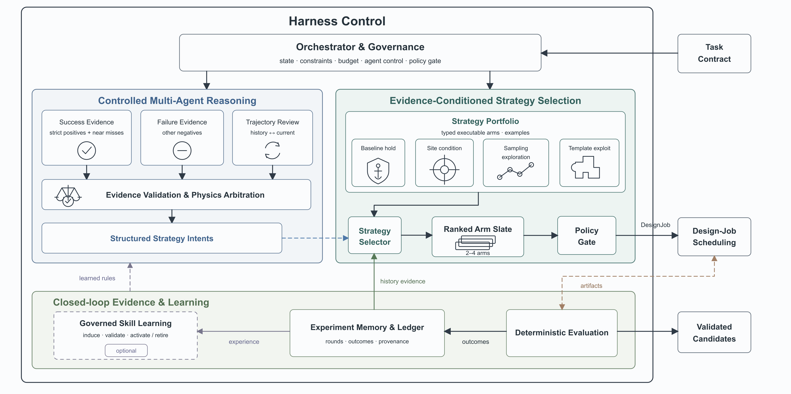

# BinderLoop

*A closed-loop active-learning harness for computational protein binder design*



BinderLoop is a strategy-level experimentation system that coordinates generative models, structural evaluation, bounded policy updates, and experiment provenance across iterative protein binder design campaigns.

The harness operates above model-specific generation software. Given a target structure, an admissible binder-design space, and either fixed or adaptively selected interface hotspots, it allocates sampling budgets, executes design jobs, evaluates candidates, and converts measured evidence into the next round of executable configurations. The current production orchestrator uses BoltzGen; the adapter layer also contains integration points for ODesign and compatible model runtimes.

> [!IMPORTANT]
> Full generation requires a Linux host with the relevant model environments, checkpoints, and GPU resources. Configuration validation, command construction, deterministic closed-loop tests, and most regression tests can run without model weights or remote-compute credentials.

## Contents

- [Research scope](#research-scope)
- [System architecture](#system-architecture)
- [Installation](#installation)
- [Quick start](#quick-start)
- [Closed-loop execution](#closed-loop-execution)
- [Configuration and control boundaries](#configuration-and-control-boundaries)
- [LLM integration](#llm-integration)
- [Leakage-controlled hotspot selection](#leakage-controlled-hotspot-selection)
- [Structural evaluation and adaptive design](#structural-evaluation-and-adaptive-design)
- [Multi-arm experiments](#multi-arm-experiments)
- [Outputs and provenance](#outputs-and-provenance)
- [Testing](#testing)
- [Repository organization](#repository-organization)
- [Documentation](#documentation)

## Research scope

BinderLoop treats protein binder design as a sequential decision problem. Each round produces computational evidence about a bounded set of design strategies. The system uses that evidence to update sampling allocations and model parameters while preserving user-defined constraints.

The principal capabilities are:

- model-independent orchestration through explicit adapter contracts;
- deterministic and LLM-assisted hypothesis generation;
- candidate-, structure-, and fragment-level quality assessment;
- adaptive binder-length allocation, epitope refinement, and template-conditioned redesign;
- controlled exploration, exploitation, rollback, and multi-arm comparison;
- leakage-controlled LLM hotspot selection with independent post-run comparison against literature priors;
- local Conda execution and optional Taiji remote execution;
- durable, arm-scoped provenance for configurations, measurements, decisions, and agent messages.

The software generates and ranks computational hypotheses. Experimental binding, specificity, stability, immunogenicity, and developability require independent validation.

## System architecture

The closed loop separates execution, measurement, interpretation, and policy control:

```text
Task specification and hard constraints
  -> optional HotspotSelectionAgent
  -> strategy arms and DesignJob allocation
  -> model adapter and execution backend
  -> result ingestion
  -> candidate and structure evaluation
  -> fragment and binder-quality analysis
  -> hypothesis and diagnostic agents
  -> bounded configuration proposals
  -> conflict resolution and policy update
  -> rollback, continuation, or termination
```

All LLM-produced configuration changes pass through a shared executable-parameter contract. Unsupported fields are recorded for audit and excluded from the next-round configuration. Hard constraints are restored after proposal merging, and numerical updates are clamped to admissible physical and operational bounds.

## Installation

BinderLoop requires Python 3.9 or later. Clone the repository into a project directory:

```bash
git clone <repository-url> binderloop
cd binderloop
```

The canonical Conda environment is named `binderloop`:

```bash
conda env create -f environment.yml
conda activate binderloop
```

The environment specification installs the local `binderloop` distribution in editable mode. A standard Python virtual environment provides an equivalent lightweight setup:

```bash
python3 -m venv .venv
source .venv/bin/activate
python -m pip install --upgrade pip
python -m pip install -e .
```

The core Python dependencies are declared in `pyproject.toml`. Model-specific environments and checkpoints are configured separately because their requirements may differ from those of the orchestration layer.

## Quick start

Use a task configuration that defines the target, design bounds, model settings, and compute resources.

### Validate the software stack

```bash
python -m compileall binderloop scripts
python -m pytest -q
```

### Inspect command construction

```bash
python scripts/run_strategy_al.py \
  --config configs/<task>.yaml \
  --dry-run
```

This adapter-level path expands the initial strategy jobs, constructs model commands, and writes `outputs/commands.json`. It does not submit a Taiji job.

### Run a deterministic closed-loop smoke test

```bash
python scripts/run_closed_loop_orchestrator.py \
  --config configs/<task>.yaml \
  --out outputs/<run> \
  --max-rounds 1
```

Without an enabled LLM endpoint, the hypothesis and interpretation stages use deterministic fallbacks. Omitting `--submit` restricts the run to validation and executable-artifact generation.

## Closed-loop execution

### Deterministic mode

Deterministic mode exercises orchestration, memory, result contracts, structural evaluation, diagnostics, and policy construction without an external LLM service. It is the preferred first check for a new task configuration.

```bash
python scripts/run_closed_loop_orchestrator.py \
  --config configs/<task>.yaml \
  --out outputs/<run> \
  --max-rounds 2
```

### LLM-assisted mode

Create a local endpoint configuration from the tracked template and store credentials in environment variables.

```bash
cp configs/llm_endpoints.example.json configs/llm_endpoints.local.json
chmod 600 configs/llm_endpoints.local.json
export BINDERLOOP_OPENAI_KEY='<api-key>'

python scripts/run_closed_loop_orchestrator.py \
  --config configs/<task>.yaml \
  --out outputs/<run> \
  --max-rounds 2 \
  --llm-config configs/llm_endpoints.local.json \
  --llm-model gpt_default \
  --llm-thinking medium \
  --require-llm
```

`--require-llm` performs a nonce-based live preflight before the formal run. A disabled endpoint, missing key, invalid model reference, network error, or malformed response terminates the command before formal run artifacts are created.

### Model execution

Add `--submit` only after validating the generated configuration and commands:

```bash
python scripts/run_closed_loop_orchestrator.py \
  --config configs/<task>.yaml \
  --out outputs/<run> \
  --max-rounds 8 \
  --llm-config configs/llm_endpoints.local.json \
  --require-llm \
  --submit
```

The selected backend remains explicit. `resource.backend: direct` starts the configured Conda runtime on the local host. `resource.backend: taiji`, or the equivalent CLI override, selects remote execution.

### Run continuation

An existing output directory can be extended by increasing `--max-rounds`. `run_manifest.json` compares the target fingerprint and user-controlled hard constraints before continuation. The comparison includes the structure content hash, chain and interface constraints, binder-length bounds, and per-round binder budget. It intentionally permits a larger maximum round count.

The final completed round retains a non-empty `next_jobs.json`, which provides a reproducible continuation seed.

### Self-improving strategy memory

Run-local strategy memory can be initialized or copied from a previous run:

```bash
python scripts/run_closed_loop_orchestrator.py \
  --config configs/<task>.yaml \
  --out outputs/<run> \
  --llm-config configs/llm_endpoints.local.json \
  --enable-self-improvement-skill
```

```bash
python scripts/run_closed_loop_orchestrator.py \
  --config configs/<task>.yaml \
  --out outputs/<run> \
  --llm-config configs/llm_endpoints.local.json \
  --self-improvement-skill outputs/<prior-run>/memory/self_improvement_skills/<skill>.yaml
```

The source skill remains immutable during reuse. The harness creates a run-local working copy and applies validated `UPSERT`, `REVISE`, `MERGE`, `UPVOTE`, `DOWNVOTE`, and `RETIRE` operations through a deterministic writer. Strategy conflicts are resolved against hard constraints, accumulated evidence, and configured promotion or retirement thresholds.

## Execution backends

### Direct Conda execution

Direct execution is the default production backend. Model environments and checkpoint roots are declared under `owner.runtime_resources.runtime.model_runtimes`:

```yaml
runtime:
  conda_executable: conda
  model_runtimes:
    boltzgen:
      conda_env: bg
      weights_path: /path/to/boltzgen/cache
    rfd3:
      conda_env: foundry
      weights_path: /path/to/foundry/checkpoints
resource:
  backend: direct
```

For BoltzGen, `weights_path` supplies the default checkpoint and cache root. `checkpoint_dir`, `cache_dir`, and `moldir` can override these locations independently. Detailed model logs are written to `logs/boltzgen_full.log`; heartbeat output is bounded to at least one message every six minutes unless silent logging is explicitly enabled.

### Taiji execution

Taiji support packages each round for remote execution, redacts submission records, monitors the remote job, and ingests the synchronized result tree. Native multi-host mode assigns a global shard plan across `host_num × host_gpu_num` workers and isolates output by host, GPU, and shard. Rank zero writes the unified `steps.yaml` and `result_manifest.json` after all hosts complete.

Use `resource.taiji_multi_host_mode: split_jobs` when the platform requires independent single-host submissions. See [Taiji submission and debugging](docs/taiji_submission_examples.md) for configuration and operational commands.

## Configuration and control boundaries

A structured task configuration defines the target, immutable design limits, adaptive search variables, runtime resources, and active-learning policy. Validate a configuration before model execution:

```bash
python - <<'PY'
from binderloop.config import binder_generation_cap, load_config

cfg = load_config("configs/<task>.yaml")
print("task:", cfg.task_name)
print("target:", cfg.target.structure_path, cfg.target.chain_id)
print("binder lengths:", cfg.search_space.binder_lengths)
print("round cap:", binder_generation_cap(cfg))
print("resources:", cfg.resource.host_num, cfg.resource.host_gpu_num)
PY
```

The control hierarchy preserves the following boundaries:

| Control class | Representative fields | Enforcement |
|---|---|---|
| User hard constraints | `task.binder_length_range`, `task.max_binders_per_round`, `hotspots`, `target_include`, `target_binding_types`, `additional_filters` | Restored after each proposal merge |
| Harness allocation | `binder_lengths` | Redistributed only within the user-defined range |
| LLM-adjustable parameters | `hotspot_weight`, `diffusion_batch_size`, `step_scale`, `noise_scale`, `alpha`, `inverse_fold_avoid`, `filter_biased`, `clash_filter`, `prioritize_hotspots`, `auxiliary_hotspots`, `module_guided_repair`, `epitope_crop_mode`, `template_conditioned_fraction`, bounded `config_overrides` | Whitelisted, sanitized, and clamped |
| Orchestrator-derived state | `num_designs`, device assignment, timeouts, template state, exploration allocation | Computed internally and excluded from LLM control |

The hotspot-selection mode forms a documented exception to fixed user hotspots: it requires the task configuration to omit hotspot priors and writes selected hotspots into runtime state through its dedicated agent. Other agents cannot modify that state through the general configuration contract.

Proposal sources are merged in a deterministic order:

```text
input configuration
  -> binder-length policy
  -> active-learning policy
  -> fragment-template mining
  -> hard-constraint restoration
  -> inertia and physical-bound clamping
```

## LLM integration

### Endpoint configuration

LLM endpoint settings are supplied only through `--llm-config`. Keep `configs/llm_endpoints.local.json` outside version control and store secrets in environment variables.

A minimal OpenAI-compatible entry has the following form:

```json
{
  "enabled": true,
  "default_model": "gpt_default",
  "secrets": {
    "BINDERLOOP_OPENAI_KEY": {
      "env": "BINDERLOOP_OPENAI_KEY"
    }
  },
  "endpoints": {
    "gpt_default": {
      "provider": "openai-compatible",
      "base_url": "https://api.example.com/v1",
      "model": "<model-name>",
      "api_key_env": "BINDERLOOP_OPENAI_KEY",
      "timeout_seconds": 60,
      "thinking": "medium",
      "extra_body": {}
    }
  }
}
```

Provider-specific reasoning fields are forwarded according to the configured provider. OpenRouter assistant messages that contain `reasoning_details` are preserved intact when appended to a subsequent message sequence.

### Secret isolation

LLM credentials are used only in HTTP authorization headers. Remote-storage credentials are injected only at the submission boundary. Secrets are excluded from prompts, analysis bundles, monitored events, and tracked configuration files. Taiji execution writes a redacted submission record for audit and confines the credential-bearing configuration to the submission command.

### Live endpoint test

The live smoke test verifies configuration loading, credential resolution, endpoint access, JSON parsing, and nonce integrity:

```bash
python scripts/test_llm_real_call.py \
  --llm-config configs/llm_endpoints.local.json \
  --llm-model gpt_default \
  --llm-thinking medium \
  --out outputs/llm_real_call_test.json
```

This command performs a real network request and is excluded from the default offline test suite. Each round-level LLM artifact contains `llm_used`, which distinguishes a live model response from deterministic fallback behavior.

## Leakage-controlled hotspot selection

The default workflow uses hotspots fixed by the task owner. The optional LLM workflow selects and refines primary hotspots from an anonymized residue representation. Literature hotspots, common-site priors, protein names, PDB identifiers, task names, and structure paths remain outside the closed-loop prompt.

> [!WARNING]
> The autonomous hotspot-search module has not yet undergone end-to-end testing. Its hotspot selection, cross-round refinement, and post-run comparison outputs remain experimental until they are validated in a complete design campaign.

Web search is disabled by default. In this state, retrieval fields are removed from the request body and online model variants are rejected.

### Configuration

Enable hotspot selection under `owner.llm_context_learning` and omit hotspot or binding-site priors from the task:

```yaml
owner:
  task_hard_constraints:
    task_name: anonymized_hotspot_task
    target_structure_path: structures/<target>.cif
    target_chain_id: A
    binder_length_range: [60, 100]
    binder_length_step: 20
    num_designs: 6
  llm_context_learning:
    hotspot_selection:
      enabled: true
      allow_web_search: false
      min_hotspots: 3
      max_hotspots: 6
      max_change_per_round: 2
      max_residues_in_prompt: 200
      require_llm: true
      model: null
```

Configuration loading rejects non-empty `hotspots`, `target_binding_types`, BoltzGen `binding_types`, and RFD3 `select_hotspots` when this mode is enabled. With `require_llm: false`, round zero can use a deterministic surface-residue heuristic and later rounds can resume model-assisted refinement.

### Closed-loop evidence flow

```text
anonymized geometry and physicochemical descriptors
  -> hotspot selection
  -> generation and evaluation
  -> hotspot-associated round outcomes
  -> bounded hotspot refinement
```

The run records the current selection, sanitization decisions, the source of the selection, and the proposed next-round update. Literature-prior comparison and memorization analysis remain separate post-run procedures.

### Independent prior comparison

```bash
python scripts/compare_llm_hotspots_to_prior.py \
  --run-dir outputs/<hotspot-run> \
  --prior-hotspots priors/<prior>.yaml \
  --baseline-run-dir outputs/<baseline-run> \
  --out outputs/<hotspot-run>/hotspot_vs_prior.json
```

The comparison identifies the best completed round and reports site-level Jaccard similarity, residue-number Jaccard similarity, sequence Hausdorff distance, and an optional success-rate comparison with a prior-guided baseline.

### Memorization analysis

```bash
python scripts/analyze_llm_hotspot_memorization.py \
  --llm-config configs/llm_endpoints.local.json \
  --llm-model gpt_default \
  --protein-name '<protein-name>' \
  --pdb-id '<pdb-id>' \
  --target-structure structures/<target>.cif \
  --chain-id A \
  --prior-hotspots priors/<prior>.yaml \
  --out outputs/hotspot_memorization.json
```

This live analysis compares identity-conditioned, sequence-conditioned, and anonymized structure-conditioned responses while enforcing `allow_web_search=False`. It is excluded from default CI.

## Structural evaluation and adaptive design

The quality model integrates three levels of evidence:

| Level | Representative evidence | Primary interpretation |
|---|---|---|
| Candidate | interface confidence, binder confidence, RMSD, diversity, sequence designability | Overall ranking and generation success |
| Structure | interface size, hotspot distance and coverage, clash density, contact chemistry, compactness, chain continuity | Geometric plausibility and interface quality |
| Fragment | local interface density, hotspot contacts, local clashes, packing, polar contacts, backbone continuity | Reusable, repairable, or low-quality modules |

### Chain assignment and data-quality checks

Generated structures may use chain identifiers that differ from those in the design specification. `structure_features.detect_binder_target_chains` assigns chains from structural and length evidence, and hotspot matching tolerates chain-name changes by using residue identities. `structure_evaluation.json` records the assignment rationale. Batch-level checks label widespread zero-contact results as `suspect_chain_mapping`, which prevents an apparent interface failure from being treated as reliable policy evidence.

### Epitope refinement and template-conditioned redesign

Reliable structures contribute observed target contacts to data-driven epitope refinement. The selected `epitope_crop_mode` controls whether the next round emphasizes the engaged region, the original hotspots, their union, or an automatically selected policy.

From the second round onward, `FragmentTemplateMiningAgent` can convert a high-quality interface or scaffold fragment into an executable `binder_template`. The BoltzGen adapter preserves the selected template region in design and inverse-folding stages through a common redesign mask. Exploration arms remove template conditioning for a configured fraction of jobs, which maintains de novo sampling alongside template-based exploitation.

Interchain PAE is the default template-eligibility metric. `fragment_interchain_pae_max` defines the configurable acceptance threshold. The decision, threshold, per-structure value, and number of reusable structures are written to `fragment_templates.json`.

### Adaptive binder length

`BinderLengthPolicyAgent` groups evaluated structures by realized binder length and integrates reliability, chain continuity, interface extent, clash density, and interchain PAE when available. The policy can shorten, lengthen, focus, or preserve the discrete length allocation. Every recommendation remains inside `task.binder_length_range` and becomes a no-op when the range is fixed or the evidence is insufficient.

### Rollback and pruning

`RollbackController` compares the current reward with the best retained round:

- `advance` continues from a competitive or improved round;
- `rollback` prunes a persistently regressing branch and restarts from the best retained state with a divergence adjustment;
- `stop` terminates after the configured absence of improvement.

Each decision is written to `round_XX/rollback_decision.json`. The cross-round reward history is stored in `memory/experiment_memory.json`.

## Multi-arm experiments

Production configurations set `owner.active_learning_and_rollback.branch_width` to `2` or `4`, with a per-round binder budget at least as large as the selected width. The scheduler selects distinct executable arms, divides the budget as evenly as possible, and maps arms to GPU slots and execution waves.

Logical strategy identity remains separate from execution identity. Each arm retains `arm_id`, `exploration_arm`, and `logical_branch_id`; execution shards add `execution_job_id`, `execution_slot`, and host-shard provenance. Arm outputs are isolated below:

```text
<output-root>/rN/arms/<rank>_<safe-arm>_<digest>/jobs/<execution-job>/
```

Result ingestion is arm-scoped and rejects manifest paths that escape the corresponding arm root. `StrategyArmRankingAgent` compares completed current-round arms, `StrategyConflictResolutionAgent` reconciles that comparison with historical evidence, and the `PhysicsDebateManager` role produces the final biochemical and biophysical strategy assessment. Each stage validates closed-arm and evidence references and uses a deterministic fallback for unavailable or invalid LLM output.

LLM decisions cannot mutate executable configuration directly. Biochemical and developability fields remain `not_assessed` in the absence of measured evidence.

## Outputs and provenance

Each round writes an auditable evidence package under `outputs/<run>/round_XX/`.

| Artifact | Content |
|---|---|
| `evaluation_summary.json` | Candidate metrics, failure tags, and representative designs |
| `structure_evaluation.json` | Interface, hotspot, clash, continuity, and fragment evidence |
| `fragment_templates.json` | Template candidates, gate decisions, and interchain PAE |
| `binder_length_recommendation.json` | Per-length evidence and next-round allocation |
| `binder_quality_analysis.json` | Module-level interpretation and actionable guidance |
| `hypotheses.json` | Failure hypotheses and bounded intervention proposals |
| `diagnostic_report.json` | Pipeline health, root causes, and corrective actions |
| `next_round_input_configuration.json` | Structured input-configuration recommendation |
| `next_round_parameter_proposal.json` | Merged policy proposal and rationale |
| `next_round_config.yaml` | Fully materialized configuration for the next round |
| `rollback_decision.json` | Advance, rollback, or stop decision with evidence |
| `arm_evidence_cards.json` | Arm-scoped measurements and provenance |
| `arm_comparison.json` | Controlled current-round arm comparison |
| `final_strategy_decision.json` | Evidence-bounded strategy decision |
| `self_improvement_evidence.json` | De-identified strategy exposure and outcome evidence |
| `self_improvement_update.json` | Validated skill operations and rejection records |
| `strategy_conflicts.json` | Parameter-family conflict detection |
| `strategy_conflict_resolution.json` | Evidence-based resolution of soft conflicts |

Cross-round state is stored under `outputs/<run>/memory/`:

```text
experiment_memory.json
events.jsonl
self_improvement_skill_state.json
self_improvement_skills/*.yaml
```

Agent communication is recorded in `outputs/<run>/agent_messages.jsonl`.

### Iteration-level analysis

```bash
python scripts/analyze_iteration_results.py \
  --out outputs/<run>
```

The analysis produces JSON and CSV summaries, a Markdown report, aggregate quality trends, and raw-metric trend plots. Use `--no-plots` when only tabular outputs are required.

```bash
python scripts/plot_iteration_metrics.py \
  --out outputs/<run>
```

## Testing

The default suite is offline and collects `scripts/test_*.py` through the project pytest configuration.

```bash
python -m pytest -q
```

Focused checks include:

```bash
python -m pytest -q scripts/test_pre_submit_execution_contract.py
python -m pytest -q scripts/test_retry_limits.py
python -m pytest -q scripts/test_boltzgen_taiji_agents.py
python -m pytest -q scripts/test_llm_hotspot_selection.py
```

The hotspot-selection regression tests cover prior isolation, retrieval stripping, descriptor sanitization, prompt anonymization, deterministic fallback, mocked multi-round refinement, post-run comparison, and memorization-scoring logic.

Live LLM tests, remote submissions, and model generation require explicit credentials or `--submit` and remain outside the default offline suite.

## Repository organization

```text
binder-harness/
  binderloop/
    active_learning/     strategy allocation, rollback, and cross-round updates
    agents/              selection, evaluation, diagnosis, and policy agents
    analysis/            structural features, scoring, and hotspot analyses
    models/              model adapters and command construction
    orchestration/       closed-loop coordination and execution control
    config.py            YAML loading and validation
    pipeline.py          adapter-level local pipeline
  configs/               task, endpoint, and skill configurations
  docs/                  design notes and operational documentation
  scripts/               command-line entry points and regression tests
  outputs/               run artifacts, measurements, and memory
```

## Documentation

- [Taiji submission and debugging](docs/taiji_submission_examples.md)
- [BoltzGen and Taiji agent parameters](docs/boltzgen_taiji_agents.md)
- [Taiji v2 configuration diagnostics](docs/taiji_config_debug_report.md)
- [Generation artifact repair notes](docs/boltzgen_taiji_generation_fix.md)
- [Research plan](docs/research_plan.md)
- [Self-improving binder strategy skill](docs/self_improving_binder_skill.md)
- [Testing guide](docs/testing.md)

## Development practice

Use one auditable intent per commit and stage explicit paths. The repository convention is:

```text
YYMMDD - <imperative summary>
```

Include the scientific or operational motivation, the affected control boundary, and the relevant offline or live verification in the commit body. Keep credentials, local endpoint files, generated outputs, and unrelated model-submodule changes outside the commit.
