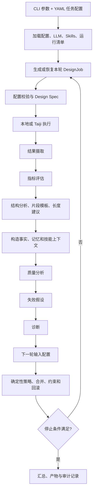

# BinderLoop Agent 工程与架构面试分析

> 分析范围：当前仓库的闭环主路径 `scripts/run_closed_loop_orchestrator.py` 与
> `binderloop/`。本文先回答通用 Agent 原理，再结合本项目说明已有实现、边界与
> 后续改进方向。

## 0. 先给出项目定位

从 Agent 工程角度看，本项目不是“让一个大模型自由调用任意工具”的通用自主智能体，
而是一个**工作流优先、确定性控制优先、LLM 增强的领域多 Agent 闭环系统**：

- 工作流负责执行顺序、预算、并发、重试、回滚、恢复和终止；
- 确定性 Agent 负责结果摄取、指标计算、结构分析、参数边界和配置校验；
- LLM Agent 负责质量解释、失败假设、诊断和下一轮配置建议；
- LLM 不可用或输出不可靠时可以回退到规则逻辑；
- 所有可执行变更都必须经过白名单、物理边界、证据门控和配置合并；
- 每轮产物、消息、记忆、技能激活和决策均落盘，强调可审计和可恢复。

项目主闭环可以概括为：



下文中的“已实现”指当前代码中存在可执行链路；“部分实现”表示已有基础设施但尚未达到
完整通用 Agent 能力；“未涉及”表示当前仓库没有对应实现。

---

## 1. 整个 Agent 从用户输入到最终完成任务，中间经历哪些步骤？

### 1.1 通用原理

一个完整 Agent 通常经历以下阶段：

1. **输入接入**：接收自然语言、结构化参数、文件、历史会话和环境状态。
2. **输入规范化**：解析格式，校验必填字段，识别敏感数据和权限边界。
3. **意图建模**：提取目标、约束、验收标准、资源预算、风险和歧义。
4. **上下文构建**：召回相关记忆、知识、Skills、工具说明和环境事实。
5. **任务规划**：将目标拆成有依赖关系的子任务，形成列表、DAG 或状态机。
6. **策略与调度**：确定串并行关系、优先级、预算、超时、重试和停止条件。
7. **行动循环**：模型推理或确定性程序作出决策，调用工具，获取 Observation，再更新计划。
8. **结果验证**：检查结构、事实、一致性、安全性和是否达到验收标准。
9. **异常恢复**：重试、降级、回滚、改用其他工具，必要时请求用户澄清。
10. **记忆写入**：保存任务轨迹、证据、结果和可复用经验。
11. **终止与交付**：满足目标、预算耗尽、达到最大轮数、无法继续或用户终止时输出结果。

工程上不能只关注“Prompt -> LLM -> Answer”。真正可靠的 Agent 是
“状态机 + 模型 + 工具 + 验证器 + 记忆 + 可观测性”的组合。

### 1.2 本项目如何实现

当前闭环入口是 `scripts/run_closed_loop_orchestrator.py`：

1. 解析 CLI 参数并通过 `binderloop/config.py` 加载 YAML。
2. 加载可选的 `OpenAICompatibleClient`；`--require-llm` 可禁止静默降级。
3. 生成 `run_manifest.json`，用配置和 CLI 身份哈希防止错误续跑。
4. 构造本地、Taiji 或 dry-run executor。
5. `BinderDesignOrchestrator` 加载实验记忆并恢复已完成轮次。
6. `StrategyLevelActiveLearner` 生成初始或下一轮 `DesignJob`。
7. 执行前由 `ConfigValidationAgent` 校验和规范化配置。
8. `DesignSpecAgent` 生成 BoltzGen 工程包和运行脚本；本地执行或由
   `TaijiExecutionAgent` 提交，`RunMonitorAgent` 监控。
9. `ResultIngestionAgent` 收集 metrics、结构、日志和运行问题。
10. `EvaluationAgent` 统一打分、排序并生成 failure tags。
11. `StructureEvaluationAgent` 分析接触、热点、碰撞、链断裂和片段质量。
12. `FragmentTemplateMiningAgent` 生成有来源和 PAE 门控的片段模板；
    `BinderLengthPolicyAgent` 给出长度建议。
13. Orchestrator 构造 metric facts、对比学习样本、记忆摘要、约束和 Skills 上下文。
14. 依次调用质量分析、假设、诊断和输入配置 Agent；可用时调用 LLM，否则走规则回退。
15. `ActiveLearningPolicyAgent` 汇总多源建议，Orchestrator 执行配置合并、白名单过滤、
    惯性限制和硬边界裁剪。
16. `RollbackController` 根据确定性 reward 决定 advance、rollback 或 stop。
17. 生成下一轮 jobs，或在达到最大轮数/early stop 后结束。
18. 将每轮 JSON、checkpoint、消息、记忆、技能激活、summary 和图表落盘。

因此，本项目的“最终完成”不是一次文本回答，而是完成若干轮蛋白 Binder 设计实验，
产生可复现的候选、评估、诊断和策略轨迹。

---

## 2. 用户输入需求后，Agent 如何理解用户意图并进行任务拆解？

### 2.1 通用原理

意图理解应把自然语言转换成一个显式任务模型，至少包含：

- `goal`：最终要得到什么；
- `constraints`：不能违反什么；
- `acceptance_criteria`：怎样算完成；
- `inputs/artifacts`：已有文件、数据和上下文；
- `resources`：时间、成本、并发、模型和工具；
- `risk/side_effects`：是否涉及外部写入、付费、删除或高风险操作；
- `unknowns`：影响方案的缺失信息。

任务拆解不是简单让模型列 TODO，而是形成有输入输出契约的 DAG：

- 节点是可验证的子任务；
- 边表示数据依赖；
- 每个节点标明执行者、工具、预算、重试和产物；
- 对高风险动作增加审批或确定性校验；
- 对不确定但不影响主路径的部分采用合理默认值；
- 只有缺失选择会实质改变结果时才向用户追问。

常见方法包括 HTN（层级任务网络）、Planner-Executor、状态机、DAG 调度和
plan-and-execute。领域任务通常比开放式任务更适合“固定骨架 + 局部动态规划”。

### 2.2 本项目如何实现

本项目当前**没有通用自然语言需求入口**。用户意图主要通过 YAML 和 CLI 被结构化表达：

- target 结构、chain、hotspots；
- binder 长度范围；
- 模型顺序和 BoltzGen 参数；
- 轮数、预算、重试、并发；
- 本地/Taiji/dry-run backend；
- Skills、LLM、模板和主动学习开关。

`HarnessConfig` 已经是解析后的任务意图。项目没有先让 LLM 判断“这是设计任务还是分析
任务”，也没有动态生成任意任务图；`BinderDesignOrchestrator.run()` 预先定义了固定拆解：

```text
执行 -> 摄取 -> 评估 -> 结构分析 -> 质量解释 -> 假设
     -> 诊断 -> 配置建议 -> 策略合并 -> 下一轮
```

`InputConfigurationAgent` 能根据 target 和历史结果提出配置，但它是领域配置推理器，
不是通用意图分类器。当前设计的优点是边界清晰、可测试、不会因 LLM 误解而跳过关键步骤；
缺点是不能直接处理“帮我设计一个针对某蛋白的 binder，并优先考虑某实验约束”这样的
自由文本需求。

### 2.3 可改进方向

可以新增一个只负责入口的 `TaskUnderstandingAgent`：

1. 将自然语言解析为版本化 `BinderTaskIntent`；
2. 区分目标、硬约束、软偏好和验收指标；
3. 对结构路径、chain、hotspot、预算等做确定性校验；
4. 输出 YAML 草案和未决问题；
5. 必须由 schema validator 验证后才能进入现有闭环。

这样既获得自然语言体验，又不破坏当前结构化配置作为执行事实源的原则。

---

## 3. 拆解后如何决定先后顺序？什么时候调用模型，什么时候调用工具？

### 3.1 通用原理

调度一般依据五类信号：

1. **依赖关系**：没有 Observation 就不能做后续判断。
2. **风险顺序**：先做只读、低成本、可逆操作，副作用操作放在校验之后。
3. **信息价值**：优先执行能最大幅度降低不确定性的步骤。
4. **成本与延迟**：便宜的规则、缓存和本地工具优先；昂贵模型或远程工具按需调用。
5. **并行条件**：无共享写冲突、无数据依赖的任务可以并行。

模型适合处理语义理解、非结构化归纳、假设生成和弱结构决策；工具适合处理精确计算、
文件、数据库、搜索、远程执行和可验证操作。凡是可以由确定性代码可靠完成的事情，
通常不应交给 LLM。

更稳妥的决策原则是：

```text
确定性规则/缓存能解决 -> 不调用模型
需要外部世界事实或副作用 -> 调用工具
需要语义推理且上下文充分 -> 调用模型
工具返回后 -> 确定性验证，再决定是否继续调用模型
```

### 3.2 本项目如何实现

本项目的先后顺序由 Orchestrator 固定控制，而不是由 LLM 临时规划：

- 必须先执行，才能摄取；
- 必须先摄取，才能计算指标和结构特征；
- 必须先形成事实，才能做质量分析和假设；
- 必须先有诊断和建议，才能合并下一轮配置；
- 必须先校验、裁剪和预算分配，才能提交下一轮。

当前会调用 LLM 的主要 Agent 是：

- `BinderQualityAnalysisAgent`；
- `HypothesisAgent`；
- `DiagnosticCoachAgent`；
- `InputConfigurationAgent`；
- `ConfigValidationAgent` 还可做辅助语义复核，但确定性 sanitizer 才是事实源。

确定性模块包括：

- 结果摄取、评分、结构特征；
- reward、回滚、长度边界和模板门控；
- 配置白名单、数值边界、预算和并发限制；
- artifact 校验、checkpoint 与恢复。

工具调用也不是经典 LLM function calling。外部工具由 Python 工作流明确调用：

- BoltzGen/ODesign adapter；
- 本地 subprocess；
- `taiji_client`；
- 文件和结构解析器。

因此，项目当前是“Orchestrator 选择工具，LLM 提供受限建议”，而不是“LLM 自己决定下一
个 tool call”。这是面试中需要明确区分的地方。

执行 job 使用 `ThreadPoolExecutor` 做有限并行；轮内分析总体仍按数据依赖串行。
每个模块通过 `_run_validated_module()` 执行、校验、重试和恢复，只有产物满足下一节点
契约后才继续。

### 3.3 可改进方向

- 将固定顺序显式建模为 DAG，使互不依赖的评估任务并行；
- 对远程任务使用异步状态机，避免轮询长期占用 worker；
- 为每个节点增加估算成本、信息价值和 deadline；
- 允许 LLM 选择有限的“分析动作”，但工具名、参数 schema 和副作用必须白名单化；
- 将动态重规划限制在局部子图，不让模型绕过校验、预算和回滚控制器。

---

## 4. 用户输入后，系统如何匹配相关 Skills？

### 4.1 通用原理

成熟的 Skill 匹配通常采用“硬过滤 + 检索 + 排序 + 预算裁剪”：

1. 根据任务类型、Agent、权限、输入模态做 metadata 硬过滤；
2. 用关键词、规则或向量检索召回候选；
3. 根据语义相关度、历史成功率、成本、风险和依赖重排；
4. 检查 required inputs 是否齐全；
5. 去重并解决冲突；
6. 在 token/工具预算内只注入 Top-K；
7. 记录为什么命中以及最终是否有效。

Skill 匹配不应完全依赖 embedding。安全策略、权限和确定性控制必须先做硬过滤。

### 4.2 本项目如何实现

运行时 Skills 位于 `configs/skills/`，索引文件是
`configs/skills/binder_skills.yaml`。`SkillRegistry` 在
`binderloop/skills/registry.py` 中实现。

每个 Skill 包含：

- `id`、`type`、`description`；
- `applies_to`；
- `trigger`；
- `required_inputs`；
- `guidance`、`runtime_logic`；
- `output_schema`、`allowed_config_keys`；
- `params`、`expected_signals`、`deterministic_controls` 和 `risk`。

当前匹配过程是确定性的：

1. 只保留调用方指定的 Skill type；
2. `applies_to` 必须包含 Agent 名或 `*`；
3. 检查 `tags_any`、`tags_all`、`metric_thresholds`、`paths_truthy`、
   `always` 或 `fallback_when_no_match`；
4. 命中后生成紧凑 activation，并记录 `trigger_reason`；
5. Orchestrator 再执行证据门控：策略 Skills 需要显式开启，
   exploitation Skills 还需要正样本或核心指标改善证据；
6. 激活结果写入每轮 `active_skills.json`。

这里没有 embedding、LLM 分类或语义近邻搜索。匹配对象也不是原始用户文本，而是评估
tags、结构 tags、metric facts、模板库和主动学习样本等结构化上下文。

优点是可解释、可复现、不会因为语义漂移误激活高风险策略；不足是覆盖规则之外的新表述
和新失败模式较弱，而且 `required_inputs` 当前主要是声明信息，并未统一做强制校验。
此外，`enable_strategy_skills` 和 `enable_exploitation_arms` 默认关闭，因此默认运行中
Strategy Skill 即使命中 trigger，也未必会物化成执行分支。

### 4.3 可改进方向

- 在规则召回之后增加语义召回，但保留 Agent/type/权限硬过滤；
- 对 `required_inputs` 做运行时 schema 校验；
- 增加优先级、互斥组、依赖关系和最大激活数；
- 使用历史成功率进行重排，但不能让高风险 Skill 仅因历史收益自动获得权限；
- 记录“召回、激活、执行、结果、收益”全链路数据，为 Skill 评估提供样本。

---

## 5. Skills 的分层体系如何设计？为什么分层？职责边界是什么？

### 5.1 通用原理

推荐从“能力”和“决策权”两个维度分层：

1. **原子工具层**：单一、可验证能力，如读取结构、提交任务、计算指标。
2. **领域推理层**：解释事实、生成假设，不直接执行高风险变更。
3. **策略层**：选择搜索分支、实验方案和资源分配。
4. **工作流层**：定义多步依赖、重试、恢复和终止。
5. **策略与安全层**：权限、预算、参数边界、审批和不可覆盖约束。

分层的原因是：

- 降低耦合，便于独立测试和复用；
- 将“建议权”和“执行权”分开；
- 防止 Prompt/Skill 覆盖硬约束；
- 让高层策略可以组合低层能力；
- 便于观测每层失败究竟来自推理、工具还是控制。

### 5.2 本项目如何实现

项目运行时 Skill 实际分为三类，它们更像**三种权限等级**，不只是知识分类：

#### `llm_reasoning`

- 为质量分析、假设、诊断和配置 Agent 提供 Prompt/context guidance；
- 说明应使用哪些证据、输出哪些字段、注意哪些风险；
- 可以提出受限配置建议；
- 不能直接修改执行配置，也不能覆盖确定性事实。

例如 `quality-interface-hotspot-reasoning` 帮助模型区分 foldability 与 interface confidence。

#### `strategy`

- 将证据映射为搜索 arm、分支角色和预算权重；
- 由 `StrategyLevelActiveLearner` 物化为 `DesignJob`；
- 只有 `enable_strategy_skills` 等开关和证据门控通过后才生效；
- 仍需经过配置白名单、长度边界、总预算和压力冲突控制。

例如 `strategy-relaxed-pose-explore` 会映射到受控的 diversity exploration arm。

#### `deterministic_policy`

- 描述 reward、rollback、模板 gate、长度范围等不可覆盖控制；
- 主要承担审计和 guardrail 说明；
- 真正执行权仍在 `round_reward`、`RollbackController`、
  `FragmentTemplateMiningAgent`、长度策略和 Orchestrator 中；
- LLM 只能解释，不能改写这些结果。

这种设计的核心边界是：

```text
LLM Skill 可以解释和建议
Strategy Skill 可以在授权后生成受限分支
Deterministic Policy 决定最终可执行边界
```

仓库中的 `docs/skills/*.skill.md` 是早期文档型 Skill；真正被当前运行时加载的是
`configs/skills/**/*.yaml`。面试时不能把“存在文档”误说成“运行时自动加载”。

### 5.3 可改进方向

- 增加显式 Skill version、owner、兼容 schema、权限级别和 deprecation；
- 将原子工具 Skill 纳入同一 registry；
- 建立冲突解决规则，例如互斥 Skill、优先级和组合器；
- 把“提示知识”和“可执行策略”拆成不同 schema，避免字段混用；
- 对高风险 Strategy Skill 增加离线评估门槛和灰度发布。

---

## 6. 有没有 Skills 沉淀机制？如何构建？

### 6.1 通用原理

Skill 沉淀应是一个受评估约束的知识工程闭环，而不是把一次成功轨迹直接写进 Prompt：

1. **采集**：保存任务、上下文、调用轨迹、结果、成本和失败原因。
2. **归因**：判断成功来自 Skill、模型、工具、数据还是偶然性。
3. **归纳**：从多条轨迹中抽取稳定触发条件、步骤、输入输出和风险。
4. **候选化**：生成带版本、owner、schema、权限和测试的 Skill candidate。
5. **离线回放**：在历史样本、反例和边界样本上比较启用/禁用效果。
6. **人工审核**：领域专家确认科学合理性和安全边界。
7. **灰度发布**：只对部分任务启用，监控收益、失败率和成本。
8. **晋升或回滚**：达到门槛后进入正式 registry；表现退化则禁用或降级。

需要避免“自我污染”：模型生成的错误经验若未经验证进入长期 Skill，会在后续任务中不断
被放大。

### 6.2 本项目现状

项目已有**人工沉淀和审计基础**：

- Skill 使用独立 YAML，便于 code review；
- `include` 索引支持模块化注册；
- 每轮保存 `active_skills.json` 和 expected signals；
- Experiment memory 保存每轮 reward、配置和结果；
- 对比学习样本区分 positive 与 hard negative；
- rollback 能阻止明显劣化分支持续扩散。

但当前没有完整自动沉淀流水线：

- 不会从成功轨迹自动抽取 Skill；
- 不会自动计算单个 Skill 的增量收益；
- 没有 candidate/staging/production 生命周期；
- 没有跨 target 的 Skill 泛化评测；
- 没有自动版本升级和退役策略。

### 6.3 建议的项目化方案

可以新增 `SkillLearningPipeline`：

1. 从 `experiment_memory.json`、`active_skills.json`、config diff 和 reward 构造轨迹数据；
2. 以 target、round、arm、Skill activation 为维度做因果对比，至少控制 baseline 和预算；
3. 只有跨多个 target/seed/重复实验稳定改善时才生成 Skill candidate；
4. 自动生成 trigger、required inputs、expected signals 和风险，但不自动赋予执行权限；
5. 用历史轮次做 replay，并测试反事实“移除该 Skill 会怎样”；
6. 由领域专家审批后写入 `configs/skills/candidates/`；
7. 灰度启用，监控核心 objective、失败率、diversity 和成本；
8. 通过后晋升，失败则自动禁用并保留审计记录。

---

## 7. 长短期记忆如何设计？分别保存什么？

### 7.1 通用原理

#### 短期记忆

短期记忆服务于当前任务，通常保存：

- 当前目标和计划；
- 最近对话和工具 Observation；
- 当前变量、未决问题和中间产物；
- 当前步骤、重试次数、预算和错误；
- 与下一步直接相关的少量历史。

其特点是高相关、低延迟、受上下文窗口限制，任务结束后可被压缩或丢弃。

#### 长期记忆

长期记忆通常再分为：

- **情景记忆**：过去任务、动作、结果和反馈；
- **语义记忆**：稳定事实、领域知识和用户偏好；
- **程序记忆**：Skills、工作流和工具使用方法；
- **实体记忆**：用户、项目、候选、实验和 artifact 的持续状态。

长期记忆必须有来源、时间、置信度、作用域、权限和失效机制。不是所有历史都应该永久保存。

### 7.2 本项目如何实现

当前短期状态主要包括：

- Orchestrator 本轮的 `context`；
- 当前 `DesignJob`、execution records 和 Agent 输出；
- 本轮 MessageBus 消息；
- `round_checkpoint.json` 中的执行阶段和 artifacts。

其中 checkpoint 更准确地说是**操作状态/恢复状态**，不等同于认知记忆。

长期或跨轮记忆由 `binderloop/memory.py` 的 `ExperimentMemoryStore` 管理：

- `experiment_memory.json`：target、rounds、messages、template library、round metrics；
- `events.jsonl`：append-only 事件；
- `RoundRecord`：jobs、submission、monitor、ingestion、evaluation、structure、
  active-learning examples、quality、hypotheses、decisions、retry、reward、
  config snapshot 和 rollback；
- Skills YAML：程序记忆；
- fragment template library：领域实体/经验记忆。

这是**单次实验范围内的长期记忆**，不是跨用户、跨项目的全局记忆。项目当前没有向量库、
知识图谱、用户偏好记忆或候选级完整 lineage 数据库。

### 7.3 可改进方向

- 将 round JSON 升级为结构化实验数据库；
- 建立 `candidate -> job -> arm -> params -> metrics -> fragments -> parent` lineage；
- 区分事实、推断和建议，并记录 provenance；
- 对跨实验可复用知识设置 target scope 和过期策略；
- 将 Skill/模板等程序记忆与实验情景记忆分库存储；
- 敏感配置和 secret 永远不得进入可召回记忆。

---

## 8. 大模型如何判断召回哪些长期记忆？如何避免上下文污染？

### 8.1 通用原理

推荐的召回流程是：

1. 从当前任务生成检索 query 和 metadata filter；
2. 按用户、项目、实体、时间、权限和记忆类型做硬过滤；
3. 结合关键词、向量、时间衰减和历史效用做混合召回；
4. 用 reranker 判断与当前子任务的相关性；
5. 去重、聚类并解决冲突；
6. 只返回有 provenance 的 Top-K 摘要；
7. 按 token budget 截断，原文按需二次读取；
8. 在 Prompt 中标记“事实、历史经验、低置信推断”，防止模型混用。

避免污染的关键不是简单扩大上下文，而是**任务相关投影、可信度分层和硬预算**。

### 8.2 本项目如何实现

项目当前不让大模型自主检索记忆，而是采用确定性召回：

- `ExperimentMemoryStore.summarize_for_agent()` 默认取最近 5 轮；
- Message memory 最多保存 200 条，Agent 摘要使用最近 50 条；
- `context_compaction.py` 再按 Agent 职责裁剪；
- Prompt 中消息通常进一步限制为最近 30 条；
- candidates、failed examples、structures、fragments、hypotheses、guidance 都有固定上限；
- 坐标、序列、PAE matrix、contact map 等重字段从 LLM 上下文移除；
- `enforce_byte_budget()` 对序列化 user payload 设置 1 MB 硬上限，并逐级压缩。

这套方案有效解决了上下文爆炸和无关坐标污染，但召回策略主要是 recency + 固定投影，
没有按语义相关性或历史收益检索远期轮次。某个很早但与当前失败模式高度相关的实验，
可能因超出最近 5 轮而丢失。

### 8.3 可改进方向

- 为 memory item 增加 target、failure tag、parameter diff、arm、reward delta 等索引；
- 先按结构化条件检索，再按语义重排；
- 对事实、模型推断和人工结论设置不同权重；
- 使用 MMR 或聚类减少重复记忆；
- 将长期记录先压缩成 evidence card，模型需要时再读取原 artifact；
- 为每个 Agent 分配独立 retrieval policy 和 token budget；
- 记录每次召回是否真正影响决策，持续优化召回器。

---

## 9. 动态 Prompt 与静态 Prompt 有何区别？上下文如何动态组装？

### 9.1 通用原理

静态 Prompt 是版本化、相对稳定的部分：

- Agent 角色与职责；
- 不可违反的规则；
- 工具和输出 schema；
- 安全约束和失败处理；
- 领域中稳定的术语定义。

动态 Prompt 是每次调用按任务组装的部分：

- 当前用户请求；
- 当前计划和步骤；
- 工具 Observation；
- 检索到的记忆和知识；
- 激活的 Skills；
- 环境、时间、预算和权限；
- 失败反馈和中间结果。

动态组装通常遵循：

```text
系统策略 > Agent 静态职责 > 工具/输出契约
         > 当前任务 > 相关记忆/Skills > 最近 Observation
```

重要的是建立清晰的信任层级，不能让低可信的历史文本覆盖系统规则。

### 9.2 本项目如何实现

项目的静态 Prompt 主要是各 LLM Agent 的 `SYSTEM` 常量，并动态拼接：

- `render_config_parameter_contract()`；
- `render_param_bounds_contract()`；
- 固定 JSON 输出要求；
- 领域规则和不可修改字段。

动态上下文由 Orchestrator 每轮构造，包含：

- evaluation 与 immutable metric facts；
- active-learning positive/hard-negative examples；
- structural analysis 与 fragment templates；
- memory summary、messages；
- target analysis、current config 和 hard constraints；
- reward、rollback、execution failure；
- 当前 Agent 命中的 `active_skills`。

随后 `context_compaction.py` 为不同 Agent 构建不同投影：

- Hypothesis 看失败证据、结构 tags、配置和记忆；
- Quality 保留更多 fragment 信息；
- Diagnostic 看执行状态、聚合指标和历史；
- InputConfiguration 只看蒸馏后的决策、配置和约束；
- ConfigValidation 只看待校验配置、prefilter 和错误文本。

因此项目已经具备较好的“静态职责 + 动态事实 + 按角色裁剪”架构。

当前 Skill guidance 是作为 user JSON 中的 `active_skills` 字段传入，并没有统一拼接到
优先级更高的 SYSTEM Prompt；部分相同规则又直接写在 Agent SYSTEM 中。这会带来两个风险：
模型可能忽略嵌套 guidance，以及 SYSTEM 与 Skill YAML 随版本演进发生漂移。未来应增加
统一的 skill-aware Prompt renderer，并对 `required_inputs` 和 `output_schema` 做运行时校验。

需要注意一个架构债务：`InputConfigurationAgent.SYSTEM` 仍包含 IL-17A 特定知识，
这可能对其他 target 造成知识泄漏。此类知识应移动到 target profile 或动态上下文，
而不是留在通用静态 Prompt。

---

## 10. 多智能体如何协作？

### 10.1 通用原理

常见多 Agent 协作模式包括：

- **Supervisor-Workers**：主管拆任务，专业 Agent 执行；
- **Pipeline/DAG**：上游产物作为下游输入；
- **Blackboard**：多个 Agent 读写共享状态；
- **Event-driven**：发布/订阅消息驱动；
- **Debate/Critic**：生成者、审阅者和裁决者协作；
- **Market/Contract Net**：Agent 根据能力、成本竞标任务。

协作系统必须处理：

- Agent 输入输出 schema；
- 幂等、超时和重试；
- 冲突仲裁；
- 共享状态一致性；
- provenance 与 trace；
- 终止条件和预算。

多 Agent 不等于多次调用同一个模型。只有角色、状态、权限和数据边界清晰，拆分才有价值。

### 10.2 本项目如何实现

项目采用**中心化 Supervisor + Pipeline/Blackboard**：

- `BinderDesignOrchestrator` 是唯一全局调度者；
- 各 Agent 通过 dataclass/JSON artifacts 交接；
- ExperimentMemory 是共享黑板；
- MessageBus 提供带 sender、recipient、round、job、correlation 的 JSONL envelope；
- 冲突由 `_merge_next_round_updates()`、白名单、证据门控和硬约束统一仲裁；
- job 执行可并行，分析和决策基本按固定流水线串行。

当前 MessageBus 更偏审计日志，而不是真正的 Agent 对话系统：

- Agent 通常不会订阅事件自主唤醒；
- 没有动态竞标、对话协商或去中心化计划；
- `parent_id/correlation_id` 具备数据结构，但尚未形成完整因果链；
- 多个 Agent 的建议最终由 Orchestrator 统一合并，而不是相互直接调用。

这是一种合理的领域系统选择。Binder 设计具有高计算成本和明确物理约束，中心化控制比
自由对话式多 Agent 更容易审计和复现。

### 10.3 可改进方向

- 将 MessageBus 升级为 schema-versioned event store；
- 引入订阅、幂等 key、dead-letter 和明确响应协议；
- 增加 `EvidenceRef`，把每条建议关联到 candidate、metric 和 structure fragment；
- 对互相独立的分析 Agent 建立并行 DAG；
- 增加独立 Critic/Verifier，但最终执行权仍由确定性 Controller 持有。

---

## 11. Workflows 与自主智能体的优劣

### 11.1 Workflow

优点：

- 顺序、预算和副作用可控；
- 易测试、复现、审计和恢复；
- 适合有明确 SOP、合规要求和高成本工具的任务；
- 故障边界清楚，可针对节点重试。

缺点：

- 面对新任务和未知异常不够灵活；
- 流程增长后容易出现大量条件分支；
- 动态发现新工具或重规划能力较弱。

### 11.2 Autonomous Agent

优点：

- 能根据 Observation 动态规划和改路；
- 适合开放式研究、信息不完整和长尾任务；
- 可以自主选择工具和迭代深度。

缺点：

- 行为难预测，成本和循环次数容易失控；
- 工具误用、Prompt injection、事实幻觉风险更高；
- 复现、测试和责任归因更困难；
- 高风险外部操作需要额外审批和沙箱。

### 11.3 本项目的选择

本项目明显是 Workflow-first：

- 主 DAG 固定；
- LLM 只能在少数认知节点内提供建议；
- reward、rollback、预算、模板和配置边界由确定性代码控制；
- 外部执行由 executor 负责，不由 LLM 自由选择；
- 每步有产物校验和恢复。

自主性主要体现在：

- LLM 对质量、原因和干预做领域推理；
- active learner 根据新证据选择搜索 arm；
- rollback 根据收益动态换分支；
- Skills 根据上下文动态激活。

最适合本项目的不是完全自主化，而是**受约束自主性**：保留固定安全骨架，只开放局部
分析、实验假设和有限工具选择。

---

## 12. MCP 协议介绍

### 12.1 通用原理

MCP（Model Context Protocol）用于标准化 AI 应用与外部能力之间的连接。核心角色是：

- **Host**：承载 AI 应用；
- **Client**：Host 内与某个 MCP Server 建立会话的组件；
- **Server**：暴露某一数据源或工具集合。

常见能力包括：

- **Tools**：可调用动作，带名称、描述和输入 schema；
- **Resources**：可读取的上下文资源，用 URI 标识；
- **Prompts**：Server 暴露的可复用 Prompt 模板；
- 能力协商、初始化、通知和错误返回。

协议通常采用 JSON-RPC 消息语义，可运行在 stdio 或网络传输之上。MCP 的价值是：

- 统一工具发现和 schema；
- 降低 Agent 与具体服务 SDK 的耦合；
- 让相同 Server 被不同 Host 复用；
- 便于权限隔离、审计和生态扩展。

但 MCP 只解决“如何连接和描述能力”，不自动保证：

- 工具结果正确；
- 调用幂等；
- 权限最小化；
- Prompt injection 安全；
- 业务参数合理。

这些仍需 Host 侧策略、认证、审批、超时、重试和结果验证。

### 12.2 本项目现状

当前仓库**没有 MCP client/server 实现**。项目直接通过：

- Python 类和 adapter；
- HTTP LLM client；
- subprocess；
- `taiji_client`；
- 本地文件和 JSON/YAML；

连接外部能力。

### 12.3 可改进方向

未来可以将以下能力包装为 MCP Server：

- Taiji submit/status/logs；
- BoltzGen/ODesign 任务生成和执行；
- 结构文件与实验结果资源；
- candidate/metric 查询；
- artifact registry。

同时必须保留现有 `ConfigValidationAgent`、secret 隔离、预算控制、幂等提交和 artifact
校验。不能因为换成 MCP 就让模型获得无边界的远程提交权限。

---

## 13. ReAct 思路介绍

### 13.1 通用原理

ReAct 将 Reasoning 与 Acting 交替组织：

```text
Thought: 基于当前目标和 Observation 判断下一步
Action: 调用某个工具及其参数
Observation: 接收工具返回
Thought: 更新判断或计划
...
Final: 给出结果
```

它比一次性生成答案更适合需要外部事实和多步操作的任务，因为模型能根据真实 Observation
纠错。工程实现通常不会保存或展示自由形式隐藏推理，而是使用结构化 decision、
action rationale、tool call 和 observation。

ReAct 的风险包括循环、错误工具选择、参数幻觉、把工具输出当绝对真相和上下文膨胀。
因此需要最大步数、工具白名单、schema、超时、重复调用检测和终止判定。

### 13.2 本项目与 ReAct 的关系

项目在系统层面具有类似的外循环：

```text
观察：执行结果、metrics、结构和历史
推理：质量、假设、诊断和策略
行动：修改受限参数、选择分支、提交下一轮
再观察：下一轮结果
```

但它不是经典的 LLM ReAct：

- LLM 没有输出通用 `Action(tool, args)`；
- 工具由 Orchestrator 固定调用；
- Observation 通过结构化 context 输入；
- 每轮通常是多 Agent 单次推理，不是一个模型内部连续 Thought/Action 循环；
- 最终执行动作经过确定性策略和校验器。

可以称为“**领域级 Observe-Reason-Act 闭环**”，不应直接宣称已经实现通用 ReAct Agent。

### 13.3 可改进方向

若引入 ReAct，建议只开放有限动作：

- `inspect_candidate`；
- `compare_rounds`；
- `request_structure_metric`；
- `propose_config_delta`；
- `wait_or_abort`。

动作必须是 typed schema，执行前由 policy engine 校验，执行后由 verifier 验证，并设置
最大步数和成本预算。

---

## 14. Agent 整体微调（包括 RL）的要点和思路

### 14.1 通用训练路线

#### SFT

用高质量轨迹训练模型掌握：

- 意图抽取和任务拆解；
- 何时调用哪个工具；
- 正确生成工具参数；
- 根据 Observation 更新计划；
- 输出结构化结果；
- 在信息不足时澄清或拒绝。

训练数据应同时包含成功轨迹、失败恢复、无需调用工具和应该停止的负例。

#### 偏好优化

DPO/IPO 等可用于学习：

- 更简洁可靠的计划；
- 更少无效工具调用；
- 更好的证据引用；
- 面对冲突信息时更保守的选择。

偏好对必须控制任务难度和工具可用性，避免模型只学会表面文风。

#### 强化学习

可以使用 outcome reward 或 process reward：

- 任务是否成功；
- 工具调用正确率；
- schema 合法率；
- 事实一致性；
- 延迟、token 和外部成本；
- 安全违规；
- 恢复能力和停止时机。

长程 Agent 的难点是 credit assignment、稀疏奖励、工具环境非平稳和 reward hacking。
应优先在模拟器/沙箱中训练，保留独立 verifier，并用离线评估防止线上探索造成副作用。

#### 工具使用专项训练

- schema 增广和参数边界样本；
- 工具错误、超时和空结果；
- 多工具选择与无需工具场景；
- 幂等和副作用意识；
- Prompt injection 和恶意工具输出。

### 14.2 本项目现状

当前项目**没有对 LLM 做 SFT、DPO、PPO、GRPO 或其他权重训练**。

项目中的 active learning 是优化 Binder 设计策略和参数，不是更新大模型权重；
`round_reward` 用于搜索分支回滚，也不是 LLM RL reward。必须在面试中明确这一区别。

### 14.3 本项目可采用的训练思路

现有轨迹可以转化为训练/评估数据：

- 输入：metric facts、结构摘要、历史配置和 Skills；
- 输出：假设、诊断、config delta；
- 标签：下一轮 core objective、是否触发 rollback、配置是否被 sanitizer 拒绝；
- 负例：事实冲突、越权参数、无效模板、重复劣化调整。

推荐顺序：

1. 先做 Prompt/规则/评估基线；
2. 用专家审核轨迹做小规模 SFT；
3. 用“事实正确、配置合法、后续收益更高”的 pair 做偏好优化；
4. 在离线历史回放和模拟器中做策略 RL；
5. 最后才考虑有限线上探索。

训练 reward 不应只看单轮 iPTM，否则会诱导过拟合和忽略 pTM、PAE、RMSD、多样性与成本。
应沿用多指标 core objective，并对越权配置、事实错误和无效工具调用施加强惩罚。

---

## 15. 如何提升问答准确度？如何保证工具调用可靠性？

### 15.1 通用原则

提升回答准确度需要：

- 先检索/读取事实，再生成结论；
- 将事实与推断分开；
- 使用结构化输出和 schema 校验；
- 对关键数字做程序化计算；
- 使用引用和 provenance；
- 引入独立 verifier 或 critic；
- 对不确定结论进行置信度校准；
- 建立离线 golden set、回归测试和线上抽样审计。

保证工具可靠性需要：

- 工具 schema 和参数类型约束；
- 权限最小化和副作用分级；
- 超时、重试、退避和熔断；
- 幂等 key、防重复提交；
- 调用前验证、调用后校验；
- 明确错误分类，不对永久错误盲目重试；
- checkpoint、补偿动作和回滚；
- 全链路 trace、日志和 artifact hash。

### 15.2 本项目已有的可靠性设计

项目已经实现了较多工程防线：

- LLM 输入使用 immutable metric facts；
- Quality 和 Diagnostic 会对明显错误的指标陈述做 fact check；
- LLM 输出要求 JSON，并检查关键字段；
- 所有配置建议经过 `supported_config_changes()` 白名单；
- internal-only、user-owned 和 Agent 可调参数分权；
- `PARAM_BOUNDS` 与 `clamp_config_with_inertia()` 限制物理范围和每轮变化；
- `ConfigValidationAgent` 以确定性 sanitizer 作为提交事实源，LLM 只做辅助复核；
- 模板必须由 `FragmentTemplateMiningAgent` 基于结构来源和 PAE 门控产生；
- reward 和 rollback 不允许由 LLM 覆盖；
- LLM transport 对 408/429/5xx 等瞬态错误做指数退避；
- Agent 可 deterministic fallback，`--require-llm` 可选择 fail-fast；
- `_run_validated_module()` 对产物做类型、数量和字段校验并重试；
- checkpoint 和 artifact SHA-256 支持安全恢复；
- execution attempt ledger 防止恢复时重复提交未结束任务；
- run manifest 防止不同配置误用同一输出目录；
- secret 与 Prompt/可提交文件隔离，并对审计输出脱敏；
- job 预算、并发和 GPU 分片均有上限。

这些设计体现了一个重要原则：**模型输出是候选建议，不是可直接执行的事实或命令。**

### 15.3 仍可改进的地方

- 为所有 Agent 输出建立正式 JSON Schema 和 schema version；
- 使用 provider-native structured output 或 Pydantic 校验替代当前“Prompt 约定 +
  `_extract_json_object()` 提取 + 粗粒度字段检查”的方式；
- 对 LLM 结论增加字段级证据引用，而不只保存整个 context digest；
- 建立覆盖真实失败模式的 Agent eval suite；
- 测试 Prompt/Skill/model 版本变化的回归；
- 对 Taiji 提交使用服务端幂等 token；
- 将 error taxonomy 区分为配置、资源、网络、模型、数据和业务失败；
- 增加 circuit breaker、速率限制和 cost accounting；
- 对结构评估使用 verifier ensemble，避免单模型偏差；
- 增加统计重复、置信区间、ablation 和跨 target 验证；
- 对 MessageBus 和 event store 增加持久化并发一致性保证。

---

## 16. 当前项目还涉及哪些重要设计？为什么这样设计？

### 16.1 确定性优先、LLM 增强

`HypothesisAgent`、Quality、Diagnostic 和 InputConfiguration 均支持 LLM 与规则回退。
这样可以离线测试、控制成本，并在外部 API 故障时继续运行。对于高成本科学计算系统，
可降级性比“所有步骤都由最强模型完成”更重要。

### 16.2 Strategy-level Active Learning

项目不训练底层生成模型，而是在模型、约束、长度、模板和采样策略层做主动学习。
这样能复用 BoltzGen/ODesign，迭代成本较低，也更容易解释“哪种策略导致了改善”。

### 16.3 对比学习样本

`active_learning/examples.py` 构造 positive 与 hard negative，促使 Agent 比较“成功候选和
近失候选差在哪里”，而不是只看聚合均值。历史正样本还带衰减逻辑，避免旧经验永久支配
当前搜索。

### 16.4 核心目标与压力冲突

项目使用 iPTM、PAE、pTM 和 RMSD 组成确定性 core objective，并把 H-bond、SASA 等作为
次要信号。`pressure_conflict` 用于发现界面压力与 foldability 冲突，阻止 Agent 继续单向
增加 hotspot/crop/template 压力。这是防止 Goodhart's law 的关键设计。

### 16.5 回滚与分支剪枝

`RollbackController` 比较每轮 reward，劣化超过阈值时回到最佳轮并屏蔽失败 arm。
执行/基础设施失败不计入质量 reward，避免把“任务没跑起来”误判为“设计策略失败”。
这将线性试错升级为带 backtracking 的搜索。

### 16.6 片段模板与来源门控

项目从高质量结构片段中挖掘模板，但只有满足来源、成功候选和 inter-chain PAE 等条件时
才允许进入可执行配置；同时保留 template-free exploration，防止搜索被单一模板锁死。

### 16.7 Binder 长度策略

`BinderLengthPolicyAgent` 根据结构质量推荐长度，但最终必须限制在用户范围和离散步长内。
这是把“适应性搜索”与“实验可比性、预算和用户意图”同时保留下来的设计。

### 16.8 配置所有权和参数契约

配置被分为：

- Agent 可调参数；
- 用户拥有、Agent 不得修改的参数；
- 只有 Orchestrator/模板模块可写的 internal-only 参数。

这种 capability boundary 比单纯在 Prompt 中说“不要修改”更可靠。

### 16.9 多后端与适配器

项目支持 local、Taiji 和 dry-run，并通过 adapter/spec 隔离底层模型和执行环境。
dry-run 使配置、脚本和产物链路能在无 GPU 环境测试；Taiji 封装满足远程资源场景。
需要准确说明的是：`pipeline.py` 支持 BoltzGen 与 ODesign adapter，但当前完整
Orchestrator/Taiji 闭环主要围绕 BoltzGen；ODesign 尚未获得对等的闭环摄取、评估和执行集成。

### 16.10 预算、并发和 GPU 分片

job 级并发与单 job 内 GPU 分片分开控制；多 GPU job 可能限制外层并行，避免重复占满整组
资源。round cap 在多个边界重复执行，防止 LLM 或配置错误放大采样成本。

### 16.11 可恢复和 artifact 完整性

原子写入、run manifest、module checkpoint、输入输出 SHA-256 和 resume validator，
共同保证中断后可以从已验证节点继续，而不是重新提交昂贵任务或错误复用旧结果。

### 16.12 可观测与审计

每轮会保存 evaluation、structure、quality、hypotheses、diagnostic、config merge、
Skills、reward、rollback 和 next jobs。`llm_used`、raw response、facts used 和
context digest 使“为什么得到这个决策”可以追踪。

### 16.13 安全与秘密管理

LLM key 和 Ceph secret 只在具体副作用边界读取；secret 不进入 Prompt、记忆和普通审计
文件。Taiji 配置另写 redacted 版本。这是 Agent 系统中必须强调的数据流隔离。

### 16.14 当前最值得推进的架构改进

按优先级建议：

1. Agent 输出统一 JSON Schema、EvidenceRef 和 schema version；
2. 构建 candidate/fragment/arm/config/reward 的完整 lineage；
3. 将 Prompt 中 target-specific 知识外置为 target profile；
4. 将固定流程显式化为可并行、可恢复的 DAG；
5. 建立跨 target 的 Agent/Skill/策略离线评估集；
6. 完成 Skill 候选、回放、审批、灰度和退役闭环；
7. 增加 verifier ensemble、多样性和可制造性评估；
8. 在保持确定性控制面的前提下，引入有限 typed ReAct 动作；
9. 如需跨工具生态，再将 Taiji、结构和 artifact 能力 MCP 化。

---

## 17. 面试总结

可以用下面这段话概括本项目：

> BinderLoop 是一个面向蛋白 Binder 设计的 workflow-first、deterministic-first
> 多 Agent 闭环。它用 Orchestrator 固化高成本实验的安全执行骨架，用 LLM Agent 完成
> 质量解释、假设、诊断和配置建议，再用参数契约、事实校验、模板门控、reward、回滚和
> artifact validation 把建议约束为可执行决策。它已经具备动态 Skills、跨轮实验记忆、
> 多 Agent 数据流、主动学习、重试和恢复，但尚未实现通用自然语言意图入口、语义记忆
> 检索、真正事件驱动的多 Agent 协商、经典 LLM ReAct、MCP 或大模型微调/RL。

面试中最容易混淆的几个点：

- “有多个 Agent 类”不等于去中心化多 Agent；
- “多轮主动学习”不等于对大模型做 RL；
- “观察—推理—行动闭环”不等于已经实现经典 ReAct tool calling；
- “Skill YAML 存在”不等于具备自动 Skill 沉淀；
- “实验记忆落盘”不等于已经具备语义长期记忆；
- “OpenAI-compatible HTTP client”不等于 MCP；
- 本项目最重要的架构价值不是 LLM 调用数量，而是将 LLM 建议放在确定性控制面之内。

## 18. 关键代码索引

- 闭环入口：`scripts/run_closed_loop_orchestrator.py`
- 全局编排：`binderloop/orchestration/orchestrator.py`
- Skills registry：`binderloop/skills/registry.py`
- Skills 配置：`configs/skills/`
- 短上下文裁剪：`binderloop/agents/context_compaction.py`
- 实验记忆：`binderloop/memory.py`
- 消息协议：`binderloop/communication.py`
- LLM client：`binderloop/llm.py`
- 配置契约：`binderloop/agents/config_parameter_contract.py`
- 配置校验：`binderloop/agents/config_validation_agent.py`
- 主动学习策略：`binderloop/active_learning/strategy.py`
- 回滚控制：`binderloop/active_learning/rollback.py`
- 恢复与 artifact hash：`binderloop/resume.py`
- 质量分析：`binderloop/agents/binder_quality_analysis_agent.py`
- 假设生成：`binderloop/agents/hypothesis_agent.py`
- 诊断：`binderloop/agents/diagnostic_coach_agent.py`
- 下一轮配置：`binderloop/agents/input_configuration_agent.py`
