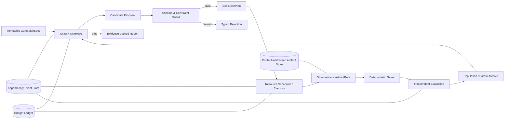

# binder-harness 架构分析、前沿 Harness/Loop Agent 调研与优化计划

> 日期：2026-08-23  
> 文献检索截止：2026-08-23  
> 文档性质：代码审计与实施路线图，不包含本轮功能代码改动

## 1. 范围、方法与结论

本次分析严格遵守工作区 `AGENTS.md` 与 `AvoidRead.txt`：先读取隔离清单，只检查允许访问的核心代码、测试与 Git 元数据；清单中的文件、目录及其子目录不作为任何结论的来源。受隔离约束和本机兼容性问题影响，未运行全量测试，相关限制见第 12 节。

文献检索使用三条互补路径：

1. 多搜索引擎按精确标题、作者、venue 与年份检索；
2. 学术检索按“发现—来源核验—综合”流程，仅用论文、正式会议/期刊页面和官方项目文档支持技术结论；
3. OpenAlex 对核心条目做独立元数据交叉核验，并按 DOI、arXiv ID、规范化标题与首作者去重。

核心判断如下：

- 当前系统已经超过普通脚本式 pipeline，是一个具有策略臂、回滚、恢复、证据卡、结果摄取和自改进记忆的 **proto-harness**。
- 它距离可长期运行的真实 Harness，主要差在四个边界没有闭合：**持久状态、执行环境、实验设计、Harness 自改进治理**。
- 当前最需要的不是继续增加 Agent 数量，而是把 Harness 从“单进程大编排器”升级为“可恢复的实验操作系统”。
- 参数选择不应继续由 LLM 对每个轴独立给出概率后直接落值。推荐的职责分工是：**LLM 产生假设、先验与故障解释；确定性约束器和联合优化器决定可执行参数；独立 evaluator 决定证据是否成立**。
- Harness 内循环与 Harness 自身改进的外循环必须隔离。任何 Prompt、路由、策略规则或代码变体都必须先通过 frozen/hidden replay、回归门、shadow/canary 和人工批准，不能由一次正向 reward 直接进入生产策略。

## 2. 什么才是本项目所需的真实 Harness

对本项目而言，Harness 不只是“模型外面的一段 Prompt”，也不只是“多个 Agent 的工作流”。它应当是生成模型与计算后端之上的控制平面，负责：

- 将目标、硬约束、参数空间、预算、后端和 evaluator 固化为不可变 campaign；
- 提出、验证、调度并执行候选参数组合；
- 把环境返回的 observation 和 artifact 视为事实，而非把 Agent 的叙述视为事实；
- 对失败做类型化分类，区分基础设施失败、确定性输入失败、科学性失败和评价不确定；
- 保存完整事件、谱系、成本和证据，使运行可恢复、可复核、可重放；
- 在预算约束下平衡探索、利用、多样性和多保真评估；
- 对 Harness 自身的修改进行离线、隔离、可回滚的治理。

因此，目标不是让 LLM “自由管理所有事情”，而是建立以下闭环：



## 3. 当前代码架构

### 3.1 规模与演进

允许访问范围内约有：

- 96 个源码 Python 文件，约 38,695 行；
- 57 个 `test_*.py`，约 15,646 行、508 个测试函数；
- 核心 [`orchestration/orchestrator.py`](../binderloop/orchestration/orchestrator.py) 已达 7,539 行，其中 `run()` 从第 592 行延伸到约第 2,195 行；
- 主 CLI [`scripts/run_closed_loop_orchestrator.py`](../scripts/run_closed_loop_orchestrator.py) 为 1,135 行；
- 声明式 [`orchestration/round_graph.py`](../binderloop/orchestration/round_graph.py) 仅 147 行。

Git 演进方向是清晰的：项目先形成基本闭环和远程执行，随后加入多臂策略、自改进 skill、rollback、执行治理和谱系，再加入本地直接执行、多模型 search profile、LLM 依赖波、候选聚类与防泄漏上下文。问题不在方向，而在大多数能力持续进入同一个 Orchestrator，使它同时承担 scheduler、状态机、恢复、LLM 波次、策略、分析和持久化。

### 3.2 当前分层

| 层 | 当前职责 | 主要实现 |
|---|---|---|
| 配置与入口 | YAML 解析、owner 字段归一化、CLI、local/Taiji 路由 | `config.py`、`run_closed_loop_orchestrator.py` |
| 作业与模型 | `DesignJob`、命令构造、模型搜索隔离 | `models/base.py`、`models/search_profile.py`、各 adapter |
| 策略与参数 | 策略臂、参数候选、LLM 配置建议、预算分配 | `active_learning/strategy.py`、`parameter_decision.py`、`input_configuration_agent.py` |
| 策略治理 | 干预适用性、语义摘要、确定性 branch/job identity、matched comparison | `strategy_governance.py` |
| 执行 | 轮次推进、并行作业、本地/远程提交、重试、恢复 | `orchestration/orchestrator.py`、CLI、`runner.py` |
| 结果与评价 | 结果摄取、质量 gate、核心排序、结构与片段分析 | `result_ingestion_agent.py`、`evaluation_agent.py`、`analysis/*` |
| 状态与记忆 | run manifest、checkpoint、message bus、experiment ledger、skill lifecycle | `resume.py`、`communication.py`、`memory.py`、`skills/self_improvement.py` |

当前实际控制流可概括为：

```text
config/CLI
  → Orchestrator.run
  → materialize jobs / arms / budgets
  → local or Taiji execution
  → ingest results
  → deterministic evaluation + structural analysis
  → LLM analysis waves
  → input configuration / policy update
  → rollback or next-round branch
  → checkpoint + memory + messages + skill update
```

`RoundGraph` 已声明 A/B/C 三个 LLM wave 和读写标签，但运行时只提供 `ThreadPoolExecutor` fan-out；依赖检查、持久 transition、lease、重放和错误策略仍由 Orchestrator 手写。因此它目前是“图的描述”，还不是 durable graph runtime。

### 3.3 应保留的现有优点

以下能力应成为重构基线，而不是被重写丢弃：

1. **有限、可执行的策略臂目录。** `active_learning/strategy.py:36-44` 定义 control、site、sampling、template、sequence 等 canonical arms，并保留 baseline control。
2. **模型搜索空间隔离。** `models/search_profile.py:138-141,302-395` 绑定模型能力、工具和受支持策略臂，避免把一个后端的参数泄漏给另一个后端。
3. **干预与归因治理。** `strategy_governance.py:32-169,284-387` 区分 intent、effective execution 与 attribution identity，生成确定性 job/output identity，并做有效干预去重。
4. **规范化核心目标。** `analysis/core_objective.py:96-159` 用 gate-first 的字典序排序，避免用某个好指标补偿硬 gate 失败。
5. **科学回退与执行失败分离。** `active_learning/rollback.py:115-190` 不把基础设施故障当作策略退化，并支持 retest/branch-from-best。
6. **原子 JSON 与 artifact 校验。** `resume.py:101-160` 使用临时文件、flush/fsync、replace 与 SHA256；Orchestrator 已用输入/输出 digest 做部分模块恢复。
7. **预算和谱系已有雏形。** 执行计划、per-arm evidence、branch lineage、candidate denominators、deterministic sampler provenance 已被记录。
8. **结果路径安全意识较强。** BoltzGen 摄取路径优先 manifest、限制 fallback scan，并验证 containment 与 transport symlink，见 `result_ingestion_agent.py:309-528`。
9. **自改进 Agent 不直接写文件。** `self_improvement_skill_agent.py` 生成 typed operation，确定性 writer 掌握文件修改和 lifecycle，方向正确。

这些能力说明项目不需要推倒重来；更合适的路线是先用 characterization tests 固化当前语义，再逐层抽离。

## 4. 关键差距与优先级

### 4.1 P0：先关闭运行安全与恢复边界

#### P0-1 不可变 run identity 不完整

`resume.py:201-250` 的 resume fingerprint 主要包含目标、位点、长度和轮次预算，未覆盖 search/scoring/active-learning、实际模型、Prompt/skill digest、运行环境、依赖、代码版本和权重摘要。`resume.py:279-330` 虽把 effective config 写入 manifest，但相同 target identity 时会用新 manifest 覆盖旧审计快照。

风险：同一输出目录可能在“看似续跑”时混入不同策略、模型、依赖或 evaluator，且原始快照被覆盖。

改进：

- 将身份拆成 `immutable_identity` 与明确白名单 `continuation_overrides`；
- `immutable_identity` 至少包含 config canonical hash、harness commit/dirty hash、模型与 checkpoint SHA、容器/环境 digest、Prompt/skill/evaluator schema hash；
- manifest 改为 append-only `run_revision`，永不覆盖旧 revision；
- 只有 `max_rounds`、等待策略等不改变科学语义的字段可作为 continuation override；
- 所有身份差异都必须产生可读 diff，并选择“拒绝”或“新 revision”，不得静默继续。

#### P0-2 损坏状态 fail-open，且没有跨进程 lease

`orchestrator.py:3826-3835` 在 `execution_attempts.json` 损坏时吞掉异常并返回空 ledger；`orchestrator.py:2928-2946` 对损坏 checkpoint 返回 `None`。MessageBus 和调度器使用的是进程内锁，没有 out-dir 级跨进程 lease。

风险：损坏状态可能被当作“从未提交”，导致昂贵任务重复提交；两个进程也可能同时接管同一 run。

改进：

- ledger/checkpoint 损坏一律 fail closed，或从带 digest 的 journal/backup 重建；
- 引入 `RunLease`：owner、PID/host、lease expiry、heartbeat、fencing token；
- 外部提交使用稳定 idempotency key，并通过 reconciler 查询已有 task ID；
- 语义目标不是假装外部世界具备严格 exactly-once，而是实现 **effectively-once**：at-least-once 协调 + 幂等提交 + 终态对账。

#### P0-3 timeout 不是硬终止条件

本地执行在 `run_closed_loop_orchestrator.py:591` 和 `runner.py:44` 使用无 timeout 的 `subprocess.run(..., capture_output=True)`；远程等待在 `run_closed_loop_orchestrator.py:839-876` 到达 deadline 后若任务仍 active，会重置 deadline 继续等待。

改进：

- 本地执行使用进程组、流式 stdout/stderr、wall-clock deadline 和子孙进程清理；
- 超时后生成明确的 `EXECUTION_TIMED_OUT`，而不是模糊失败；
- 远程任务超过等待窗口后持久化为 `REMOTE_PENDING` 并释放本地 worker；
- 独立 reconciler 继续轮询并接回原 task ID，绝不因为本地等待结束而重提。

#### P0-4 secret、文件权限与平台兼容性

`secrets.py:76-86` 的文本脱敏不能覆盖所有常见 key/token/password 形式，字典规则又会把普通 `rank_key`、`cache_key` 等过度脱敏。`taiji_execution_agent.py:125-130` 会先写未脱敏配置，且未显式限制权限。

本机验证还发现 `llm.py:5` 无条件导入 POSIX 专用 `fcntl`，导致 Windows 上多个核心测试在 collection 阶段失败；锁操作位于 `llm.py:875-879`。因为 `agents/__init__.py` eager import 多个 Agent，这个问题还会污染原本不需要 LLM 的模块导入。

改进：

- 使用基于精确 key schema 的 secret 类型，而不是子串 `key` 判定；
- 敏感配置仅短生命周期存在、最小权限写入、提交后按策略删除；
- 使用跨平台 file-lock abstraction，并将 LLM 依赖改为 lazy import；
- CI 增加 Windows import/contract job。

### 4.2 P1：从单体编排器升级为 durable runtime

#### P1-1 Orchestrator 责任过载

7,539 行 Orchestrator 同时包含 stage 闭包、LLM 波次、执行恢复、结果解析、策略合并、checkpoint 和写盘逻辑。新增后端或 Agent 会持续修改核心控制流，扩大回归面。

目标拆分：

```text
orchestration/
  stage.py              # Stage contract and lifecycle
  graph.py              # dependency graph only
  engine.py             # transition loop, <= 1,000 LOC target
  retry_policy.py       # typed failures/backoff/deadline
runtime/
  run_store.py          # transactional state/event API
  artifact_store.py     # content-addressed artifacts
  lease.py              # run/job lease and fencing
  reconciler.py         # remote pending reconciliation
execution/
  protocol.py           # typed backend contract
  scheduler.py          # resource-aware scheduler
  backends/local.py
  backends/taiji.py
planning/
  policy_engine.py
  optimizer.py
  budget_allocator.py
evaluation/
  ingestion.py
  gates.py
  evaluator.py
```

每个 stage 只能通过版本化输入/输出 contract 与 RunStore 通信，不能直接修改其他 stage 的文件或内存对象。

#### P1-2 三套持久化表面缺少唯一事实源

当前 checkpoint JSON、`memory.json/events.jsonl`、MessageBus JSONL、lineage 和各类 manifest 都保存部分重叠状态。`communication.py:92-230` 有 append-only/idempotency 雏形，但只有 RLock、append 无 fsync，坏行会使 decode 失败；`memory.py:214-220` 也直接 append。

建议采用：

- SQLite WAL 作为本地默认 `RunStore`，以后可替换为 Postgres；
- append-only event table，字段含 monotonic sequence、schema version、correlation ID、payload digest 与前一事件 digest；
- content-addressed artifact store 保存大文件，数据库只存 `ArtifactRef`；
- 当前状态全部由 event fold 或事务化 materialized view 得到；
- JSON 文件保留为可读导出格式，而不再是相互竞争的事实源。

#### P1-3 当前 graph 不是状态机

`round_graph.py:43-147` 有 wave 和读写声明，却没有依赖验证、节点 lease、持久 transition、条件分支、取消和恢复。

建议 stage 状态机：

```text
PENDING
  → LEASED
  → RUNNING
  → SUCCEEDED
  → FAILED_RETRYABLE → RETRY_SCHEDULED → LEASED
  → FAILED_FINAL
  → REMOTE_PENDING → RECONCILING → SUCCEEDED/FAILED_FINAL
  → CANCELLED
```

每次 transition 必须是带 expected-version/fencing token 的事务；恢复只重调度没有终态事件的 stage。

#### P1-4 Adapter 合同过窄且后端不对称

`models/base.py:23-30` 的 `ModelAdapter` 只有 `build_command()` 与 `expected_outputs()`。一个真实执行环境还需要 validate、prepare、submit、poll、cancel、collect、classify failure、cleanup 和 provenance。

同时，`result_ingestion_agent.py:67-174` 的 BoltzGen 路径已有 manifest、bounded scan、containment 与 transport 验证；RFD3 路径 `:175-235` 在缺结构时仍会 `root.rglob("*")`。两个后端的 provenance 与 path contract 不对称。

新协议建议：

```python
class ExecutionBackend(Protocol):
    def capabilities(self) -> BackendCapabilities: ...
    def validate(self, candidate: CandidateSpec) -> ValidationResult: ...
    def prepare(self, plan: ExecutionPlan) -> PreparedExecution: ...
    def submit(self, prepared: PreparedExecution, idempotency_key: str) -> Handle: ...
    def poll(self, handle: Handle) -> ExecutionStatus: ...
    def cancel(self, handle: Handle) -> CancelResult: ...
    def collect(self, handle: Handle) -> Observation: ...
```

所有后端必须返回相同的 typed Observation、manifest 和 failure taxonomy；不允许 Agent 直接拼接任意命令。

#### P1-5 调度不理解资源与远程等待

当前并行主要依赖 `ThreadPoolExecutor` 和粗粒度 `max_parallel`，任务没有统一的 `{gpu,cpu,ram,host,backend,cost}` resource vector；远程任务等待还会占用本地线程。

建议：

- 资源 token + priority queue；
- job lease、heartbeat、cancel、fairness 与 starvation 监控；
- submit/poll 分离，远程 pending 不占 worker；
- budget ledger 在提交事务中扣减或预留，完成/失败后按规则结算；
- GPU-hours、queue latency、执行时长和后端调用数成为一等 telemetry。

#### P1-6 可复现构建与正式 CLI

`pyproject.toml` 只有开放下界依赖，未发现 lock/constraints；未把 harness commit、依赖、模型源码与 checkpoint SHA 纳入 run identity，也没有 `[project.scripts]`。CI 在 checkout 内运行，会掩盖 wheel 外无法找到主 CLI 的问题。

改进：

- 生成 lock/constraints，记录 Python/OS/container digest；
- 模型源码 commit、权重 SHA、工具版本为必填 provenance；
- 将 CLI 移入 package，并提供 `binder-harness` entry point；
- 在仓库外 clean venv 做 wheel install、`--help` 与 CPU dry-run smoke。

### 4.3 P1：把“参数推荐”升级为“受约束实验设计”

#### P1-7 当前每个参数轴独立决策，无法表达联合效应

`input_configuration_agent.py:367-386` 针对每个参数分别调用 `chat_label_distribution`；`orchestrator.py:5864-5909` 再逐轴调用 `decide_parameter_distribution`。`parameter_decision.py:212-247,306-347` 的 top probability、margin、entropy gate 很适合保守落值，但独立轴分布不能表达参数交互、条件空间和联合可行性。

建议职责分层：

1. **LLM Hypothesis Layer**：根据失败标签、历史分支和原始轨迹提出“应探索哪个参数族、方向、交互或 fidelity”，并输出可证伪假设；
2. **Constraint Layer**：把硬约束、后端 capability、条件参数和安全边界编译成可行域；
3. **Joint Optimizer**：在整个配置向量上选择候选，可从 TPE/SMAC、constrained Bayesian optimization 或 contextual bandit 起步；
4. **Budget Allocator**：依据不确定性、预期改进、成本和多样性分配预算；
5. **Deterministic Resolver**：生成最终 `CandidateSpec`，LLM 不直接拥有数值落地权。

LLAMBO 的启发不是“让 LLM 替代 BO”，而是让 LLM 提供 warm-start、surrogate/candidate prior，同时保留模型化优化与可比较基线。

#### P1-8 缺少正式的对照、重复与不确定性设计

系统已有 baseline arm、per-arm outcome 和 Wilson interval，这是很好的起点；但 round 选择仍容易受到预算不等、后端失败、candidate 数不同和一次性波动混杂。绝对 strict count 也会偏向完成预算更多的 round。

改进：

- 每轮保留 matched baseline/control；
- 比较时按实际完成 trial、fidelity、后端版本和 seed/重复分层；
- 基础设施失败作为 censored/missing observation，不计为科学失败，也不当作成功；
- 记录 effect size、置信区间/后验概率，而不只记录 point estimate；
- 对高价值 candidate 增加独立重复，对明显劣势 arm 使用 sequential elimination；
- 停止条件同时考虑预算、posterior probability of improvement、边际收益和多样性。

#### P1-9 多保真和多目标尚未成为统一策略

目前各生成、反折叠、过滤和结构分析阶段已存在，但 scheduler 没有把它们表达为同一 candidate 的 fidelity ladder。

建议 `CandidateSpec` 带 `fidelity` 和 `promotion_rule`：

```text
F0: schema/capability/cheap deterministic checks
  → F1: low-cost generation or reduced budget
  → F2: standard execution and deterministic gates
  → F3: expensive independent validation / replicate
  → F4: human-approved downstream validation
```

只有通过上一级且具有足够预期价值的 candidate 才晋级。排序继续尊重现有 lexicographic hard gates；Pareto archive 保存质量、成本、多样性和不确定性，避免过早压成一个不可解释 reward。

### 4.4 P1/P2：评价、记忆与自改进治理

#### P1-10 生成、评价和报告需要更强隔离

前沿 benchmark 的共同设计是：rollout 环境、clean reproduction 环境和 judge 环境分离。当前 deterministic evaluator 是优势，但部分分析、策略和自改进仍共享同一轮上下文与代理指标。

建议：

- deterministic gates 永远先运行，并拥有最高优先级；
- evaluator 只读 immutable artifacts，不读生成器的自由文本结论；
- clean replay/reproduction 从 manifest 重建，而不是在 dirty working directory 中评分；
- LLM critic 只做补充解释，需在人工标注集上校准；
- 评价结果包含 evaluator version、输入 artifact hash、缺失值语义和 uncertainty；
- 最终报告从 evidence objects 生成，不允许事后补造来源。

#### P1-11 记忆应分为原始轨迹、事实与经验规则

Reflexion 支持 episodic feedback，但也说明错误反思会被固化。Meta-Harness 进一步表明，过度压缩会丢失诊断信息；有效 outer-loop proposer 需要按需访问原始代码、分数和轨迹，而不是只看摘要。

建议三层记忆：

1. **Raw trajectory**：不可变 Action/Observation/Event 与 artifact；
2. **Verified fact**：由确定性 evaluator 产生，可引用到具体 event/artifact hash；
3. **Experience rule**：带适用条件、支持/反例、置信度、版本和过期策略。

摘要只是缓存，不是事实源；任何 rule 都必须能回溯到 verified facts。

#### P1-12 当前 self-improvement 晋升门过松

`self_improvement_skill_agent.py:319-377` 可在一次足够大的正 reward delta 后设置 `strong_evidence=True`、`support_count=1`；`skills/self_improvement.py:279-305` 允许 `support >= min_support` **或** `strong_evidence` 直接从 candidate 晋升 active。

这适合快速原型，不适合真实 Harness，因为一次收益可能来自随机性、预算差异、后端版本或同时发生的其他修改。

目标 lifecycle：

```text
PROPOSED
  → STATIC_VALIDATED
  → REPLAY_PASSED
  → SHADOW
  → CANARY
  → HUMAN_APPROVED
  → ACTIVE
  → CONTESTED / RETIRED / ROLLED_BACK
```

每次 Harness 变体只改变一个可归因因素，或显式声明 interaction bundle；评估必须包含 frozen train/dev、hidden/OOD、回归集、成本和可靠性。生产 campaign 的最终 holdout 不得反复用于外循环调参。

### 4.5 P2：测试、CI、可观测性与文档

当前 CI 只有 Ubuntu/Python 3.11 和 `pytest -q`，没有 coverage、类型、lint、wheel smoke、Windows、故障注入或版本矩阵。测试数量多，但数量不能替代关键不变量验证。

建议 required gates：

- Linux Python 3.9/3.11/3.12 + Windows import/contract；
- ruff/format、mypy 或 pyright、依赖与 secret scan；
- core orchestration/resume/governance branch coverage ≥ 80%，总体 line coverage ≥ 85%；
- 关键状态机 mutation score ≥ 60%；
- wheel-outside-repo smoke；
- corrupt ledger、kill/restart、concurrent lease、timeout、remote reconciliation、secret corpus、symlink escape 和 budget conservation fault tests；
- 100% stage/event 带 run/round/job/attempt/correlation IDs；
- dashboard 可计算 stage latency、queue wait、GPU-hours、token/cost、cache hit、retry/cancel、失败类型和 best-so-far curve。

## 5. 前沿文献：Harness 构建策略与可迁移结论

### 5.1 证据矩阵

“已发表”表示正式会议/期刊；“预印本/工作坊”不作为单独的生产决策依据。

| 工作与状态 | Harness/Loop 机制 | 能迁移什么 | 不能直接推断什么 |
|---|---|---|---|
| [ReAct](https://openreview.net/forum?id=WE_vluYUL-X), ICLR 2023 | Reasoning 与 action 交替，环境 observation 驱动下一步 | 固化 `propose → execute → observe → revise`；理由和动作分开 | 文本 reasoning 不是事实，也不提供持久恢复 |
| [Reflexion](https://proceedings.neurips.cc/paper_files/paper/2023/hash/1b44b878bb782e6954cd888628510e90-Abstract-Conference.html), NeurIPS 2023 | 把反馈写入 episodic verbal memory | 失败模式记忆、跨 trial 学习 | 未验证反思可能污染长期策略 |
| [Self-Refine](https://proceedings.neurips.cc/paper_files/paper/2023/hash/91edff07232fb1b55a505a9e9f6c0ff3-Abstract-Conference.html), NeurIPS 2023 | 生成—自反馈—迭代改写 | 适合低风险文本草案或候选解释 | 同一模型自评不能替代独立 evaluator |
| [DSPy](https://proceedings.iclr.cc/paper_files/paper/2024/hash/f1cf02ce09757f57c3b93c0db83181e0-Abstract-Conference.html), ICLR 2024 | 类型化 LM pipeline，针对 metric 编译 Prompt/demo | 声明式 Agent contract、Prompt/version 优化 | 容易对开发 metric 过拟合；不保证科学有效性 |
| [SWE-agent](https://proceedings.neurips.cc/paper_files/paper/2024/hash/5a7c947568c1b1328ccc5230172e1e7c-Abstract-Conference.html), NeurIPS 2024 | Agent-friendly 受限动作与紧凑反馈接口 | 后端 adapter 是稳定、类型化 ACI，而非裸 Shell | 软件工程结果不能直接外推到科学搜索 |
| [OpenHands](https://proceedings.iclr.cc/paper_files/paper/2025/hash/a4b6ad6b48850c0c331d1259fc66a69c-Abstract-Conference.html), ICLR 2025 | Agent、EventStream、Runtime/sandbox 分离；Action→Observation | event-sourced state、隔离 executor、统一运行接口 | replay 仍受环境和模型漂移影响 |
| [BrowserGym/AgentLab](https://openreview.net/forum?id=5298fKGmv3), TMLR 2025 | 标准 observation/action、reset、依赖调度、trace/cost/replay | 明确 setup/reset/collision domain，实验管理与环境分离 | replay 诊断不等于位级确定复现 |
| [τ-bench](https://openreview.net/forum?id=roNSXZpUDN), ICLR 2025 | 隐藏权威状态、API 工具、终态验证、`pass^k` | 终态事实 + 轨迹政策检查；多次运行可靠性 | 单次 pass 不能代表稳定性；终态分数会漏掉过程违规 |
| [MLAgentBench](https://proceedings.mlr.press/v235/huang24y.html), ICML 2024 | starter workspace、动作轨迹、中间快照、独立 evaluator | campaign fixture、逐步 artifact snapshot、成本曲线 | 小任务集成功率不能代表真实科研自治 |
| [ScienceAgentBench](https://proceedings.iclr.cc/paper_files/paper/2025/hash/f12b4df26344f3be803c06b555252efe-Abstract-Conference.html), ICLR 2025 | 分阶段评估科学代码、执行结果和成本 | 先建 stage benchmark，再测端到端 | 外观完整的流程不等于科学正确 |
| [PaperBench](https://proceedings.mlr.press/v267/starace25a.html), ICML 2025 | rollout、clean reproduction、judge 三环境；分层 rubric；JudgeEval | 评价环境隔离、部分进展 rubric、评价 evaluator | LLM judge 仍非真值，rubric 构建成本高 |
| [LATS](https://proceedings.mlr.press/v235/zhou24r.html), ICML 2024 | MCTS、环境反馈、价值函数与反思 | 在高成本候选上做受预算树搜索、回溯 | LLM value 不能替代真实后端评价 |
| [GPTSwarm](https://arxiv.org/abs/2402.16823), 2024 预印本 | Agent 表达为可优化计算图，优化节点和边 | Prompt/路由/拓扑可作为外循环搜索空间 | 预印本证据和 benchmark 泛化有限 |
| [Automated Design of Agentic Systems](https://proceedings.iclr.cc/paper_files/paper/2025/hash/36b7acf6f6010652b3f2a433774a66fe-Abstract-Conference.html), ICLR 2025 | Meta Agent Search + agent archive | Harness 变体不可变归档、分支探索 | 自动生成代码有安全、回归和过拟合风险 |
| [AgentSquare](https://openreview.net/forum?id=mPdmDYIQ7f), ICLR 2025 | Planning/Reasoning/Tool/Memory 统一接口，模块演化与重组 | 把 Harness 搜索空间模块化，先预测/淘汰低价值变体 | 模块组合得分不自动具有因果归因 |
| [AFlow](https://openreview.net/forum?id=z5uVAKwmjf), ICLR 2025 | code-represented workflow + MCTS + execution feedback | 对已类型化 workflow 做离线结构搜索 | 不应直接改生产 DAG；需要 holdout 与 sandbox |
| [LLAMBO](https://proceedings.iclr.cc/paper_files/paper/2024/hash/84b8d9fcb4e262fcd429544697e1e720-Abstract-Conference.html), ICLR 2024 | LLM 用于 BO warm-start、surrogate 与 candidate sampling | LLM 作为联合优化先验，而非独立逐轴落值 | HPO benchmark 收益不等于本项目参数空间收益 |
| [The AI Scientist-v2](https://arxiv.org/abs/2504.08066), 2025 预印本 | experiment manager + progressive agentic tree search | 独立 experiment manager、树分支与回溯 | workshop 论文生成不等于可靠科学发现 |
| [Darwin Gödel Machine](https://openreview.net/forum?id=pUpzQZTvGY), ICLR 2026 | 自修改代码、实证 benchmark、开放式分支 archive | 外循环候选保留多分支、sandbox、回归、回滚 | coding 域结果不是 Harness 自修改的形式安全保证 |
| [Meta-Harness](https://arxiv.org/abs/2603.28052), 2026 预印本/RLC 工作坊 | 外循环搜索 harness code；按需读取历史代码、分数与原始 trace | 不把历史压成单一摘要；隔离评估 harness 变体 | 尚未充分同行评审；搜索成本和数据污染风险高 |
| [Agent Lightning v1.0](https://arxiv.org/abs/2608.17528), 2026-08-18 最新预印本 | deploy harness 掌握环境循环，trainer 只读标准轨迹 | 先标准化 state/action/reward/next-state，优化器与 runner 解耦 | 发布仅数日，RL 稳定性和跨域证据不足 |
| [Co-Scientist](https://www.nature.com/articles/s41586-026-10644-y), Nature 2026 | Supervisor、异步 specialist、tournament、memory、test-time scaling | 只并行可分解候选；生成、反思、排序、演化分工 | 自动排序是代理信号，最终验证仍需专家/独立证据 |
| [Coscientist](https://www.nature.com/articles/s41586-023-06792-0), Nature 2023 | Planner、文档/网络工具、代码与外部执行闭环 | 工具能力清单、明确执行边界、可解释计划 | 特定实验域案例不能证明通用无人值守自治 |

### 5.2 文献的共同规律

跨论文最稳定的结论不是“越多 Agent 越好”，而是：

1. **环境接口决定能力上限。** SWE-agent、OpenHands、BrowserGym 都表明，动作空间、反馈格式、reset 和 validator 是 Harness 的核心设计对象。
2. **事实来自环境状态和 artifact。** ReAct 的 observation、τ-bench 的终态数据库、PaperBench 的 clean reproduction 都把“执行后的世界状态”置于模型叙述之上。
3. **长循环必须事件化。** Action/Observation/Event、完整轨迹、termination reason、成本与版本是恢复、调试和训练的共同基础。
4. **评价必须隔离和校准。** generator、runtime、evaluator/judge 不应共享写权限；评价器本身也要被评估。
5. **搜索要显式预算化。** LATS、AFlow、ADAS、DGM 与科研 Agent 都使用树、archive、population 或 tournament；它们的有效性依赖可比较评价和预算，而不只是反思文本。
6. **多 Agent 只适合可并行或可独立批评的部分。** 强顺序依赖、共享可变状态的执行链应保持单 controller，以免协调错误放大。
7. **内外循环必须隔离。** 内循环优化 candidate；外循环优化 Prompt、工具路由、workflow 或 Harness code。二者不能共享修改 evaluator、约束和最终 holdout 的权限。

## 6. 目标数据合同

建议先建立以下版本化对象，再拆 Orchestrator：

| 对象 | 必要字段 | 不变量 |
|---|---|---|
| `CampaignSpec` | target/content hash、hard constraints、objectives、search space、budgets、seeds、backend/evaluator versions | 创建后不可变；任何语义变化生成新 revision |
| `CandidateSpec` | candidate/parent ID、arm、完整联合参数、hypothesis、fidelity、requested budget、proposer version | schema/constraint 通过后才可执行 |
| `ExecutionPlan` | resolved command/API request、resource vector、environment digest、idempotency key、output root | immutable；与 CandidateSpec digest 绑定 |
| `Observation` | terminal status、failure class、artifact refs、stdout/stderr refs、runtime/cost | 环境产生；Agent 不可改写 |
| `Evaluation` | evaluator version、raw metrics、hard-gate result、uncertainty、evidence refs | 只读 immutable artifacts；缺失值有显式语义 |
| `TransitionDecision` | promote/retry/stop/branch、budget delta、reason、evidence refs | 决策可重放；预算守恒 |
| `HarnessVariant` | parent variant、Prompt/tool/router/workflow/code diff、benchmark split、evaluation summary | 仅外循环可创建，不能直接 active |
| `ArtifactRef` | digest、size、media type、producer event、logical role、storage URI | content-addressed；写后不可变 |

核心事件建议：

```text
RUN_CREATED
RUN_REVISION_CREATED
CANDIDATE_PROPOSED
CANDIDATE_REJECTED
EXECUTION_PLANNED
EXECUTION_SUBMITTED
EXECUTION_STARTED
EXECUTION_REMOTE_PENDING
EXECUTION_FINISHED
EXECUTION_FAILED
EVALUATION_RECORDED
CANDIDATE_PROMOTED
RETRY_SCHEDULED
CHECKPOINT_EXPORTED
BUDGET_RESERVED
BUDGET_RELEASED
BUDGET_EXHAUSTED
RUN_COMPLETED
RUN_ABORTED
```

## 7. 推荐搜索策略

### 7.1 第一个可落地版本

不建议第一步就引入复杂 RL。更稳妥的组合是：

- **策略臂层**：保留现有 canonical arms，用 contextual Thompson sampling 或 UCB 分配探索预算；
- **参数层**：对 mixed/conditional space 使用 TPE/SMAC 类联合优化器；数据足够后再比较 constrained BO；
- **目标层**：继续使用 gate-first lexicographic ranking，并维护质量/成本/多样性 Pareto archive；
- **保真层**：successive halving/Hyperband 风格晋级，但晋级依据使用当前硬 gate 和 uncertainty，不把全部指标粗暴压成单分数；
- **LLM 层**：生成假设、选择参数族和构造先验；它提出的任何数值都必须进入 optimizer candidate pool，而不是直接执行。

### 7.2 每轮实验设计

每一轮至少包含：

1. 一个 matched baseline/control；
2. 一个最高预期改进 candidate；
3. 一个高不确定性探索 candidate；
4. 预算允许时，一个 diversity-preserving candidate；
5. 对上一轮最佳但证据不足者的 replicate/promotion candidate。

branch width 为 2 时，优先 baseline + challenger；width 为 4 时再加入 uncertainty/diversity。不要让分支宽度只由固定配置决定，还要受预算、资源和 evidence quality 约束。

### 7.3 停止与回退

停止条件应是组合条件：

- 硬预算耗尽；
- 连续若干轮 posterior probability of meaningful improvement 低于阈值；
- best-so-far 的 cost-normalized 边际收益低于阈值；
- 多样性收缩且新的探索不能恢复；
- evaluator disagreement 或环境漂移超过允许范围；
- run identity/provenance 不完整。

回退到历史节点时，应新建分支事件，不覆盖历史；任何 retest 使用新的 candidate ID，但保留 parent 和 semantic identity。

## 8. 分期实施计划

估计为 12–18 周的连续演进；每个阶段都可单独交付，时间取决于远程后端联调与 replay fixture 建设。

### Phase 0：冻结现状与运行安全（1–2 周）

目标：在不改变科学策略的前提下，消除会导致错误续跑、重复提交或泄密的问题。

PR 建议：

1. **PR-01 Characterization contracts**
   - 为当前 Candidate、ExecutionPlan、Evaluation、round summary 建 schema/golden fixtures；
   - 对现有 semantic/attribution digest、预算守恒和 core rank 建 characterization tests。
2. **PR-02 Immutable run identity**
   - immutable/continuation 字段表；
   - append-only run revisions；
   - config/model/evaluator/code/environment digest。
3. **PR-03 Fail-closed state + lease**
   - 坏 ledger/checkpoint quarantine；
   - out-dir lease、heartbeat、fencing token；
   - idempotent submit/reconcile tests。
4. **PR-04 Timeout/secret/platform**
   - 本地硬 timeout 与 process tree cleanup；
   - remote pending/reconciler；
   - secret schema、最小权限文件；
   - 跨平台 lock 与 lazy imports。

Definition of Done：

- 配置、代码、模型、evaluator 任一语义字段变化都不能静默续跑；
- 8 个进程竞争同一 out-dir 时只有一个 lease holder；
- 损坏 ledger 时 executor 调用次数为 0；
- 本地 T 秒 timeout 在 T+5 秒内终止全部子进程；
- secret corpus 零明文，普通 `rank_key/cache_key` 保留；
- Windows 能导入 core package 并运行纯 contract tests。

### Phase 1：Durable RunStore 与 Stage Engine（3–4 周）

目标：建立唯一事实源，把恢复语义从 Orchestrator 中抽出。

PR 建议：

5. **PR-05 RunStore/EventStore/ArtifactStore**
   - SQLite WAL、schema migration、event sequence/digest；
   - artifact content addressing；
   - JSON export/import。
6. **PR-06 Typed Stage API**
   - `prepare/run/validate/commit/recover` contract；
   - typed failure 与 retry policy；
   - 先迁移一个只读分析 stage 和一个执行 stage。
7. **PR-07 State-machine engine**
   - 条件 DAG、transactional transitions、lease、cancel、resume；
   - 原有 `RoundGraph` 变为纯声明层。

Definition of Done：

- 同一 event log 重放得到相同的 materialized state 与 next action；
- 100 次随机 kill/restart 后已确认的外部提交不重复；
- 8 writers × 10,000 events 无坏行、无已确认事件丢失；
- checkpoint 变为导出物，而不是第二事实源。

### Phase 2：执行协议、调度和 Orchestrator 拆分（3–4 周）

目标：把后端、资源和等待语义从业务策略中解耦。

PR 建议：

8. **PR-08 ExecutionBackend protocol**
   - local/Taiji 实现统一 validate/prepare/submit/poll/cancel/collect；
   - capability manifest 与统一 failure taxonomy。
9. **PR-09 Manifest-first ingestion parity**
   - 所有后端统一 result manifest、path containment、no-follow policy；
   - RFD3 与 BoltzGen provenance/transport contract 对齐。
10. **PR-10 Resource scheduler**
    - resource vector、token、priority/fairness、remote reconciler、budget reservation。
11. **PR-11 Orchestrator extraction**
    - 逐 stage 搬迁，保留 facade；
    - 目标：engine ≤ 1,000 行，单 stage ≤ 500 行。

Definition of Done：

- 100 个异构 fake jobs 不超售、无 starvation；
- remote pending 不占执行 worker；
- 新增 backend 不修改 scheduler、RunStore 或 PolicyEngine；
- symlink/reparse-point 越界 fixture 的目标字节读取次数为 0。

### Phase 3：受约束联合优化与证据体系（3–5 周）

目标：从 LLM 单轴推荐升级为可比较、可校准的实验设计。

PR 建议：

12. **PR-12 Joint SearchSpace + baseline optimizer**
    - 条件/联合参数 schema；
    - random/space-filling baseline；
    - TPE/SMAC 类 optimizer；
    - LLM prior adapter。
13. **PR-13 Arm bandit + budget allocator**
    - contextual arm posterior；
    - matched control、replicate、sequential elimination；
    - infra failures censored。
14. **PR-14 Multi-fidelity promotion**
    - fidelity ladder、successive halving、cost-aware archive。
15. **PR-15 Independent evaluator**
    - clean replay、deterministic gates、evaluator agreement/calibration；
    - evidence graph 与 report generation。

Definition of Done：

- joint optimizer 在 frozen synthetic/replay campaign 上优于 random baseline，报告置信区间而非只报最好一次；
- 任何候选都能追溯到 CandidateSpec、ExecutionPlan、Observation、Evaluation 和 artifact hashes；
- arm comparison 对预算、fidelity、backend version 和实际完成 trial 做匹配；
- best-so-far 同时按 execution count、wall-clock、GPU-hours 和成本报告。

### Phase 4：Benchmark 与受治理的 Harness 外循环（2–3 周起，持续进行）

目标：只有在内循环可重放、可评价后，才允许 Harness 变体自动搜索。

PR 建议：

16. **PR-16 Frozen/hidden benchmark suite**
    - stage-level、end-to-end、fault/recovery、cost/reliability split；
    - train/dev/hidden/OOD 隔离。
17. **PR-17 HarnessVariant registry**
    - Prompt/tool/router/workflow 变体不可变 archive；
    - one-change 或 declared interaction bundle。
18. **PR-18 Shadow/canary/promotion**
    - replay → shadow → canary → human approval；
    - automatic rollback 与 contested/retired lifecycle。

Definition of Done：

- 外循环不能写 evaluator、硬约束、原始结果或最终 holdout；
- 变体必须在 hidden/OOD、可靠性、成本和回归指标上过门；
- active 变体始终能一键回滚到上一不可变版本；
- 不再允许一次正 reward 直接激活经验规则。

## 9. 迁移映射

| 当前代码 | 目标位置/责任 | 迁移策略 |
|---|---|---|
| `orchestration/orchestrator.py` | `engine.py` + typed stages + policy service | 先 facade 包裹，再按 stage 抽取，避免大爆炸重写 |
| `orchestration/round_graph.py` | declarative DAG | 保留 node/read/write 描述，删除执行与持久责任 |
| `resume.py` | RunIdentity + export/import | 保留 canonical hash/atomic helpers；身份与状态进入 RunStore |
| `communication.py` | EventStore projection / agent inbox view | Message 变 event/view，不再单独承担 durability |
| `memory.py` | verified facts、experience projection | raw event 不重复存；memory 是可重建 projection |
| `models/base.py` | domain Candidate + execution protocol | 分离 domain job 与 backend handle |
| `models/search_profile.py` | capability registry | 保留并版本化，成为约束编译输入 |
| `active_learning/strategy.py` | arm catalog / hypothesis policy | 保留 canonical arms，选择权交 bandit/optimizer |
| `parameter_decision.py` | conservative resolver / LLM prior adapter | 保留 confidence gate，但不再逐轴形成最终联合状态 |
| `strategy_governance.py` | intervention/attribution service | 保留 digest 与 deterministic identity，接入 event contracts |
| `result_ingestion_agent.py` | backend-neutral collector + validators | manifest-first，统一后端安全合同 |
| `evaluation_agent.py`、`analysis/*` | deterministic evaluator | 保持 gate-first，增加 version、uncertainty、clean replay |
| `skills/self_improvement.py` | HarnessVariant lifecycle | candidate 之后增加 replay/shadow/canary/approval |
| `scripts/run_closed_loop_orchestrator.py` | package CLI + backend plugin | 薄 CLI；不再实现 scheduler 与执行状态机 |

## 10. 量化指标与发布门

### 10.1 Harness 正确性

- Run identity mutation table 覆盖率：100%；
- budget conservation：`reserved + spent + released + remaining == total`，所有事件序列均成立；
- 已确认 event 丢失率：0；
- resume 后重复外部 submit：0；
- stage 终态完整率：100%；
- arm/candidate attribution 完整率：100%；
- artifact digest/provenance 完整率：100%。

### 10.2 搜索质量

- strict pass yield 及 Wilson/后验区间；
- best-so-far vs execution count / wall-clock / GPU-hours / cost；
- simple regret 或相对 frozen baseline 的改进；
- parameter/phenotype diversity 与 duplicate rate；
- matched control effect size；
- multi-seed `pass^k`/重复运行可靠性；
- evaluator agreement、calibration error 与人工升级率。

### 10.3 运行效率

- queue wait、stage p50/p95/p99；
- GPU/CPU 利用率与资源超售次数；
- retry success、invalid retry、cancel latency；
- cache hit 与错误复用率；
- 1,000-round synthetic replay 的 p95 resume < 5 秒；
- 单轮 append 成本不随历史长度线性增长。

### 10.4 Harness 外循环

- hidden/OOD 相对 baseline 的均值与区间；
- regression suite 零 P0/P1 回归；
- cost/latency 不超过声明预算；
- shadow/canary 样本量满足预注册门槛；
- promotion 后自动 rollback 演练通过。

## 11. 明确不建议现在做的事

1. 在 durable state、独立 evaluator 和 hidden benchmark 建成前继续增加大量 Agent；
2. 让 LLM 直接修改生产 Harness、evaluator、硬约束或预算账本；
3. 把所有指标压成单一 reward，再以一次最好结果宣称策略改进；
4. 让多个 Agent 并发修改同一个 candidate 的顺序执行状态；
5. 以 LLM critic 替代确定性 gate 或独立复算；
6. 在没有环境/模型/权重 digest 的情况下宣称可复现；
7. 第一阶段就采用复杂 RL。先完成标准轨迹、可行域、joint optimizer 与 frozen benchmark，再判断 RL 是否值得。

## 12. 本次验证与限制

### 12.1 已完成

- 对允许范围内的核心架构、Git 演进、配置、策略、执行、恢复、摄取、评价、记忆和自改进实现进行了静态审计；
- 对 18 个明确不使用目录通配、只覆盖纯函数/临时状态的测试进行验证：`18 passed`；
- 通过官方 proceedings、OpenReview、Nature、PMLR、arXiv 与 OpenAlex 对核心文献元数据交叉核验；
- 当前允许路径的源码/Git 状态未发现本轮前置修改；本轮只新增本计划文档及工作过程错误日志。

### 12.2 未完成或不能声称

- 不能声称全量 508 个测试通过：全量测试可能触达隔离路径，因此未运行；
- Windows 上部分核心测试在 collection 阶段因 `fcntl` 无条件导入失败；
- 一次候选测试组被发现含目录通配后立即作废；该用例在首个非受限配置处即因 `fcntl` 停止，未进入后续受限文件内容，但目录枚举本身不满足隔离要求，因此其结果未被使用；
- 未执行真实生成后端或远程任务；所有搜索质量提升都是实施建议，不能视为已实证收益；
- 文献中的 benchmark 成绩来自各自任务域，只支持架构机制的参考价值，不证明迁移后一定改善 binder 参数搜索。

## 13. 最终建议顺序

如果只能先做五件事，顺序应当是：

1. **不可变 RunIdentity + append-only revision + out-dir lease；**
2. **RunStore/EventStore + fail-closed 恢复 + effectively-once reconciliation；**
3. **硬 timeout、secret/权限、跨平台锁与正式 CLI；**
4. **Typed Stage/ExecutionBackend + 资源 scheduler，随后拆 Orchestrator；**
5. **matched-control 的联合参数 optimizer + multi-fidelity evaluator，最后才治理 Harness 自改进。**

这一路线能够最大限度复用当前已建立的策略臂、digest、rollback、核心目标、artifact hash 与结果摄取能力，同时把项目从“功能丰富的闭环脚本”提升为真正可恢复、可审计、可比较、可持续演进的 Harness。

## 14. 参考文献

1. Yao, S. et al. ReAct: Synergizing Reasoning and Acting in Language Models. ICLR (2023). https://openreview.net/forum?id=WE_vluYUL-X
2. Shinn, N. et al. Reflexion: Language Agents with Verbal Reinforcement Learning. NeurIPS (2023). https://doi.org/10.52202/075280-0377
3. Madaan, A. et al. Self-Refine: Iterative Refinement with Self-Feedback. NeurIPS (2023). https://proceedings.neurips.cc/paper_files/paper/2023/hash/91edff07232fb1b55a505a9e9f6c0ff3-Abstract-Conference.html
4. Khattab, O. et al. DSPy: Compiling Declarative Language Model Calls into State-of-the-Art Pipelines. ICLR (2024). https://proceedings.iclr.cc/paper_files/paper/2024/hash/f1cf02ce09757f57c3b93c0db83181e0-Abstract-Conference.html
5. Yang, J. et al. SWE-agent: Agent-Computer Interfaces Enable Automated Software Engineering. NeurIPS (2024). https://doi.org/10.52202/079017-1601
6. Wang, X. et al. OpenHands: An Open Platform for AI Software Developers as Generalist Agents. ICLR (2025). https://openreview.net/forum?id=OJd3ayDDoF
7. Le Sellier de Chezelles, T. et al. The BrowserGym Ecosystem for Web Agent Research. TMLR (2025). https://openreview.net/forum?id=5298fKGmv3
8. Yao, S. et al. τ-bench: A Benchmark for Tool-Agent-User Interaction in Real-World Domains. ICLR (2025). https://openreview.net/forum?id=roNSXZpUDN
9. Huang, Q. et al. MLAgentBench: Evaluating Language Agents on Machine Learning Experimentation. ICML (2024). https://proceedings.mlr.press/v235/huang24y.html
10. Chen, L. et al. ScienceAgentBench: Toward Rigorous Assessment of Language Agents for Data-Driven Scientific Discovery. ICLR (2025). https://proceedings.iclr.cc/paper_files/paper/2025/hash/f12b4df26344f3be803c06b555252efe-Abstract-Conference.html
11. Starace, G. et al. PaperBench: Evaluating AI’s Ability to Replicate AI Research. ICML (2025). https://proceedings.mlr.press/v267/starace25a.html
12. Zhou, A. et al. Language Agent Tree Search Unifies Reasoning, Acting, and Planning in Language Models. ICML (2024). https://proceedings.mlr.press/v235/zhou24r.html
13. Zhuge, M. et al. Language Agents as Optimizable Graphs. arXiv:2402.16823 (2024). https://arxiv.org/abs/2402.16823
14. Hu, S., Lu, C. & Clune, J. Automated Design of Agentic Systems. ICLR (2025). https://proceedings.iclr.cc/paper_files/paper/2025/hash/36b7acf6f6010652b3f2a433774a66fe-Abstract-Conference.html
15. Shang, Y. et al. AgentSquare: Automatic LLM Agent Search in Modular Design Space. ICLR (2025). https://openreview.net/forum?id=mPdmDYIQ7f
16. Zhang, J. et al. AFlow: Automating Agentic Workflow Generation. ICLR (2025). https://openreview.net/forum?id=z5uVAKwmjf
17. Liu, T. et al. Large Language Models to Enhance Bayesian Optimization. ICLR (2024). https://proceedings.iclr.cc/paper_files/paper/2024/hash/84b8d9fcb4e262fcd429544697e1e720-Abstract-Conference.html
18. Yamada, Y. et al. The AI Scientist-v2: Workshop-Level Automated Scientific Discovery via Agentic Tree Search. arXiv:2504.08066 (2025). https://arxiv.org/abs/2504.08066
19. Zhang, J. et al. Darwin Gödel Machine: Open-Ended Evolution of Self-Improving Agents. ICLR (2026). https://openreview.net/forum?id=pUpzQZTvGY
20. Lee, Y. et al. Meta-Harness: End-to-End Optimization of Model Harnesses. arXiv:2603.28052 (2026). https://arxiv.org/abs/2603.28052
21. He, Z. et al. Agent Lightning v1.0: Towards Harnessed Agentic RL. arXiv:2608.17528 (2026). https://arxiv.org/abs/2608.17528
22. Gottweis, J. et al. Accelerating Scientific Discovery with Co-Scientist. Nature 655, 487–496 (2026). https://doi.org/10.1038/s41586-026-10644-y
23. Boiko, D. A. et al. Autonomous Chemical Research with Large Language Models. Nature 624, 570–578 (2023). https://doi.org/10.1038/s41586-023-06792-0

## 15. AI 辅助说明

本报告由 Codex 辅助完成代码审计、检索、去重、来源核验和综合。最终判断基于允许访问的仓库证据与链接所列主来源；文献中的性能数字未被直接外推为本项目收益。实施前仍应由维护者复核优先级、运行环境约束和每项 Definition of Done。
