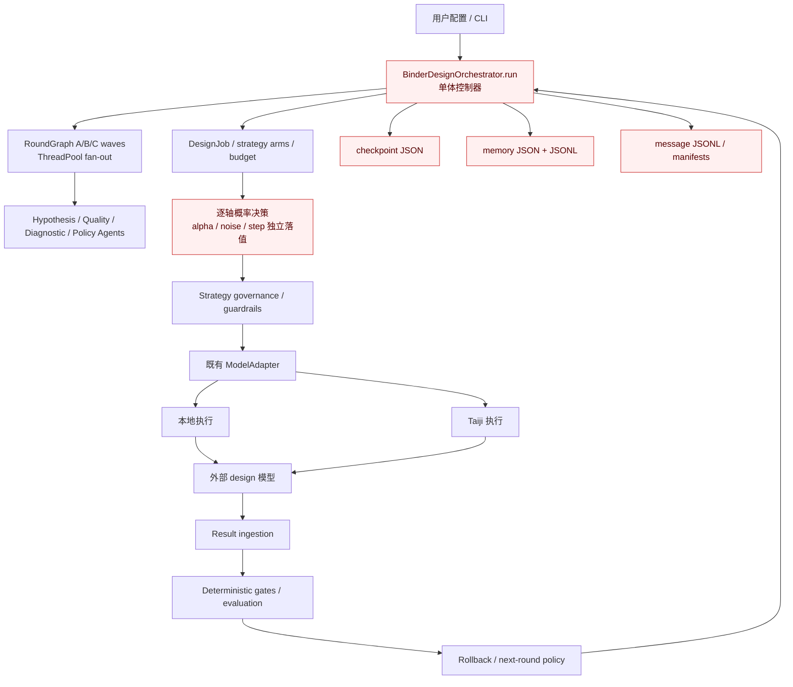
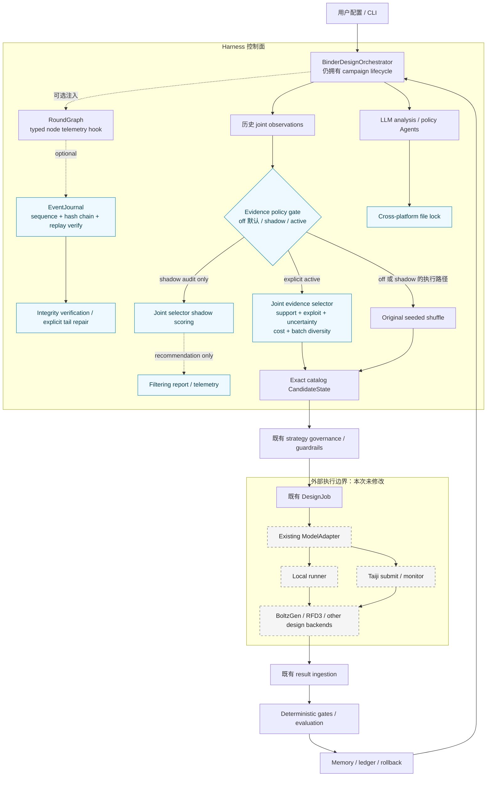

# binder-harness 代码优化与 Harness 架构工作报告

日期：2026-08-23  
状态：代码优化已实现，定向验证完成；设计质量收益仍需冻结 benchmark 实证  
关联方案：[Harness 架构与 Loop Agent 优化计划](harness_architecture_and_loop_agent_optimization_plan_2026-08-23.md)

## 1. 结论

本次优化不改动任何 binder design 外部模型的适配器、命令构造、参数到命令的映射、本地执行入口或 Taiji 提交流程。修改集中在三个 Harness 控制面问题：

1. 消除 Windows 上 `fcntl` 顶层导入导致的运行时不可用，并建立统一的跨平台进程锁；
2. 增加类型化、可校验、可 replay-verify 的 append-only 事件日志，为后续 durable runtime 提供可选遥测基础；
3. 为 sampler fallback 增加显式 gated 的联合参数证据选择：完整参数向量、最小支持、探索/利用、成本与批内多样性共同决定候选；默认 `off` 保留旧行为，另提供 `shadow` 与显式 `active` 模式。

当前系统可以称为 **Harness**，但更准确的成熟度描述是“已有真实闭环能力的中期 Harness，而非完成态 durable Harness”。它的核心不是 Agent 数量或图拓扑，而是 Orchestrator 对 campaign 生命周期、外部执行、权威结果、约束、评价、预算、恢复和下一轮反馈的所有权。`RoundGraph` 和多个专职 Agent 只是 Harness 内部的一种策略实现。

本次代码优化消除了一个 Windows 平台阻断，保护新增 journal 与 LLM 请求锁的并发临界区，并为联合参数实验提供了 fail-closed 策略组件；它没有把既有 checkpoint/memory/message JSONL 变成单一并发安全事实源，也不能据此声称 binder 设计质量已经提升。质量收益必须通过冻结任务集、严格 matched baseline、多 seed/重复、成本归一化和独立 evaluator 验证。

## 2. 范围与不变量

### 2.1 隔离边界

执行期间遵守工作区 `AGENTS.md` 与 `AvoidRead.txt`：隔离清单中的路径没有被打开、列举、检索、总结、修改，也没有通过全量测试或动态 glob 间接访问。

### 2.2 外部模型调用不变量

以下行为保持不变：

- `DesignJob` 的字段和构造方式；
- BoltzGen、RFD3 等 adapter 的 `build_command()` 与 `expected_outputs()`；
- sampler 最终状态到既有 search profile/adapter 参数的物化路径；
- 本地任务启动、Taiji submit/poll/collect 和 CLI 路由；
- 外部模型输出目录及结果摄取合同。

因此，本次变化不会改变“如何启动一次 design 任务”。默认配置下 fallback 数值选择也保持原 seeded shuffle；只有用户显式启用 `active` 后，Harness 才会在既有合法参数目录中采用联合证据排序。

## 3. 优化前的系统运行架构



优化前已经具备完整的 `propose → execute → observe → evaluate → revise` 循环、硬约束、baseline arm、回退和跨轮记忆，因此并不是一个只会传消息的 Agent 图。主要问题是：

- 7,500 行以上的 Orchestrator 同时承担状态机、调度、恢复、策略和持久化；
- `RoundGraph` 有节点/波次声明，但没有 durable transition 或可验证事件链；
- 多个 JSON/JSONL 表面互相重叠，尚无单一事实源；
- LLM request lock 依赖 POSIX `fcntl`，Windows 在 import/测试收集阶段失败；
- sampler 的 LLM 概率按轴独立落值，无法直接表达参数组合的交互；
- deterministic fallback 虽然在完整联合目录中抽样，但不利用历史证据、支持度、成本或批内多样性。

## 4. 已实施的代码优化

### 4.1 跨平台进程锁

新增 [`file_lock.py`](../binderloop/file_lock.py)，提供单一 `exclusive_file_lock()`：

- POSIX 使用惰性导入的 `fcntl.flock`；
- Windows 使用惰性导入的 `msvcrt.locking`，以非阻塞尝试和固定轮询间隔等待锁；
- 使用专用单字节 sidecar lock file；
- context 退出或异常时可靠释放；
- 不配置锁路径时保持原 no-op 行为。

该锁不可重入且当前没有 timeout；持锁代码必须短小、不得递归获取同一路径。释放失败不会遮蔽临界区中原本的异常。timeout/cancellation 与 owner diagnostics 留待后续 runtime 阶段实现。

[`llm.py`](../binderloop/llm.py) 删除了顶层 `fcntl`，`_endpoint_request_lock()` 委托统一锁原语。`ModelEndpoint.request_lock_path`、请求格式、重试、endpoint 选择和 LLM 调用流程均未改变。

这项变化的直接价值不是提高代理指标，而是避免平台差异和并发错误被误记为科学失败，保护闭环证据的有效性。

### 4.2 类型化 Harness Event Journal

新增 [`harness/contracts.py`](../binderloop/harness/contracts.py) 与 [`harness/event_journal.py`](../binderloop/harness/event_journal.py)：

- `HarnessEventType` 与 frozen event envelope；payload 在构造时被复制为 JSON 值，replay 后仍是普通可变 `dict/list`，内容 hash 可用于复验；
- run-scoped、从 1 开始的连续 sequence；
- canonical JSON 和逐事件 SHA-256；
- `previous_hash` 组成 hash chain；
- append、flush、file `fsync`，在支持的平台同步新目录项；
- 线程锁与统一跨进程锁；
- replay 时验证 schema、run ID、sequence、event hash 和 hash link；
- 区分完整记录损坏与 torn tail；
- 断尾只允许显式 `repair_truncated_tail()`，完整但被篡改的记录绝不自动修复。

[`round_graph.py`](../binderloop/orchestration/round_graph.py) 增加可选 `event_recorder` 与 `event_context`。显式启用时，节点产生 `started/succeeded/failed` 事件；失败事件只记录异常类型，不把异常正文或潜在敏感内容写入日志。recorder 失败被隔离到 `WaveResult.telemetry_errors`，不会阻止节点执行、丢弃已成功输出或遮蔽节点原异常。默认 `event_recorder=None`，旧调用语义保持不变。

这是一层可用的 durable telemetry 基础，但还不是全系统单一事实源。当前 Orchestrator 仍构造 `RoundGraph()`，没有默认注入该 journal；checkpoint、memory 和 message JSONL 也未迁移。当前 append 为保证一致性会在每次写入前全量 replay 并逐次 `fsync`，累计复杂度约为 O(N²)；hash chain 能发现链内内容改写/中段删除，却不能在没有外部锚点时证明完整尾部未被删除。后续应先增加增量 tail checkpoint/外部锚、run identity、lease 和 stage transition 合同，再考虑让它成为权威 journal。

### 4.3 联合参数证据策略

[`parameter_decision.py`](../binderloop/parameter_decision.py) 新增 `JointParameterEvidence`、`JointSelectionPolicy`、`JointCandidateScore`、`joint_parameter_evidence_from_rounds()`、`joint_candidate_scores()` 和 `select_joint_parameter_states()`。`deterministic_sampler_states()` 增加可选的 `evidence/policy/selected` 参数；调用者不传 evidence 时仍进入原 seeded shuffle 分支。

- 候选始终是有限目录中的完整 `ParameterCandidate`，禁止插值和逐轴拼出目录外状态；
- 先应用现有物理边界、步长/比例惯性和 current-state 排除；
- 历史证据按完整参数向量聚合，避免把一个轴的边际相关误当成联合因果；
- exploitation 的重复数、trial 门槛和 posterior rank 都只使用带同轮 control 的 challenger rows；未配对 observation 只进入探索统计；
- uncertainty 只作为一个 acquisition 项，不覆盖 greedy/random baseline；
- cost 项防止高成本候选仅因样本少而长期占优；
- 当受支持的 exploitation 候选超出剩余成本预算时，selector 降级填充可负担的 exploration 候选，而不是提前返回不足 batch；
- diversity 项按参数轴距离逐个构造 batch，降低重复探索；
- current/baseline 由上层既有 baseline arm 保留，fallback 不重复生成 current state；
- 没有可用历史证据时，继续使用原先基于固定 seed 的 deterministic shuffle，保持兼容和可复现。

默认支持门要求至少 2 个同轮 control-group challenger 重复、4 个 matched-row trial、2 个含 control 的 comparison group，且 challenger Wilson 下界减 control Wilson 上界不小于 0。这里的实现只证明“same-target/same-round control group”，尚未证明 backend/fidelity/evaluator/预算都严格匹配，因此不能把它等同于完整 paired experimental design。未配对 observation 可以贡献探索统计，但不能改变 support gate 或 exploitation posterior；重复 ID 内容冲突会直接拒绝。

证据提取采用 fail-closed 归因：分支结果必须精确匹配 `branch_id`；只有 arm 唯一时才兼容旧 arm-level aggregate；共享 arm 的 branchless jobs 不能复用一个 outcome；缺少 terminal status 时必须存在完整 requested/completed accounting；partial/confounded/out-of-catalog rows 被拒绝。

[`orchestrator.py`](../binderloop/orchestration/orchestrator.py) 只在 `_deterministic_sampler_fallback_jobs()` 接入该策略，并通过 `owner.parameter_decision.joint_evidence_fallback_mode` 控制：

- `off`（默认）：不读取 active memory，继续原 seeded shuffle，job 参数与选择顺序保持兼容；
- `shadow`：读取并评分兼容 evidence，但实际仍执行 seeded shuffle；提取或评分异常只记录 sanitized error type，不能阻断 job 生成；
- `active`：显式采用联合 selector，证据损坏按 fail-closed 阻断。

非 `off` 模式先检查 active-memory header 的 `target_memory_key`，再逐 job 校验 target artifact digest、parameter catalog digest、design model、sequence tool 和 refold tool provenance。该边界允许兼容的同 target 跨 run 证据，不是 current-run isolation；当前仍未绑定 evaluator/fidelity/预算版本。成本使用 completed/requested budget 或 trial 数作为代理，不是 GPU-hours 的真实成本。

该策略不修改 adapter，也不修改最终参数物化规则。它只对“需要填补分支宽度的 sampler fallback 候选”排序；主路径的 per-axis LLM logprob 决策尚未被替换。

当前 evidence 的质量信号是 per-arm `successes/trials`，尚未包含独立的连续质量 effect；memory header 的 `target_memory_key` 也是逻辑身份键，job-level `target_identity_digest` 才提供结构内容身份检查。它们仍是第一版边界：前者优化通过率证据而非全部质量维度，后者尚不能替代带 run/model/evaluator/fidelity 全版本的不可变 evidence identity。

## 5. 优化后的系统运行架构



图中蓝色节点为本次新增或强化能力；虚线灰色节点是明确冻结、没有修改的外部 design 执行边界。

## 6. Harness 与常规 Multi-Agent 的本质区别

| 维度 | Harness | 常规图式 Multi-Agent 工作流 |
|---|---|---|
| 核心对象 | campaign、环境状态、action/observation、artifact、budget | Agent、消息、节点和路由边 |
| 权威状态 | Harness/runtime 持有，Agent 只能通过合同观察或提案 | 经常分散在各 Agent 上下文或共享 graph state |
| 环境循环 | Harness 决定何时执行、观察、重试、停止、恢复 | graph 通常只决定下一个 Agent/节点 |
| 动作落地 | 类型化工具/adapter、约束、幂等和资源治理 | Agent 输出常直接成为下游输入或工具调用 |
| 评价 | 环境/确定性 evaluator 是权威，Agent 自评仅为补充 | 常依赖 critic、vote 或 supervisor 聚合 |
| 失败语义 | 区分执行失败、科学退化、超时、取消、损坏和预算耗尽 | 常被折叠成节点异常或空消息 |
| 长程能力 | checkpoint、replay、artifact provenance、rollback | 主要依赖对话历史或 graph checkpoint |
| 多 Agent 地位 | 可选策略组件，可以是 0、1 或多个 | 系统定义通常以多个 Agent 的协作为前提 |

最简单的判别法是：

- 如果移除 Hypothesis、Quality、Diagnostic 等 LLM specialist，换成确定性模块，binder-harness 仍能组织 job、启动外部执行、摄取结果、评价、回退并进入下一轮；
- 如果移除 Orchestrator、执行合同、结果摄取、评价、budget、memory 和 rollback，只保留 Agent 图，系统就不再能完成可验证的 binder design campaign。

因此，本系统的多 Agent 图是 **Harness 内部的推理/分析策略**，不是系统本体。

### 6.1 为什么当前系统已具备 Harness 资格

当前实现已经满足 Harness 的关键最小条件：

1. Orchestrator 而非 LLM 拥有环境交互循环；
2. `DesignJob` 与 adapter 隔离了 Agent 意图和真实外部命令；
3. 有确定性 gate、core objective 和结果摄取，不把 Agent 叙述当真值；
4. 有预算、轮次、branch lineage、baseline、rollback 和跨轮 memory；
5. 参数只能从有限目录和 guardrail 后的 final state 落地；
6. 执行失败与科学回退已有区分；
7. 本次新增的 event contract、replay verifier 与跨进程锁为后续 durable 化提供了明确原语；其中 EventJournal 尚未默认接管 Orchestrator。

### 6.2 为什么还不是成熟 Harness

仍缺少以下生产级边界：

- immutable run identity 覆盖代码、依赖、模型/权重、prompt/skill 和 evaluator 版本；
- out-dir lease、fencing token 与外部提交 idempotency；
- stage-level durable state machine 和远程 reconciler；
- 单一 transactional RunStore；
- clean reproduction 与独立 judge 环境；
- 全链路 cost/resource telemetry；
- frozen/hidden benchmark 驱动的 Harness 外循环晋升门。

因此应称为“真实但尚未完成 durable 化的 Harness”，而不是把现有 `RoundGraph` 本身误称为 Harness runtime。

## 7. 从 binder 设计质量出发的优化策略

### 7.1 首要问题：把参数调节当成实验设计，而不是逐轴投票

逐轴独立概率容易忽略联合效应：每个单轴变化看起来合理，组合后却可能不可归因或落在历史从未支持的区域。本次联合 selector 先解决 fallback 的完整向量选择；下一步应让主参数决策也接受 joint posterior 或 joint surrogate，而不是只从边际分布拼接最终状态。

建议把 LLM 限定为 hypothesis/prior：它可以提出“探索哪个参数族、方向或交互”的理由，但数值候选由 constraint compiler 与 joint optimizer 从合法目录中选择。LLM 不应成为数值优化器或 evaluator。

### 7.2 每轮保留 matched control 与重复

每个 challenger 至少与同轮、同 backend 版本、同 fidelity、相近资源预算的 baseline 比较。基础设施失败记作 missing/censored observation，不能算科学失败。高价值候选应独立重复；低价值候选可 sequential elimination。

推荐最小统计记录：

- completed/requested trial 数；
- success rate 与 Wilson interval；
- core objective effect size 及 uncertainty；
- backend/model/evaluator 版本；
- seed 或不可控随机性说明；
- cost、wall-clock、GPU-hours；
- candidate lineage 和完整参数向量。

### 7.3 保留 hard gates，再引入 Pareto archive

现有 `gate-first` 字典序目标值得保留：硬约束失败不能被某个高代理分数补偿。在通过硬 gate 的候选中，再维护非支配集合，而不是过早压成单一 reward。建议 archive 维度至少包括：

- 质量主指标；
- 鲁棒性/重复一致性；
- 多样性与新颖性；
- 计算成本；
- evaluator uncertainty；
- 与 baseline 的可归因改变量。

最终 promotion 可以用明确的 preference policy 从 Pareto set 选取，archive 本身不丢失权衡信息。

### 7.4 引入 fidelity ladder

将现有多个生成、检查和评价步骤表达为统一的 candidate promotion：

```text
F0 schema / capability / cheap deterministic checks
  → F1 low-cost generation or reduced budget probe
  → F2 standard design execution + deterministic gates
  → F3 independent rerun / higher-cost validation / replicate
  → F4 human-approved downstream validation
```

预算按预期信息增益、成功概率、成本和多样性分配；未通过低 fidelity 的候选不应消耗高成本执行。

### 7.5 校准不确定性，而不是迷信不确定性

ALDE 展示了 batch active learning 在具有联合效应的特定实验空间中的价值，但 Greenman 等人的系统 benchmark 发现没有一种 UQ 方法在所有数据/划分/指标上占优，uncertainty-based BO 也经常不能超过 greedy。因此：

- 同时保留 greedy、random、UCB/Thompson 等可比较策略；
- 在历史 campaign 上做 calibration、coverage、rank-correlation 和 OOD 分层；
- acquisition policy 作为可版本化组件做 ablation；
- uncertainty 高不等于候选好，只代表需要谨慎解释或可能有信息价值；
- 当 uncertainty calibration 退化时，自动降低其权重或退回 deterministic/random baseline。

### 7.6 evaluator 与 generator 隔离

评价应优先使用确定性、版本化指标，并只读 immutable artifacts。生成器的自由文本理由不得进入评分输入。LLM critic 只提供解释或异常归因，并需在人工标注集上校准。高分 candidate 是 lead，不是已经验证的 binder。

### 7.7 停止、回退与质量门

建议同时满足以下信号之一才继续扩张搜索：

- posterior probability of improvement 高于阈值；
- Pareto hypervolume 或 best-so-far 有稳定边际增益；
- 新候选显著增加可行域/多样性信息；
- 复验能实质降低关键不确定性。

当连续若干轮边际收益不足、失败率升高、diversity collapse 或 evaluator disagreement 增大时，应停止、回退到已验证分支或切换 acquisition policy，而不是仅增加 Agent 或 token。

### 7.8 把“binder 质量”拆成分层合同

单一 interface proxy 不应等同于最终 binder 质量。[BindCraft, Nature 2025](https://www.nature.com/articles/s41586-025-09429-6) 报告 AF2 `i_pTM` 对 binding activity 是有用的二分类信号，但不与 affinity 直接相关，并观察到 AF3 filtering 仍有较多 false positives；作者因此指出正交 physics-based scoring 的价值。[Improving de novo protein binder design with deep learning, Nature Communications 2023](https://www.nature.com/articles/s41467-023-38328-5) 则显示 monomer/complex 一致性、pLDDT、interface PAE 和 Rosetta ddG 在回顾数据中提供不同的判别信息。这些结果支持多层 evaluator，而不是简单增加同类 proxy。

建议将当前质量合同拆为：

1. **可执行与身份门**：目标 artifact/chain/hotspot 身份、输出完整性、预算完成度、无基础设施失败；
2. **结构硬门**：binder fold 自洽、interface 几何、clash/contact、设计结构与独立 refold 的偏差；任何一项失败都不能由高综合分补偿；
3. **正交排序层**：interface confidence/PAE、能量或几何互补、hotspot 覆盖、模型间一致性；按 target 和 evaluator 版本分别校准，不能把 `i_pTM` 解释成 affinity；
4. **鲁棒与特异性层**：target 构象 ensemble、随机 seed/独立 rerun、预先定义的 off-target/negative controls，以及 epitope/sequence/structure diversity；
5. **可开发性与实验层**：表达/折叠、聚集或非期望表面性质、稳定性、真实 binding/affinity/功能读数。计算高分只能晋升为待验证 lead。

在实现上，每个 evaluator 输出 `value + uncertainty + version + artifact_refs + applicability`，Harness 先过硬门，再更新 Pareto archive。generator 与 evaluator 使用相同模型家族时要标记 correlated evidence，不能把多个相关分数误算成多份独立证据。[RFdiffusion, Nature 2023](https://www.nature.com/articles/s41586-023-06415-8) 的实验验证同样说明，计算过滤可显著富集成功候选，但实验测量仍是最终校准来源。

## 8. 前沿文献综合与本项目迁移判断

### 8.1 高可信、可直接迁移的系统规律

| 证据 | 主要结论 | 对本项目的迁移 |
|---|---|---|
| [SWE-agent, NeurIPS 2024](https://proceedings.neurips.cc/paper_files/paper/2024/hash/5a7c947568c1b1328ccc5230172e1e7c-Abstract-Conference.html) | Agent-computer interface 本身决定可执行性和反馈质量 | 保持 adapter/tool contract 类型化，Agent 不直接拼命令 |
| [OpenHands, ICLR 2025](https://openreview.net/forum?id=OJd3ayDDoF) | action/observation event stream、隔离 runtime 与 Agent abstraction 分离 | event-sourced control plane、runtime/strategy 解耦 |
| [BrowserGym/AgentLab, TMLR 2025](https://openreview.net/forum?id=5298fKGmv3) | reset、dependency、trace、replay、cost 与版本是长期实验基础 | 明确 stage reset、保存全轨迹和运行成本 |
| [tau-bench, ICLR 2025](https://openreview.net/forum?id=roNSXZpUDN) | 权威环境状态应与对话分离；重复成功率比单次分数更可靠 | evaluator 读真实 artifact/state；报告多次可靠性 |
| [PaperBench, ICML 2025](https://proceedings.mlr.press/v267/starace25a.html) | rollout、clean reproduction、judge 分离，并单独评价 judge | 生成、重跑、评分三权分立 |
| [ERA, Nature 2026](https://www.nature.com/articles/s41586-026-10658-6) | 可机器评分任务可用树搜索平衡探索/利用，并保留历史分支 | 对完整 parameter/campaign state 建 branch archive，不只追当前最优 |

### 8.2 binder 质量相关证据与张力

| 证据 | 支持的结论 | 限制与本项目处理 |
|---|---|---|
| [Active learning-assisted directed evolution, Nature Communications 2025](https://doi.org/10.1038/s41467-025-55987-8) | batch active learning 可在特定联合效应空间中比局部逐步搜索更有效 | 单一实验系统不能推出所有 binder campaign 都受益；保留 matched baseline 与多策略 ablation |
| [Benchmarking uncertainty quantification for protein engineering, PLOS Computational Biology 2025](https://doi.org/10.1371/journal.pcbi.1012639) | UQ 表现依赖数据、划分和指标；uncertainty BO 常不能超过 greedy | uncertainty 只占 acquisition 一部分，必须校准并与 greedy/random 比较 |
| [EVOLVEpro, Science 2025](https://doi.org/10.1126/science.adr6006) | few-shot、实验反馈驱动的迭代通常优于静态零样本排序 | 不能把不同蛋白任务结果直接外推；本项目只迁移“反馈闭环和小样本更新”原则 |
| [BindCraft, Nature 2025](https://www.nature.com/articles/s41586-025-09429-6) | 计算过滤可取得高实验成功率，但 `i_pTM` 不等同 affinity，单一新模型过滤仍有 false positives | 将 interface proxy、正交评分、鲁棒性/特异性、可开发性和实验结果分层，标记 correlated evaluators |

两组证据并不矛盾：主动学习提供了利用联合效应和反馈的框架，但具体 surrogate、UQ 和 acquisition 必须在当前任务分布上校准。由此得到的工程结论是“联合、可比较、可回退的 selector”，而不是“固定采用某一种 BO/UQ”。

### 8.3 前沿但暂不作为生产依据

- [Agent Systems with Harness Engineering, 2026 survey](https://github.com/RUCAIBox/awesome-agent-harness) 将 action interface、context、tools/skills、orchestration、memory 和 evaluation 视作 Harness 的多层设计空间；它适合作为分类框架，不是效果因果证据。
- [Meta-Harness, arXiv 2026](https://arxiv.org/abs/2603.28052) 表明 raw traces/code/scores 比过度压缩摘要更利于外循环搜索；仍是预印本，且自动改写 Harness 有过拟合和回归风险。
- [Agent Lightning v1.0, arXiv 2026-08-18](https://arxiv.org/abs/2608.17528) 明确定义 deploy-time Harness 拥有环境交互循环、trainer 消费标准化轨迹；发布很新，本项目只迁移 trajectory contract，不引入在线 RL。
- [Towards a Science of Scaling Agent Systems, arXiv 2025/2026](https://arxiv.org/abs/2512.08296) 报告多 Agent 对可并行任务可能有利，但对强顺序任务可能显著退化；因此本项目只并行独立分析波，外部 design 生命周期保持单一控制器。

### 8.4 不建议当前迁移的策略

- 不让 LLM 自动修改生产 Harness 并直接晋升；
- 不用 LLM critic 替代 deterministic evaluator；
- 不因“多 Agent”标签继续拆出更多角色；
- 不对未校准 proxy metric 做无限 tree search；
- 不把生产 campaign 的最终结果反复用作 Harness 外循环调参集；
- 不为了统一接口而改写当前已能工作的外部模型启动逻辑。

## 9. 验证与边界审计

### 9.1 定向测试

新增测试只使用临时目录或纯内存对象，不包含 workspace glob/rglob，也不加载配置目录：

- [`test_file_lock.py`](../scripts/test_file_lock.py)：异常释放、无锁 no-op、真实 spawn 双进程互斥；
- [`test_event_journal.py`](../scripts/test_event_journal.py)：连续 hash chain、线程/双进程并发、内容篡改、torn tail、显式修复和 RoundGraph telemetry；
- [`test_round_graph.py`](../scripts/test_round_graph.py)：并行 wave、节点异常与 recorder 异常隔离；
- [`test_joint_parameter_evidence.py`](../scripts/test_joint_parameter_evidence.py)：完整向量、matched-only support/exploitation、歧义归因拒绝、terminal gate、约束、成本降级、多样性和无证据兼容 fallback；
- [`test_joint_sampler_orchestrator.py`](../scripts/test_joint_sampler_orchestrator.py)：off/shadow/active gate、错误 target、过期执行 context、shadow 故障隔离，以及 audit metadata 不污染执行语义 digest。

白名单测试命令：

```text
python -m pytest -q scripts/test_file_lock.py scripts/test_event_journal.py scripts/test_round_graph.py scripts/test_joint_parameter_evidence.py scripts/test_joint_sampler_orchestrator.py scripts/test_execution_governance.py scripts/test_llm_request_controls.py scripts/test_io_caches.py
```

结果：`84 passed, 14 subtests passed`。此外，`python -m compileall -q binderloop` 和 Orchestrator/EventJournal/JointSelectionPolicy fresh import 均通过。没有运行会动态扫描受限配置/输出的全量测试。

### 9.2 外部调用未改动审计

最终 diff 审计结果：

- `binderloop/models/` 无改动；
- 本地/Taiji execution agent 与 runner 无改动；
- `scripts/run_closed_loop_orchestrator.py` 无改动；
- Orchestrator 只新增 sampler fallback policy gate；默认 `off` 不改变选择，只有显式 `active` 才改变 fallback 排序；
- adapter command、submit、poll、collect、output contract 无 diff；
- `git diff --check` 无 whitespace error，仅报告工作树既有的 LF→CRLF 提示。

### 9.3 不能声称的结果

本次没有运行真实外部 design campaign，也没有访问隔离结果目录。因此不能声称：

- 某个具体指标已经提高；
- 新 selector 在所有 target 上优于旧 random fallback；
- event journal 已经替代现有 checkpoint/memory/message bus；
- 本地或 Taiji 的真实外部任务已由本次环境端到端验证。

## 10. 后续实施顺序

### P0：运行正确性

1. immutable run identity + append-only revision；
2. out-dir lease、fencing token、submit idempotency；
3. ledger/checkpoint 损坏 fail closed；
4. 本地 hard timeout、远程 pending reconciler；
5. Windows CI 和 clean wheel install smoke。

### P1：质量与可归因搜索

1. 将主参数决策升级为 joint posterior，不只改 fallback；
2. matched baseline、重复、effect size/interval 成为一等 contract；
3. candidate fidelity ladder 与预算账本；
4. gate-first + Pareto archive；
5. independent evaluator/reproduction；
6. calibration benchmark：greedy/random/UCB/TS/当前策略统一比较。

### P2：Harness 外循环

1. 冻结 train/dev、hidden/OOD 与 regression campaign；
2. Harness 变体采用不可变 branch archive；
3. shadow → canary → human approval → active；
4. 按质量、成本、可靠性和 OOD 泛化共同晋升；
5. 生产最终 holdout 永不参与反复调参。

## 11. 发布门

EventJournal 与联合 selector 当前都没有成为默认生产决策路径（journal 未注入，selector mode 默认 `off`）。在晋升之前，至少满足：

- journal 改为增量 tail/index，消除当前逐 append 全量 replay 的 O(N²) 路径；10,000+ 事件压力测试无断链，故障注入能区分完整损坏与断尾；
- journal tail hash 写入独立 checkpoint/manifest 或其他外部锚，明确其防护范围；
- Windows/Linux 双进程锁测试稳定；
- 相同 seed + 相同历史产生相同 joint candidate 顺序；
- 无历史时与旧 deterministic fallback 的候选集合/顺序兼容；
- 多 seed frozen benchmark 中，joint selector 的 best-so-far、成功率或成本至少一项显著改善且其他项不退化；
- adapter、local、Taiji contract tests 无回归；
- resume/replay 对 config、code、model/backend、evaluator、fidelity 和 artifact hash 差异 fail closed；
- same-round control 升级为严格 matched contract：预算、fidelity、backend/evaluator 版本一致，并按组估计 effect，而非简单池化 trial。

## 12. 总结

本次改动选择了“先增强 Harness 控制面，再优化联合实验选择”的路径：跨平台锁消除 Windows 阻断并保护明确的临界区；可选事件链让 RoundGraph 节点遥测内容能够校验和 replay-verify；gated 联合 selector 让完整参数组合而非单轴边际成为实验单位，同时默认不改变生产参数选择。它们共同提高的是 **可执行性、可审计性、可归因性和搜索质量上限**，不是已经证明的设计质量收益。

真正的 binder 设计质量提升仍取决于严格的实验设计：matched controls、重复、联合效应、校准不确定性、多保真晋升、Pareto 保留、独立评价和冻结 benchmark。Harness 的职责不是让更多 Agent 讨论，而是把这些规则变成不可绕过、可恢复、可审计的执行系统。
