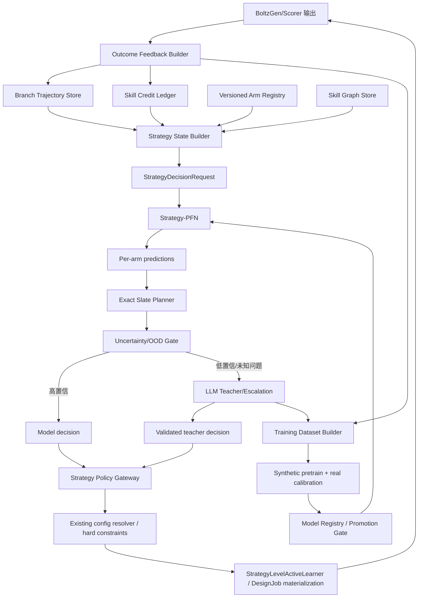

# BinderLoop Strategy-PFN 工程架构与接入方案

## 0. 文档定位

本文设计一种面向 BinderLoop 的轻量策略模型：

> 将当前由 LLM、规则、skills、arm 比较和 rollback 共同完成的
> binder-design strategy improvement algorithm，蒸馏为一个能够读取实验历史、
> 预测各策略结果并选择下一轮策略组合的轻量模型。

本文不是当前仓库的逐行修改清单。当前仓库与实际运行版本存在差异，因此本文重点定义：

1. 后续实现必须满足的数据和接口契约；
2. Strategy-PFN 的模块边界和内部计算；
3. 与现有 Harness 组件的候选接入位置；
4. arms 和 skills 为支持可学习策略需要具备的能力；
5. 从 training-free、shadow mode 到模型控制的渐进上线流程。

具体文件级改造应在实际运行代码同步后，根据本文的功能契约再次映射。

---

## 1. 一句话理解整体方案

当前系统大致是：

```text
实验结果
  -> 多个 LLM/规则 Agent 分析
  -> 比较 arms
  -> 总结和更新 skills
  -> 决定下一轮策略
  -> BoltzGen 生成
```

目标系统是：

```text
实验结果和历史分支
  -> Strategy-PFN 预测所有可用 arms 的结果、风险和信息价值
  -> 约束规划器枚举全部可行的 2/4-arm 组合
  -> 低风险时由小模型决策
  -> 高不确定或新问题时升级到 LLM
  -> 实际结果继续校正模型和 skill credit
```

LLM 不再是每轮必须调用的唯一决策者，而逐步变成：

- 早期的数据教师；
- 新失败模式的分析者；
- 新 skill 的作者和审核者；
- 小模型不确定时的升级处理器；
- 周期性复盘和知识整理的 coach。

真实实验结果始终是最高优先级监督信号。LLM 判断只是软标签，不能覆盖实验事实。

---

## 2. 研究对象的重新定义

### 2.1 Strategy-PFN 学什么

Strategy-PFN 不学习蛋白坐标，也不直接生成 binder。它学习的是：

```text
在某类 target、某个当前配置和某段历史下，
哪个 arm 可能改善哪些指标，
哪个 arm 主要带来探索信息，
哪些 skills 值得相信，
应该选择哪组 2/4 个 arms，
以及什么时候应当 hold、rollback 或请求 LLM。
```

### 2.2 为什么不是简单的 LLM action 模仿

只模仿 LLM 的最终 action 会得到一个行为克隆模型：

```text
history -> imitate(LLM selected arms)
```

它无法判断 LLM 是否选错，也会继承历史 prompt 和 teacher 的偏差。

推荐的 Strategy-PFN 同时学习：

```text
history + candidate arms
  -> per-arm outcome distribution
  -> failure and rollback risk
  -> skill applicability and credit
  -> slate value
```

规划器再根据这些可验证预测选择 action。因此模型有机会在积累真实结果后纠正 teacher。

### 2.3 为什么要建模 branch，而不是普通线性序列

Harness 轨迹并不总是：

```text
R1 -> R2 -> R3 -> R4
```

它可能是：

```text
R1 -> R2 -> R3(regressed)
  \-----------------> R4(branch from R1)
```

如果模型误以为 R4 继承自 R3，就会错误分配策略 credit。Strategy-PFN 必须显式读取：

- 当前 active branch；
- 每轮真实 parent round；
- 被回滚分支；
- sibling arm/branch 摘要；
- best baseline；
- blocked intervention 和 cooldown。

### 2.4 为什么 action 是 slate

每轮实际需要选择 2 或 4 个 arms，而不是单个 winner。当前单一 winner 可以保留为
`anchor_arm`，但不能代表完整决策。

新的 action 应定义为：

```text
StrategySlate = {
  anchor_arm,
  selected_arms,
  per_arm_role,
  per_arm_budget,
  selection_probability,
  score_breakdown
}
```

其中 `per_arm_role` 至少区分：

- `control`：稳定基线；
- `exploit`：当前最高预期收益；
- `explore`：高不确定但可能有价值；
- `repair`：针对主要失败模式；
- `diversify`：补充不同机制的 arm。

---

## 3. 总体架构



### 3.1 必须保持权威的现有控制

Strategy-PFN 初期不应获得以下权限：

- 直接绕过 hard constraints；
- 直接修改 target definition；
- 直接写入未验证的 BoltzGen 参数；
- 直接决定未测量的 biochemical/developability 结论；
- 覆盖 RollbackController 的安全决策；
- 绕过 template provenance；
- 直接发布新 skill 为 active；
- 直接替换生产模型而无 promotion gate。

推荐权责划分：

| 职责 | 权威组件 |
|---|---|
| 预测 arm 结果、排序和组合价值 | Strategy-PFN |
| 枚举和选择可行 slate | ExactSlatePlanner |
| 参数合法值解析 | 现有 parameter/config resolver |
| hard constraint、预算和 provenance | 现有治理模块 |
| rollback、stop 和 exact replay | RollbackController |
| 新 skill 的生成与语义审核 | LLM + SelfImprovementSkillAgent |
| skill 数值 credit | SkillCreditLedger + outcome feedback |
| OOD 或低置信决策 | LLM escalation |

---

## 4. 在线实施逻辑链路

### Step 1：关闭本轮实验并构造真实反馈

输入：

- 每个 arm 的 requested/completed budget；
- 候选指标和结构评价；
- strict positive、near miss 和 other negative；
- execution failure；
- scorer/checkpoint 版本；
- 实际消耗；
- rollback 决策。

输出：

```text
StrategyOutcomeFeedback
```

期望效果：

- 将“计算失败”和“真实质量失败”分开；
- 保留候选集合分布，而不只保留 winner；
- 为 candidate -> arm -> skill 的分层 credit 提供统一事实源。

### Step 2：更新 branch 轨迹

把本轮作为图节点写入 trajectory store，并记录真实 parent、active branch、被丢弃分支和
best baseline。

期望效果：

- 后续模型看到正确的因果顺序；
- rollback 后的新分支不继承错误的最近轮状态；
- 能够训练 branch-aware ablation。

### Step 3：更新 skill 的证据统计

只更新本轮决策前已经存在、且确实暴露给决策器的 skills。区分：

- available；
- retrieved；
- activated；
- cited；
- applied；
- explicitly not used。

期望效果：

- 避免“某 skill 存在于库中”被误认为“该 skill 导致了 action”；
- 支持 exposure-aware credit；
- 防止使用结果产生后的 skill 反向污染本轮训练输入。

### Step 4：构造决策时状态

`StrategyStateBuilder` 生成一个冻结、可哈希、只包含当前可用信息的快照。

期望效果：

- 防止未来信息泄漏；
- 保证离线训练和在线推理使用相同 schema；
- 允许对任意历史 decision 做精确 replay。

### Step 5：枚举当前可用 arms

`ArmRegistry` 输出全部 eligible 和 ineligible arms，并说明不可用原因。

期望效果：

- 模型知道当时真正的候选集合；
- 可以计算 action propensity 和 selection bias；
- template 不可用、blocked、cooldown 等情况不会被错误视为模型未选择。

### Step 6：Strategy-PFN 预测

模型为每个 eligible arm 输出：

- 各核心指标的预测分布；
- strict-positive 概率；
- failure mode 分布；
- rollback 风险；
- epistemic/aleatoric uncertainty；
- 信息增益；
- 相关 skill 权重；
- OOD 分数。

期望效果：

- 将 LLM 的模糊判断变成可校准的结构化预测；
- 可以用真实 outcome 逐项评估，而不仅是评价最终 action 是否一致。

### Step 7：精确 slate 规划

当前 7 arms、宽度 2/4 的组合数最多为：

```text
C(7, 2) + C(7, 4) = 56
```

因此可以枚举全部可行组合，再根据预测收益、风险、探索价值、机制多样性、预算和约束评分。

期望效果：

- 避免为了小动作空间引入不稳定的 PPO/GRPO；
- 输出完整的组合评分分解；
- 区分“最高分单 arm”和“最有价值的组合”。

### Step 8：不确定性门控

当出现以下情况时，小模型应 abstain：

- 新 target 与训练分布距离过大；
- arm catalog 或 feature schema 不兼容；
- ensemble 预测分歧过大；
- 关键输入缺失；
- 所有组合风险过高；
- 新失败模式未被 taxonomy 覆盖；
- 生物化学判断需要当前没有的测量。

此时调用 LLM teacher/escalation，并记录结构化输出。

期望效果：

- 小模型只处理已经学会的常规决策；
- LLM 资源集中在困难和新颖问题；
- 避免为了降低 API 成本牺牲安全性。

### Step 9：接入现有参数和执行链

V1 中 Strategy-PFN 只输出：

- selected arm IDs；
- arm roles；
-排序；
-证据和置信度。

现有 resolver 继续把 arm intent 转换为合法配置，现有 learner 继续物化为 `DesignJob`。

期望效果：

- 将模型决策与配置所有权解耦；
- 当前真实代码变化后仍容易重新接入；
- 可以独立测试策略模型，不需要同步改动 BoltzGen。

### Step 10：结果回流

任务完成后，用 `decision_id` 将预测、执行、outcome、rollback 和 skill exposure 连接起来。

期望效果：

- 形成可训练的闭环样本；
- 支持 teacher imitation、outcome supervision、off-policy weighting 和 calibration；
- 支持模型版本、skill 版本和 arm 版本追溯。

---

## 5. 核心数据契约

以下接口表示功能契约，不要求最终一定使用 Python dataclass；也可以落地为 Pydantic、JSON Schema
或 Protobuf。

### 5.1 StrategyDecisionRequest

```python
@dataclass(frozen=True)
class StrategyDecisionRequest:
    schema_version: str
    decision_id: str
    experiment_id: str
    round_id: int
    decision_timestamp: float

    target_context: TargetContext
    current_config: ConfigSnapshot
    branch_context: BranchContext
    outcome_history: list[RoundObservation]

    candidate_arms: list[ArmInstance]
    skill_snapshot: SkillGraphSnapshot
    hard_constraints: StrategyConstraints

    branch_width: int
    remaining_budget: int

    feature_schema_version: str
    arm_catalog_digest: str
    skill_snapshot_digest: str
    scorer_versions: dict[str, str]
```

关键要求：

- 快照必须在 action 生成前冻结；
- 只能包含当时已经存在的信息；
- 所有可学习字段必须结构化；
- 文件路径只作为 artifact reference，不作为模型语义特征；
- 训练和推理使用同一 state builder；
- request 必须可稳定哈希和 replay。

### 5.2 TargetContext

```python
@dataclass(frozen=True)
class TargetContext:
    target_id: str
    target_family_id: str | None
    sequence_digest: str
    structure_digest: str
    target_length: int
    chain_count: int
    binding_site_features: dict[str, float]
    geometry_features: dict[str, float]
    optional_frozen_embedding: list[float] | None
```

初期应优先使用可解释结构特征。冻结的 ESM/结构编码器 embedding 可作为辅助输入，但不能代替
binding-site、hotspot 和结构质量字段。

### 5.3 BranchContext

```python
@dataclass(frozen=True)
class BranchContext:
    active_branch_id: str
    parent_round_id: int | None
    ancestor_round_ids: list[int]
    best_round_id: int | None
    best_config_digest: str | None
    sibling_branch_summaries: list[dict]
    abandoned_branch_summaries: list[dict]
    blocked_arm_ids: list[str]
    blocked_intervention_digests: list[str]
    cooldowns: dict[str, int]
    last_rollback_action: str | None
```

V1 可仅编码 active path，并把其他分支压缩成固定长度摘要。V2 再使用图注意力直接处理完整分支图。

### 5.4 ArmDefinition 与 ArmInstance

稳定定义和本轮实际实例必须分开。

```python
@dataclass(frozen=True)
class ArmDefinition:
    arm_definition_id: str
    version: str
    family: str
    intent_type: str
    branch_role: str
    parameter_families: list[str]
    action_directions: dict[str, str]
    preconditions: list[str]
    expected_signal_schema: list[str]
    risk_schema: list[str]
    requires_templates: bool
    estimated_cost_class: str


@dataclass(frozen=True)
class ArmInstance:
    arm_instance_id: str
    arm_definition_id: str
    round_id: int
    eligible: bool
    ineligible_reasons: list[str]
    base_config_digest: str
    parameter_delta: dict[str, object]
    effective_intervention_digest: str
    requested_budget: int
    compatibility_tags: list[str]
```

`ArmDefinition` 表示可跨 target 学习的稳定语义，`ArmInstance` 表示这一轮真正执行的参数化动作。

### 5.5 StrategyPrediction

```python
@dataclass(frozen=True)
class ArmPrediction:
    arm_instance_id: str
    metric_distributions: dict[str, DistributionSummary]
    strict_positive_probability: float
    failure_mode_probabilities: dict[str, float]
    rollback_probability: float
    information_gain: float
    epistemic_uncertainty: float
    aleatoric_uncertainty: float
    skill_contributions: list[SkillContribution]


@dataclass(frozen=True)
class StrategyPrediction:
    decision_id: str
    model_version: str
    arm_predictions: list[ArmPrediction]
    state_embedding_digest: str
    ood_score: float
    abstain_reasons: list[str]
```

模型不应直接输出自由文本 config。必要的解释由结构化 score breakdown、skill IDs 和 evidence IDs
构成。

### 5.6 SlatePlan

```python
@dataclass(frozen=True)
class SlateCandidate:
    arm_instance_ids: list[str]
    arm_roles: dict[str, str]
    expected_utility: float
    exploration_value: float
    diversity_value: float
    rollback_risk: float
    estimated_cost: float
    constraint_checks: dict[str, bool]
    total_score: float


@dataclass(frozen=True)
class SlatePlan:
    decision_id: str
    planner_version: str
    ranked_slates: list[SlateCandidate]
    selected_slate: SlateCandidate | None
    selection_probability: float
    sampling_policy: str
    randomization_seed: int
```

必须记录选择概率。否则以后不能可靠进行 off-policy evaluation 或因果 credit 分析。

### 5.7 StrategyPolicyDecision

```python
@dataclass(frozen=True)
class StrategyPolicyDecision:
    decision_id: str
    mode: str  # rules | teacher | shadow | assist | control
    source: str  # rule | bandit | model | llm_escalation
    selected_arm_instance_ids: list[str]
    anchor_arm_instance_id: str | None
    arm_roles: dict[str, str]
    accepted_evidence_ids: list[str]
    applied_skill_ids: list[str]
    model_version: str | None
    teacher_trace_id: str | None
    confidence: float
    abstained: bool
```

### 5.8 StrategyOutcomeFeedback

```python
@dataclass(frozen=True)
class StrategyOutcomeFeedback:
    decision_id: str
    execution_round_id: int
    executed_arm_instance_ids: list[str]
    per_arm_outcomes: list[ArmOutcomeObservation]
    execution_failures: list[ExecutionFailure]
    rollback_action: str
    next_branch_id: str | None
    total_compute_cost: float
    outcome_schema_version: str
    scorer_versions: dict[str, str]
```

每个 `ArmOutcomeObservation` 至少包含：

- requested/completed budget；
- strict successes/trials；
- margin 分布和分位数；
- core rank key；
- positive/near-miss/negative 数量；
- failure taxonomy；
- execution status；
- baseline/control linkage；
- confounders；
- artifact/evidence IDs。

### 5.9 TeacherTrace

```python
@dataclass(frozen=True)
class TeacherTrace:
    teacher_trace_id: str
    decision_id: str
    teacher_role: str
    teacher_model: str
    prompt_version: str
    candidate_arm_ids: list[str]
    structured_decision: dict
    accepted_evidence_ids: list[str]
    validated: bool
    fallback_used: bool
    output_schema_version: str
```

蒸馏只依赖可验证的结构化 decision、evidence 和简短 rationale，不依赖模型私有或不可复现的隐藏
chain-of-thought。

---

## 6. 新增工程模块

建议新增独立包：

```text
binderloop/
  strategy_learning/
    contracts.py
    state_builder.py
    trajectory_store.py
    feature_schema.py
    teacher_recorder.py
    feedback.py
    skill_graph.py
    skill_credit.py
    model.py
    encoders.py
    planner.py
    uncertainty.py
    policy_gateway.py
    model_registry.py
    dataset.py
    evaluation.py
    synthetic/
      target_prior.py
      arm_effect_prior.py
      outcome_model.py
      skill_dynamics.py
      branch_dynamics.py
      behavior_policies.py
      simulator.py
      oracle.py
    training/
      losses.py
      pretrain.py
      calibrate.py
      distill.py
      offline_eval.py
```

以下逐一说明模块职责。

### 6.1 StrategyStateBuilder

输入：

- `ExperimentMemory`/ledger；
- 当前 round artifacts；
- normalized config；
- arm registry；
- skill snapshot；
- scorer/version metadata。

输出：

- `StrategyDecisionRequest`；
- `state_build_report.json`；
- 缺失字段和默认值报告。

内部计算：

1. 截断到 decision timestamp；
2. 恢复真实 branch ancestry；
3. 聚合每个历史 arm 的候选结果分布；
4. 标准化连续指标；
5. 构造 missingness mask；
6. 绑定 feature、arm、skill 和 scorer 版本；
7. 生成稳定 digest。

接入点：

- 当前 round evaluation、rollback 完成后；
- candidate arms 排序之前。

期望效果：

- 统一在线和离线输入；
- 消除数据泄漏；
- 使任意历史 decision 可重放。

### 6.2 BranchTrajectoryStore

输入：

- `StrategyOutcomeFeedback`；
- rollback/replay/branch decision；
- parent round 和 parent config。

输出：

- append-only trajectory node；
- active-path view；
- branch graph view；
- side-branch summaries。

内部计算：

- branch graph 去重和 parent 校验；
- execution failure 与 quality regression 分离；
- best baseline 链接；
- abandoned/cooldown 状态；
- active path materialization。

接入点：

- 可扩展当前 `ExperimentMemoryStore`；
- 也可独立保存为 `strategy_trajectory.jsonl`，再由 memory 引用。

期望效果：

- 不再依赖“round_id 相邻等于父子关系”的错误假设；
- 支持 branch-aware model 和审计。

### 6.3 VersionedArmRegistry

输入：

- 稳定 arm definitions；
- 当前 config 和 target 条件；
- template、blocked、cooldown 和预算状态。

输出：

- 全部 `ArmInstance`；
- eligibility report；
- arm catalog digest；
- compatibility/diversity matrix。

内部计算：

- definition 与 instance 分离；
- precondition 检查；
- parameter delta 规范化；
- effective intervention digest；
- cost 估计；
- 单因素变化计数；
- compatible slate 约束。

接入点：

- 可由当前 `CANONICAL_STRATEGY_ARM_CATALOG` 演进；
- `candidate_arms()` 应逐步只负责 eligibility/materialization，不再同时承担最终策略排序。

期望效果：

- action 语义稳定；
- 允许模型跨代码版本和 target 学习；
- 使 arm 选择偏差可计算。

### 6.4 SkillGraphStore

输入：

- versioned skill definitions；
- semantic relations；
- arm/failure/phenotype 关联；
- skill lifecycle。

输出：

- `SkillGraphSnapshot`；
- 与当前 decision 相关的子图；
- snapshot digest。

节点类型建议：

- skill definition；
- arm definition/family；
- failure phenotype；
- target phenotype；
- parameter family。

边类型建议：

- equivalent/subsumes/complementary/contradictory/distinct；
- supports_arm；
- contraindicates_arm；
- triggered_by_failure；
- predicts_signal；
- observed_with；
- validated_on_target_family。

接入点：

- 当前 skill document 可继续保存语义规则；
- 派生图和模型数值状态应单独存储，避免模型直接重写 canonical skill。

期望效果：

- 将零散文字经验变成可计算关系；
- 为 skill retrieval、credit 和 MoE gating 提供结构。

### 6.5 SkillCreditLedger

输入：

- skill exposure；
- arm selection propensity；
- `StrategyOutcomeFeedback`；
- baseline/control outcome；
- target family 和 confounders。

输出：

- 每个 skill 的 posterior credit；
- uncertainty；
- attribution status；
- promotion/demotion recommendation；
- credit update audit。

内部 credit 分三层：

1. **Applicability credit**：该 skill 是否适用于当前状态；
2. **Predictive credit**：使用它是否改善了 outcome 预测；
3. **Causal credit**：是否有随机、匹配或受控证据支持其实际效果。

建议不要继续只使用一个 `utility` 标量。至少保存：

```text
exposure_count
applied_count
support_count
contradiction_count
posterior_mean
posterior_uncertainty
target_family_coverage
attribution_status
last_updated_round
```

接入点：

- 当前 self-improvement lifecycle 之后增加数值 credit 层；
- `UPVOTE/DOWNVOTE` 可由 ledger 提供建议，但仍需治理门执行。

期望效果：

- 避免高频但无效的 skill 被不断强化；
- 区分相关性和因果证据；
- 支持跨 target promotion。

### 6.6 TeacherRecorder

输入：

- 各 LLM Agent 的结构化 request/response；
- deterministic fallback；
- schema validation 结果；
- accepted/rejected evidence。

输出：

- `TeacherTrace`；
- role-specific distillation labels；
- teacher consistency report。

内部计算：

- 只保留 closed-catalog 和有效证据引用；
- 记录 prompt/model/schema 版本；
- 将不同 Agent 输出映射到统一标签：
  - failure classification；
  - arm ranking；
  - history conflict；
  - final hold/select；
  - skill operation；
  - uncertainty/escalation。

接入点：

- 包装当前 LLM agents，而不是在每个 Agent 内重复实现训练日志。

期望效果：

- 将现有 API 成本转化为长期训练资产；
- 可以比较不同 teacher 和 prompt；
- 不依赖不可验证的自然语言推理过程。

### 6.7 SyntheticStrategySimulator

输入：

- target prior；
- arm effect prior；
- noise prior；
- skill dynamics；
- rollback policy；
- behavior policy；
- episode length/budget。

输出：

- 合成 `StrategyDecisionRequest`/`StrategyOutcomeFeedback` 序列；
- 完整 latent ground truth；
- oracle slate；
- branch graph。

内部模拟变量建议：

```text
target latent:
  site_alignment_sensitivity
  context_dependence
  sampler_exploration_need
  template_reusability
  off_patch_tendency
  length_preference
  foldability_difficulty
  observation_noise

arm latent:
  base_effect_vector
  target_interaction_vector
  failure_mode_effect
  information_value
  cost
  nonstationarity

skill latent:
  correctness
  applicability_scope
  delayed_effect
  contradiction_probability
  decay
```

每个 synthetic episode 应随机混合多种 behavior policy：

- current-rule-like；
- random exploration；
- contextual bandit；
- teacher-like noisy policy；
- oracle；
- partially adversarial/suboptimal policy。

不能只生成 oracle 轨迹，否则模型无法学习如何从失败或次优历史恢复。

期望效果：

- 在真实轨迹不足时预训练“如何从实验历史中学习”；
- 覆盖真实数据中罕见的 rollback 和分支情况；
- 为新 target 提供合理的 few-shot adaptation prior。

### 6.8 SyntheticOraclePlanner

输入：

- simulator latent ground truth；
- 当前 state；
- eligible arms；
- budget 和风险约束。

输出：

- oracle arm outcome；
- oracle slate；
- expected regret；
- oracle information gain。

用途：

- 给 synthetic pretraining 提供策略标签；
- 评价 Strategy-PFN 是否学到近似推断算法；
- 区分 outcome prediction 能力和 planning 能力。

### 6.9 StrategyPFN

推荐 V1 规模：

```text
hidden size: 96-192
arm/candidate set layers: 1-2
trajectory layers: 2-4
skill graph layers: 1-2
trainable parameters: approximately 1-3M
```

模型内部建议分为六部分。

#### A. TargetEncoder

输入 target 结构化描述和可选冻结蛋白 embedding，输出 target context token。

#### B. ArmInstanceEncoder

编码 arm definition、parameter delta、eligibility、cost 和历史统计。

#### C. Candidate/ArmOutcomeSetEncoder

候选顺序没有语义，因此使用 Deep Sets 或 Set Transformer，将候选集合压缩为 arm outcome token。

#### D. RoundSetEncoder

将一轮内的多个 arm tokens 聚合为 round token，同时保留 per-arm 表征供预测头使用。

#### E. BranchAwareTrajectoryEncoder

V1：

- active path 使用 causal Transformer/GRU；
- parent round 使用显式 embedding；
- side branches 使用 pooled summary。

V2：

- 使用 graph attention 在 branch DAG 上传递消息。

#### F. SkillGraphEncoder

对当前相关 skill 子图做关系注意力，并输出：

- skill embeddings；
- state-conditioned applicability gate；
- sparse skill contributions。

#### G. PredictionHeads

至少包括：

- metric distribution head；
- strict-positive beta/binomial head；
- failure multi-label head；
- rollback head；
- arm ranking head；
- information-gain head；
- skill applicability/credit head；
- teacher action imitation head；
- OOD/uncertainty head。

期望效果：

- 一个共享表征同时覆盖结果预测、策略选择和 skill credit；
- 通过多任务监督提高小数据效率；
- 每个输出都可以独立验证和消融。

### 6.10 ExactSlatePlanner

输入：

- `StrategyPrediction`；
- candidate arms；
- branch width；
- hard constraints；
- exploration schedule；
- control policy。

输出：

- `SlatePlan`。

内部计算：

1. 枚举全部可行组合；
2. 剔除 precondition、blocked、cooldown 和预算不合法组合；
3. 计算每个组合的：
   - exploitation utility；
   - uncertainty bonus；
   - information gain；
   - mechanism diversity；
   - rollback risk；
   - cost；
   - control coverage；
4. 对候选 slate 排序；
5. 按配置选择 greedy、softmax、Thompson 或 epsilon exploration；
6. 记录真实 selection probability。

多目标指标应保留向量或 lexicographic/Pareto 关系，不能为了方便训练随意压成一个不可解释的
reward。若需要 planner scalar score，应完整记录 score breakdown。

期望效果：

- 充分利用小型动作空间；
- 决策可解释和可复现；
- 为 bandit、PFN 和规则提供统一 planner，避免比较不公平。

### 6.11 StrategyPolicyGateway

输入：

- rule/bandit decision；
- model prediction 和 slate；
- teacher decision；
- uncertainty/OOD；
- deployment mode。

输出：

- 最终 `StrategyPolicyDecision`；
- source 和 fallback audit。

建议支持：

```text
rules_only
teacher_only
shadow
assist
partial_control
model_control
```

行为定义：

- `shadow`：模型只记录建议；
- `assist`：模型结果作为 LLM/规则的附加 evidence；
- `partial_control`：模型控制一个 slot；
- `model_control`：模型控制完整 slate，但仍受硬约束和 escalation gate 管理。

期望效果：

- 同一接口支持研究对照和生产渐进上线；
- 任意模型故障都能回退；
- 不需要在 orchestrator 中散布大量 mode 分支。

### 6.12 StrategyFeedbackBuilder

输入：

- decision request；
- policy decision；
- materialized jobs；
- ingested results；
- evaluation；
- rollback。

输出：

- `StrategyOutcomeFeedback`；
- joined training sample；
- data-quality report。

内部计算：

- decision/job/arm identity join；
- requested/completed denominator；
- scorer version consistency；
- candidate population aggregation；
- confounder detection；
- execution failure masking；
- baseline linkage。

### 6.13 DatasetBuilder

建议输出三类数据：

```text
strategy_decisions.parquet
strategy_arm_outcomes.parquet
strategy_skill_exposures.parquet
```

同时保留 branch graph 和大对象引用：

```text
strategy_trajectories.jsonl
artifact_index.jsonl
```

切分必须按 target family，而不是按 candidate 或 round 随机切分。

### 6.14 ModelRegistry 与 PromotionGate

注册内容：

- model weights；
- feature schema；
- arm catalog digest；
- skill schema；
- training dataset manifest；
- target-family split；
- calibration parameters；
- offline metrics；
- promotion certificate。

promotion 至少检查：

- schema 兼容；
- held-out target family 非退化；
- uncertainty calibration；
- rollback 风险非退化；
- hard constraints 100% 通过；
- shadow mode 稳定；
- fallback 可用；
- scorer independence。

期望效果：

- 模型更新可审计和回滚；
- 避免因反复试验同一验证集产生 adaptive overfitting。

### 6.15 GeneratorControlBridge，后续阶段

Strategy-PFN 通过验证后，再增加：

```python
class GeneratorControlRequest:
    decision_id: str
    strategy_state_embedding: list[float]
    selected_arm_roles: dict[str, str]
    skill_mixture: dict[str, float]
    adapter_catalog_version: str


class GeneratorControlDecision:
    adapter_ids: list[str]
    mixture_weights: list[float]
    conditioning_residual_id: str | None
    confidence: float
```

它可以控制：

- arm-family LoRA；
- diffusion-conditioning residual adapter；
- q/c 或 Pairformer 小模块；
- sampler parameter expert。

此阶段仍应冻结 BoltzGen backbone，并把 Strategy-PFN 的动作限定为已注册 adapter 的 mixture weights。

---

## 7. Strategy-PFN 的训练逻辑

### 7.1 训练信号优先级

从高到低：

1. 真实 arm outcome；
2. 真实 rollback/branch 结果；
3. 受控或随机 exposure 得到的 skill credit；
4. synthetic latent/oracle；
5. 通过 schema 和 evidence 验证的 LLM teacher；
6. deterministic rule decision；
7. 未验证的自由文本 rationale。

### 7.2 推荐损失

```text
L =
  w_outcome * L_metric_distribution
  + w_success * L_beta_binomial
  + w_rank * L_listwise_arm_rank
  + w_failure * L_failure_taxonomy
  + w_rollback * L_rollback
  + w_skill * L_skill_applicability_credit
  + w_teacher * L_teacher_distillation
  + w_policy * L_synthetic_oracle_policy
  + w_cal * L_uncertainty_calibration
```

原则：

- `w_teacher` 不应高于真实 outcome 监督；
- incomplete execution 不能当作 arm 质量负样本；
- candidate 行不能伪装为独立 trajectory；
- 同一 target/round 内样本使用 cluster-aware weighting；
- skill credit 使用 exposure/propensity correction；
- 多指标预测优先使用分布或 quantile，而不是只回归平均值。

### 7.3 四阶段训练

#### Phase A：LLM/规则行为蒸馏

目标：

- 快速复现 failure taxonomy；
- 复现 closed-catalog arm ranking；
- 学习 hold/select/escalate；
- 学习 skill retrieval 和 activation。

预期：

- 先降低模型完全随机的冷启动；
- 不作为最终有效性证明。

#### Phase B：PFN-style synthetic pretraining

目标：

- 在大量随机 target/task prior 上学习结果推断；
- 学习探索、利用和 rollback；
- 学习从少量观测识别 target latent type。

预期：

- 新 target 上零到少样本适应能力；
- 避免真实小数据直接训练 Transformer。

#### Phase C：真实轨迹 outcome calibration

目标：

- 冻结大部分 encoder；
- 只训练 input projection、heads、LoRA 或小 adapter；
- 校准真实指标尺度和失败分布。

预期：

- 缩小 synthetic-to-real gap；
- 保留 synthetic 中学到的更新算法。

#### Phase D：在线保守更新

目标：

- 新结果进入 replay buffer；
- 周期性离线训练；
- 通过 promotion gate 后发布；
- 不在单轮实验结束后立即覆盖生产模型。

预期：

- 避免策略震荡和灾难性遗忘；
- 模型、skill 和 adapter 可以独立版本化和回滚。

---

## 8. Synthetic Strategy Environment 的构建

### 8.1 TargetPrior

每个 synthetic target 由连续 latent 而不是单一离散标签定义：

```text
z_target = [
  site sensitivity,
  context sensitivity,
  sampling difficulty,
  template reuse potential,
  off-patch tendency,
  foldability difficulty,
  length preference,
  noise level
]
```

可使用若干可解释 mixture components 生成不同区域，但不要让模型只学习简单类别查表。

### 8.2 ArmEffectPrior

每个 arm 的效果由三部分组成：

```text
arm_effect =
  global_arm_prior
  + target_arm_interaction
  + state_dependent_effect
```

例如 sampler exploration 在搜索空间未覆盖时有效，但在已经有稳定 template 后可能只增加方差。

### 8.3 OutcomeNoiseModel

至少模拟：

- heteroscedastic noise；
- arm 内候选相关性；
- candidate denominator；
- metric correlation；
- near-miss threshold；
- execution missingness；
- scorer bias；
- occasional distribution shift。

### 8.4 SkillDynamics

模拟 skill：

- 正确但适用范围窄；
- 错误但短期偶然成功；
- 与另一 skill 重复；
- 与另一 skill 矛盾；
- 延迟产生效果；
- 在 target family 变化时失效。

### 8.5 BranchDynamics

模拟：

- normal advance；
- plateau；
- significant regression；
- retest best；
- branch from best；
- execution retry；
- cooldown 和 blocked interventions。

### 8.6 Prior 校准

真实数据逐步积累后，用 summary statistics 更新 simulator prior：

- 每个 arm 的成功率区间；
- margin 方差；
- failure mode 共现；
- rollback 频率；
- execution failure 频率；
- target family 间差异；
- skill 生命周期。

不能用一个拟合得过窄的 simulator。建议保留多个 priors，并在训练时 domain randomization。

---

## 9. Arms 为 Strategy-PFN 所需的改进

### 9.1 从名称 catalog 升级为稳定、版本化 action ontology

当前 arm 名称可继续保留，但必须增加：

- stable definition ID；
- schema/version；
- family；
- intent；
- parameter families；
- action directions；
- preconditions；
- expected signals；
- known risks；
- estimated cost；
- template requirement；
- compatibility tags。

模型不应该从字符串名称猜测 action 语义。

### 9.2 分离 ArmDefinition 和 ArmInstance

相同 `sampler_explore` 在不同轮可能对应不同实际参数。训练时必须同时知道：

- 它属于哪个稳定策略类别；
- 本轮实际改了什么；
- 与 base config 的差异；
- effective intervention digest。

否则模型会把同名但效果不同的动作错误合并。

### 9.3 记录完整 candidate action set

每次决策必须记录：

- 全部 eligible arms；
- 全部 ineligible arms；
- 不可用原因；
- 每个 arm 的 model/rule/LLM score；
- 最终 rank；
- 是否被选择；
- selection probability。

只保存 executed arms 无法识别选择偏差。

### 9.4 为每个 slate 增加 slot role

不能简单取 top-k。建议每轮显式分配：

```text
control / exploit / explore / repair / diversify
```

同一个 arm 在不同轮可能承担不同 role，role 应属于 `ArmInstance in Slate`，而不是永久写在
`ArmDefinition` 中。

### 9.5 保证同轮比较的可识别性

理想情况下：

- 各 arm 共享同一个冻结 base config；
- 每个 arm 只引入明确的 branch-specific delta；
- 预算可比；
- baseline/control 按计划出现；
- 全局 config 变化与 arm delta 分开记录。

如果先对所有分支应用同一个未知 global update，再比较 arms，会削弱 arm credit 的解释性。

### 9.6 规范化 ArmOutcome

每个 arm 都应输出统一字段，而不是依赖不同 Agent 的临时 JSON：

- budget denominator；
- candidate population；
- endpoint distributions；
- strict/near/negative counts；
- failure taxonomy；
- confounders；
- cost；
- execution health；
- branch linkage；
- scorer versions。

### 9.7 不急于扩张 arm 数量

Strategy-PFN 的早期优势来自学习 context-dependent selection，而不是创建大量细碎 arm。

推荐顺序：

1. 保持 7 个稳定定义；
2. 改进 instance 和 exposure logging；
3. 证明模型能在新 target 上排序；
4. 再把 length、selection、sampling 等方向拆成新的 factorized arm families。

---

## 10. Skills 为 Strategy-PFN 所需的改进

### 10.1 分离三类对象

当前一个 skill 文档同时承担语义、状态和 utility。建议拆分：

```text
SkillDefinition
  = 人类/LLM 可读的规则和 canonical signature

SkillCreditState
  = 模型和统计方法维护的数值证据

SkillExposure
  = 某次决策中该 skill 是否可用、检索、激活和应用
```

这样模型可以更新 credit，而不能静默改写规则语义。

### 10.2 增加时间和版本边界

每条 skill 至少需要：

- skill ID/version；
- valid-from round；
- retired-at round；
- source round IDs；
- source target family；
- definition digest；
- graph snapshot；
- promotion status。

训练输入必须读取 action 前的 skill version。

### 10.3 强化 canonical signature

除自由文本外，应结构化：

- parameter families；
- action directions；
- trigger phenotypes；
- expected signals；
- watch signals；
- contraindications；
- candidate arm families；
- applicability scope；
- required evidence；
- risk class。

文本 encoder 只能作为辅助，不能成为唯一 skill 表征。

### 10.4 增加 applicability scope

建议区分：

```text
target_local
target_family_candidate
cross_target_candidate
cross_target_validated
```

只有在未参与该 skill 生成的新 target family 上有效，才能晋升为 transferable。

### 10.5 Credit 不再等于简单 UPVOTE/DOWNVOTE

建议同时保存：

- posterior mean；
- confidence interval；
- exposure denominator；
- controlled/randomized evidence count；
- target-family coverage；
- contradiction rate；
- decay；
- last validation time。

`UPVOTE/DOWNVOTE` 可以作为 lifecycle 操作，但不是训练模型唯一使用的数值。

### 10.6 增加随机和对照 exposure

若同一批 skills 永远共同激活，就无法区分谁有效。可在安全范围内：

- 随机关闭一条非关键 skill；
- 随机选择等价 skill 表达；
- 保留 baseline skill-free slot；
- 记录 propensity。

这类数据对 causal skill credit 比更多自然语言总结更有价值。

### 10.7 Skill graph 不应无限增长

需要定期：

- merge equivalent；
- 标记 subsumed；
- retire 高 contradiction/低 utility；
- 压缩低证据规则；
- 保留 definition lineage；
- 将自然语言差异归一到同一 canonical signature。

### 10.8 为未来 MoE/adapter gating 准备

每条可控制 generator 的 skill 应明确链接：

```text
skill -> arm family -> adapter/expert family
```

但不应立即让一条未经跨 target 验证的 skill 创建新的 adapter。建议只有
`cross_target_validated` skills 才有资格进入参数内化阶段。

---

## 11. 与当前 Harness 组件的候选接入

以下仅描述功能方向。

| 当前功能区域 | 建议改造方向 |
|---|---|
| `active_learning/strategy.py` | 将固定 arm catalog 升级为 versioned definitions；分离 eligibility、ranking、slate selection 和 job materialization；支持直接接收 `SlatePlan` |
| `agents/strategy_arm_ranking_agent.py` | 逐步变成 `TeacherPolicy`/fallback adapter；V1 保留现有 rank 输出，同时记录 TeacherTrace；V2 接收 model prediction 作为 assist evidence |
| `agents/strategy_conflict_resolution_agent.py` | 保留历史冲突和安全仲裁；常规情况由模型 conflict/rollback head 处理，复杂冲突升级至该 Agent |
| `agents/binder_quality_collaboration_agent.py` | 保留为复杂证据和 OOD escalation；输出继续作为 teacher labels，不作为不可验证 ground truth |
| `agents/self_improvement_skill_agent.py` | 继续负责新 skill 生成、语义关系和 lifecycle 建议；数值 credit 移至独立 ledger |
| `skills/self_improvement.py` | 增加 version/time/scope；分离 definition、credit 和 exposure；保持 typed operations 和 immutable controls |
| `memory.py` | 增加 decision、teacher trace、skill exposure、arm instance、model version 和 branch-parent records；提供 schema migration |
| `active_learning/rollback.py` | 保持最终权威；确保显式 parent/branch/cooldown 输出给 state builder |
| `orchestration/orchestrator.py` | 插入 StateBuilder -> Model -> Planner -> Gateway；统一写审计 artifacts；不在主循环中实现模型细节 |
| `config.py` | 增加 strategy learning、mode、model URI、uncertainty、exploration 和 escalation 配置 |
| `models/boltzgen_adapter.py` | V1 无需改变；后续只增加 adapter catalog/version 和 gating metadata 接口 |
| `scripts/` | 增加 export dataset、generate synthetic、pretrain、calibrate、offline eval、shadow report 命令 |

### 11.1 当前单 winner 接口的过渡

当前 `FinalStrategyDecision.selected_arm_id` 可以保留为：

```text
anchor_arm_id
```

新增：

```text
selected_arm_ids
arm_roles
slate_score
selection_probability
```

兼容期可以把 `SlatePlan.selected_slate.arm_ids` 转换为现有 `ranked_arm_names`，让旧 learner 仍然选择
前 2/4 个 arms。之后再让 learner 直接接收完整 slate，避免重新排序破坏 planner 结果。

当前类似 `next_strategy_exposure` 的记录不能再只从 `next_jobs[0]` 提取一个
`selected_arm`。它需要覆盖全部 `next_jobs`，并记录：

- 每个 selected arm/instance；
- slate slot role；
- per-arm requested budget；
- 完整 candidate arm set；
- model/rule/teacher score；
- selection probability；
- ineligible 和 non-selected 原因。

### 11.2 LLM agents 的过渡

```text
阶段 1：LLM 正常控制 + TeacherRecorder
阶段 2：LLM 正常控制 + Strategy-PFN shadow
阶段 3：Strategy-PFN assist，LLM 最终决定
阶段 4：Strategy-PFN 控制常规 decision，LLM 处理 abstain
阶段 5：LLM 只负责新 skill、OOD 和周期性复盘
```

---

## 12. 配置建议

```yaml
strategy_learning:
  enabled: true
  mode: shadow

  feature_schema_version: "1.0"
  model_uri: null
  model_version: null

  branch_encoding:
    mode: active_path_with_side_summaries
    max_active_rounds: 12
    max_side_branches: 8

  planner:
    algorithm: exact_enumeration
    exploration_policy: softmax
    require_control_arm: false
    min_mechanism_diversity: 2
    log_propensity: true

  uncertainty:
    enable_abstention: true
    max_ood_score: 0.7
    max_ensemble_disagreement: 0.2
    missing_feature_policy: escalate

  teacher:
    record_traces: true
    call_on_abstain: true
    call_on_new_failure_mode: true

  skill_credit:
    enabled: true
    require_exposure_logging: true
    causal_promotion_min_target_families: 2

  safety:
    model_can_write_config_values: false
    rollback_controller_authoritative: true
    require_schema_digest_match: true
```

阈值仅为配置结构示例，不能直接作为最终实验参数。

---

## 13. 必须新增的审计 artifacts

每个 decision 建议写：

```text
strategy_state_snapshot.json
strategy_candidate_arms.json
strategy_skill_snapshot.json
strategy_teacher_trace.json
strategy_model_prediction.json
strategy_slate_plan.json
strategy_policy_decision.json
strategy_outcome_feedback.json
strategy_skill_credit_update.json
```

每个 artifact 至少包含：

- schema version；
- decision ID；
- experiment/round ID；
- producer/version；
- input digests；
- created timestamp；
- evidence IDs；
- scorer/model/skill/arm versions。

---

## 14. 工程测试要求

### 14.1 Contract tests

- request/response JSON round trip；
- schema version rejection；
- missingness mask；
- arm/skill/catalog digest；
- outcome join。

### 14.2 Causal snapshot tests

- action 后生成的 skill 不得出现在本轮 state；
- future outcome 不得进入 request；
- rollback 后 ancestry 正确；
- resumed run 与原 decision snapshot 一致。

### 14.3 Planner tests

- 宽度严格为 2/4；
- 只选择 eligible arms；
- 不重复 arm；
- blocked/cooldown 生效；
- hard constraints 100% 通过；
- 相同输入和 seed 可复现；
- propensity 合法；
- 全 56 组合评分可审计。

### 14.4 Gateway tests

- shadow 不改变生产 action；
- assist 不越权写 config；
- model failure 回退；
- OOD 必须 abstain；
- teacher invalid schema 回退；
- model/catalog digest 不匹配拒绝控制。

### 14.5 Credit tests

- unavailable skill 不获得 exposure；
- retrieved 但未应用与 applied 分开；
- execution failure 不被计为 skill 负效果；
- post-decision skill 不反向获得本轮 credit；
- controlled evidence 和 observational evidence 分开。

### 14.6 Resume/idempotency tests

- 同一 decision 不重复写 feedback；
- credit update 可幂等；
- model prediction 可从 artifact 恢复；
- partial execution 保留 denominator；
- branch graph 不产生重复节点。

---

## 15. 评估和消融

### 15.1 离线预测

- per-arm strict-positive Brier/NLL；
- margin CRPS/quantile loss；
- arm ranking NDCG/Kendall；
- top-arm regret；
- rollback AUROC/AUPRC；
- uncertainty calibration；
- OOD detection。

### 15.2 离线策略

- replay 中已执行 arms 的 value prediction；
- logged-policy IPS/DR，只在 propensity 可用时；
- synthetic held-out priors 上的 simple regret；
- 新 target family 上的 few-shot adaptation。

### 15.3 前瞻闭环

- 每 100 个 design 的 strict positives；
- 首个 strict positive 的 compute cost；
- 固定预算后的最佳 candidate；
- rollback 数量和失败分支成本；
- target-family generalization；
- LLM API 调用量和延迟。

### 15.4 必做消融

```text
rules only
contextual bandit
PFNs4BO/TabPFN feature baseline
teacher imitation only
Strategy-PFN without synthetic pretraining
Strategy-PFN without branch encoding
Strategy-PFN without skill graph
Strategy-PFN without exact slate diversity
Strategy-PFN full
Strategy-PFN + later Light-Train adapter
```

---

## 16. 分阶段实施计划与期望效果

### Phase 0：数据契约与观测改造，1 周

工作：

- 实现 decision、arm instance、skill exposure 和 feedback schema；
- 记录完整候选 arm 集合和 propensity；
- 显式记录 branch parent；
- 导出因果快照。

期望效果：

- 现有策略不变；
- 得到可训练、可 replay 的数据；
- 识别当前日志缺口。

Go 条件：

- 所有决策均能通过 request/feedback join；
- 无 future leakage；
- 2/4 arms 的预算和 outcome 可完整追踪。

### Phase 1：Bandit/PFN 强基线和 TeacherRecorder，1-2 周

工作：

- 记录 LLM teacher traces；
- 实现层次贝叶斯/Thompson 和 PFNs4BO 手工特征基线；
- 使用统一 ExactSlatePlanner；
- 运行 shadow report。

期望效果：

- 在训练复杂模型前获得强基线；
- 将 LLM 调用转化为蒸馏数据；
- 产生更均衡的 arm exposure。

### Phase 2：Synthetic simulator，1-2 周

工作：

- 构建 target/arm/noise/skill/rollback priors；
- 混合 oracle、规则、随机和次优 behavior policies；
- 生成 branch trajectories；
- 验证 simulator 不同 latent type 可识别。

期望效果：

- 低成本生成大规模策略训练任务；
- 覆盖真实数据罕见事件；
- 为 Strategy-PFN 提供预训练环境。

### Phase 3：Strategy-PFN 原型，1-2 周

工作：

- 实现 arm set + active-path trajectory encoder；
- 训练 outcome/rank/failure/rollback heads；
- synthetic pretraining；
- 与从零训练和 PFN/TabPFN 对比。

期望效果：

- 在 held-out synthetic target 和少量真实 target 上快速适应；
- 证明 branch/history 表征有预测价值。

Go 条件：

- 优于 last-round、XGBoost/bandit 和无 branch 模型；
- uncertainty 可校准；
- 不依赖 teacher imitation 也能预测 outcome。

### Phase 4：真实校准与 shadow mode，1-2 周

工作：

- 冻结 backbone，校准 heads/adapter；
- leave-target-family-out；
- model recommendation 不参与生产决策；
- 建立 OOD/abstention threshold。

期望效果：

- 评估 synthetic-to-real gap；
- 验证小模型何时可信；
- 确定 LLM escalation 比例。

### Phase 5：部分控制和前瞻实验，2-4 周以上

工作：

- 在 4-arm round 中先让模型控制一个 slot；
- 逐步扩大到完整 slate；
- target-family 级随机对照；
- 等预算比较 rules、bandit、teacher 和 Strategy-PFN。

期望效果：

- 证明模型减少寻找有效 binder 的成本；
- 证明不是只拟合历史 LLM；
- 获得论文最关键的 prospective evidence。

### Phase 6：接入 Light-Train adapter，后续

工作：

- 训练少量 arm/skill-conditioned adapter experts；
- Strategy-PFN 输出 MoE gate；
- 版本化 promotion/rollback；
- 做 skill-only、adapter-only、joint ablation。

期望效果：

- 把策略学习从“选择生成配置”推进到“控制生成分布”；
- 形成完整的 strategy improvement -> generator adaptation 方法链。

---

## 17. 主要风险与规避

| 风险 | 后果 | 规避 |
|---|---|---|
| 真实轨迹过少 | Transformer 过拟合 | 先做 bandit/PFN；synthetic pretraining；限制参数量 |
| teacher 偏差 | 蒸馏错误 action | outcome loss 高于 teacher loss；保留多 teacher/规则对照 |
| synthetic-to-real gap | 合成表现无法迁移 | 多 priors、domain randomization、真实校准、前瞻验证 |
| skill 共现混淆 | credit 错误 | exposure logging、随机 skill ablation、propensity correction |
| arm 同名不同作用 | 学习冲突 | definition/instance 分离；记录 parameter delta |
| 全局 config 与 arm 混淆 | 无法归因 | 冻结 round base；branch-specific delta；完整 confounder |
| branch 关系缺失 | 错误历史 credit | 显式 parent DAG；active path view |
| evaluator leakage | 提高 predictor 而非真实质量 | 独立 scorer、version logging、前瞻/实验验证 |
| 模型过度控制 | 安全和质量退化 | shadow -> partial -> control；OOD abstain；authoritative rollback |
| validation 反复使用 | adaptive overfitting | target-family split；versioned promotion set；anytime-valid gate |

---

## 18. 最小可行版本

如果短期资源有限，最小实现只需要：

1. `StrategyDecisionRequest` 和 `StrategyOutcomeFeedback`；
2. versioned `ArmDefinition/ArmInstance`；
3. skill exposure logging；
4. active-path branch encoding；
5. per-arm outcome predictor；
6. ExactSlatePlanner；
7. shadow mode；
8. LLM escalation。

暂时不需要：

- 完整 branch graph Transformer；
- VQ macro-skill；
- 在线 RL；
- full BoltzGen fine-tuning；
- 大规模 MoE；
- 模型直接生成 config；
- 模型自动写新 skill。

这一最小版本已经足以验证核心研究假设：

> 结构化地蒸馏 LLM 驱动的策略改进过程，能否在新 target family 上以更低 API 和计算成本，
> 做出更准确、更稳定的 multi-arm binder-design 决策。

---

## 19. 预期论文贡献结构

如果最终实验成立，可形成以下贡献：

1. **问题定义**  
   将 binder design closed loop 形式化为 branch-aware、skill-conditioned、set-valued
   experimental strategy process。

2. **方法**  
   Strategy-PFN：在合成策略任务先验上预训练，并用少量真实轨迹校准的轻量上下文策略模型。

3. **结构化知识机制**  
   versioned symbolic skill graph、exposure-aware credit 和跨 target promotion。

4. **组合规划**  
   面向 2/4-arm controlled experiments 的 exact slate planner。

5. **系统与验证**  
   LLM teacher -> shadow -> partial control -> full control 的安全蒸馏流程，以及新 target family
   的前瞻闭环验证。

仅实现“小模型模仿 LLM action”不足以构成强贡献。论文价值主要来自：

- branch-aware 表征；
- outcome-grounded teacher correction；
- PFN-style synthetic task prior；
- skill exposure/credit；
- exact multi-arm experimental planning；
- prospective cross-target improvement。

---

## 20. 关键方法来源

1. Müller et al. **PFNs4BO: In-Context Learning for Bayesian Optimization**. ICML 2023.  
   https://proceedings.mlr.press/v202/muller23a.html

2. Laskin et al. **In-context Reinforcement Learning with Algorithm Distillation**.  
   https://arxiv.org/abs/2210.14215

3. Lee et al. **Supervised Pretraining Can Learn In-Context Reinforcement Learning**.  
   https://arxiv.org/abs/2306.14892

4. Chen et al. **Decision Transformer: Reinforcement Learning via Sequence Modeling**.  
   https://arxiv.org/abs/2106.01345

5. Lee et al. **Set Transformer: A Framework for Attention-based Permutation-Invariant Neural Networks**.  
   https://arxiv.org/abs/1810.00825

6. Ie et al. **Reinforcement Learning for Slate-based Recommender Systems**.  
   https://arxiv.org/abs/1905.12767

这些工作提供方法组成部分，但本文提出的工程对象不是通用机器人 policy，也不是标准 HPO：
它同时具有昂贵生成器、结构化生物评价、并行 arm slate、symbolic skills、rollback branch 和
跨 target 转移约束。
