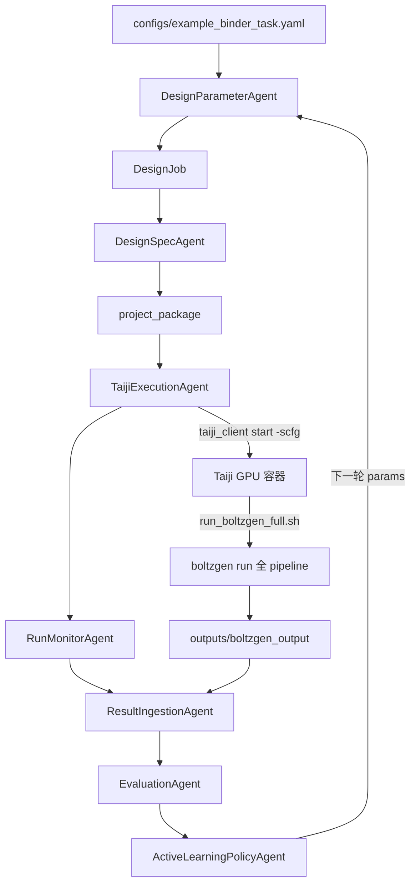

# Taiji 提交示例与调试指南

本文档集中保存 BinderLoop 中与 Taiji 平台提交相关的完整示例。README 仅保留通用 harness 调试和运行入口。

## BoltzGen + Taiji 完整路径

闭环 Orchestrator 负责全局调度和策略更新；BoltzGen 生产任务路径由 `scripts/run_boltzgen_complete_path_test.py` 验证：

```bash
cd /aceph/daweihuang/program/binder-harness

# dry-run：生成 package + Taiji simple config，不提交
python3 scripts/run_boltzgen_complete_path_test.py --out outputs/boltzgen_complete_path_test

# 真实提交 Taiji
python3 scripts/run_boltzgen_complete_path_test.py --out outputs/my_boltzgen_run --submit

# 如需挂载 /aceph/daweihuang
CEPH_SECRET='<your-ceph-secret>' python3 scripts/run_boltzgen_complete_path_test.py --out outputs/my_boltzgen_run --submit

# 默认：Taiji 只运行 GPU 生成/折叠步骤，分析在本地执行
# 任务完成后，在同步的 project_package 中运行：
bash /aceph/daweihuang/dataset/proteo_benchmark/boltzgen_harness_tests/<task_flag>/project_package/scripts/run_boltzgen_analysis_local.sh

# 可选：如果明确希望在 Taiji 中运行 BoltzGen analysis/filtering
python3 scripts/run_boltzgen_complete_path_test.py --out outputs/my_boltzgen_run --submit --analysis-on-taiji
```

## Agent + Taiji 链路

面向 BoltzGen 完整 pipeline 的标准路径由多个确定性 Agent 串联，职责分离、产物可审计：

```text
HarnessConfig (YAML)
    │
    ▼
DesignParameterAgent.choose_boltzgen_parameters()
    │  将简洁 YAML 扩展为 BoltzGen 参数计划（protocol、num_designs、budget、filtering 等）
    ▼
DesignJob + params
    │
    ▼
DesignSpecAgent.create_boltzgen_run_spec()
    │  生成 project_package/：
    │    inputs/          复制 target 结构
    │    configs/         boltzgen_design_spec.yaml、parameter_plan
    │    scripts/         run_boltzgen_full.sh（完整 --steps）
    │    outputs/         boltzgen_output/
    │    logs/            boltzgen_full.log
    ▼
TaijiExecutionAgent.create_boltzgen_taiji_spec()
    │  写入 taiji simple config JSON；start_cmd 在 package 内执行 run_boltzgen_full.sh
    ▼
TaijiExecutionAgent.submit()
    │  taiji_client start -scfg <json>
    ▼
RunMonitorAgent.check_once()          # 单次状态/日志/产物检查（上层负责轮询）
    │
    ▼
ResultIngestionAgent.ingest_boltzgen_output()
    │  读取 metrics CSV、intermediate 目录、log tail
    ▼
EvaluationAgent.evaluate_candidates()
    │  加权评分 + failure taxonomy 标签
    ▼
ActiveLearningPolicyAgent.propose_next_boltzgen_params()
    │  根据 dominant failure tags 提议下一轮参数
```



## 关键组件

| 组件 | 输入 | 输出 | 说明 |
|------|------|------|------|
| `DesignParameterAgent` | `HarnessConfig` | `Dict` 参数计划 | 启发式扩展 protocol/filtering/batch size；可被 YAML `search_space.boltzgen` 覆盖 |
| `DesignSpecAgent` | `DesignJob` + params | `BoltzGenRunSpec` | 自包含 project package，避免硬编码远程 `/aceph/...` 路径 |
| `TaijiExecutionAgent` | `BoltzGenRunSpec` | `TaijiSubmitSpec` | 支持 v2.0（`dataset_id`/`model_id`）或 `model_local_file_path` 本地上传 |
| `RunMonitorAgent` | task_flag, instance_id | `RunStatusSnapshot` | 单次检查；需调用方循环 poll |
| `ResultIngestionAgent` | output_dir | `IngestedBoltzGenRun` | 扫描 `**/all_designs_metrics.csv` 等 |
| `EvaluationAgent` | candidates | `EvaluationSummary` | 映射 iptm/plddt/RMSD 等到统一指标 |
| `ActiveLearningPolicyAgent` | summary + current_params | `NextRoundParameterProposal` | 按 hotspot_miss/folding_failure 等标签调整 |

默认情况下，Taiji 容器只执行需要 GPU 的生成/折叠步骤，避免把本地 LLM API 分析或 CPU 后处理放到可能无法访问外网的计算平台：

```bash
boltzgen run configs/boltzgen_design_spec.yaml --output outputs/boltzgen_output \
  --steps design inverse_folding folding design_folding ...
```

随后在本地或已挂载 Ceph 的环境执行生成的 `scripts/run_boltzgen_analysis_local.sh` 完成 BoltzGen `analysis/filtering`，再由 `ResultIngestionAgent`、`EvaluationAgent`、`BinderQualityAnalysisAgent`、`HypothesisAgent` 等本地模块读取结果。只有显式传 `--analysis-on-taiji` 时，才会把 `analysis filtering` 放进 Taiji 运行命令。

## 完整 Python 示例

以下示例与 `scripts/run_boltzgen_complete_path_test.py` 逻辑一致，可直接保存为脚本运行，也可在 Python REPL 中逐步执行。

### 前置条件

1. 已安装本仓库：`pip install -e .`
2. 已配置 `taiji_client`（Token 可通过模板 JSON 或客户端全局配置提供）
3. 同级目录存在 BoltzGen 源码/安装（`DesignSpecAgent` 默认指向 `../boltzgen`）
4. GPU 任务建议使用 Taiji v2 路径（`dataset_id` + `model_id`），详见 `docs/taiji_config_debug_report.md`

### 示例代码

```python
#!/usr/bin/env python3
"""BoltzGen + Taiji 端到端示例：参数选择 → 生成 package → 提交 → 轮询 → 摄取 → 评价 → 下一轮建议。"""

from __future__ import annotations

import json
import os
import time
from dataclasses import asdict
from pathlib import Path

from binderloop.agents import (
    ActiveLearningPolicyAgent,
    DesignParameterAgent,
    DesignSpecAgent,
    EvaluationAgent,
    ResultIngestionAgent,
    RunMonitorAgent,
    TaijiExecutionAgent,
)
from binderloop.config import load_config
from binderloop.models.base import DesignJob

ROOT = Path("/aceph/daweihuang/program/binder-harness")
BOLTZGEN_ROOT = ROOT.parent / "boltzgen"
BOLTZGEN_CACHE_DIR = Path("/aceph/daweihuang/program/boltzgen/cache")
BOLTZGEN_CHECKPOINT_DIR = Path("/aceph/daweihuang/program/boltzgen/checkpoints")
BOLTZGEN_MOLDIR = BOLTZGEN_CACHE_DIR / "datasets--boltzgen--inference-data/snapshots/c3d36fd276e9caf098c75d4113c6d5eb320b1a4c/mols.zip"
OUT_DIR = ROOT / "outputs/my_boltzgen_run"
OUT_DIR.mkdir(parents=True, exist_ok=True)

SUBMIT_TO_TAIJI = os.environ.get("SUBMIT_TO_TAIJI") == "1"

TAIJI_OPTIONS = {
    "business_flag": "pathology_gpu_chongqing",
    "project_id": 192631,
    "image_full_name": "mirrors.tencent.com/davedwhuang/boltzgen:cu118",
    "GPUName": "V100",
    "host_gpu_num": 1,
    "host_num": 1,
    "cuda_version": "11.0",
    "priority_level": "HIGH",
    "quota_type": "public",
    "location": "cq",
}
if os.environ.get("CEPH_SECRET"):
    TAIJI_OPTIONS["envs"] = {"CEPH_SECRET": os.environ["CEPH_SECRET"]}

TEMPLATE = None
TASK_FLAG = "binder_boltzgen_my_run_len50"


def main() -> None:
    cfg = load_config(ROOT / "configs/example_binder_task.yaml")
    params = DesignParameterAgent().choose_boltzgen_parameters(cfg)
    params.update(
        {
            "task_id": "my_run_len50",
            "target_include": [
                {"chain": {"id": "A", "res_index": "1..104"}},
                {"chain": {"id": "B", "res_index": "1..109"}},
            ],
            "target_binding_types": [
                {"chain": {"id": "A", "binding": "67,89"}},
                {"chain": {"id": "B", "binding": "49"}},
            ],
            "structure_groups": "all",
            "devices": 1,
            "num_designs": 4,
            "budget": 2,
            "diffusion_batch_size": 1,
            "cache": str(BOLTZGEN_CACHE_DIR),
            "moldir": str(BOLTZGEN_MOLDIR),
            "design_checkpoints": [
                str(BOLTZGEN_CHECKPOINT_DIR / "boltzgen1_diverse.ckpt"),
                str(BOLTZGEN_CHECKPOINT_DIR / "boltzgen1_adherence.ckpt"),
            ],
            "inverse_fold_checkpoint": str(BOLTZGEN_CHECKPOINT_DIR / "boltzgen1_ifold.ckpt"),
            "run_filtering": True,
            "keep_unfiltered_for_failure_analysis": True,
        }
    )
    DesignParameterAgent().write_parameter_plan(params, OUT_DIR / "01_design_parameter_plan.yaml")

    job = DesignJob(
        job_id="my_run_len50_seed0",
        target_structure=str(ROOT / "examples/bg_example/IL-17A.cif"),
        chain_id="A",
        hotspots=["A:67", "A:89", "B:49"],
        binder_length=50,
        seed=0,
        params=params,
        output_dir=str(OUT_DIR / "round0_len50_seed0"),
    )
    run_spec = DesignSpecAgent(BOLTZGEN_ROOT).create_boltzgen_run_spec(job, params=params)

    taiji_options = dict(TAIJI_OPTIONS)
    taiji_options["model_local_file_path"] = run_spec.package_dir
    submit_spec = TaijiExecutionAgent(dry_run=not SUBMIT_TO_TAIJI).create_boltzgen_taiji_spec(
        run_spec,
        template_json=TEMPLATE,
        output_json=OUT_DIR / "02_taiji_simple_config.json",
        task_flag=TASK_FLAG,
        taiji_options=taiji_options,
    )

    submission = TaijiExecutionAgent(dry_run=not SUBMIT_TO_TAIJI).submit(submit_spec)
    monitor = RunMonitorAgent()
    instance_id = submission.taiji_job_id
    snapshot = None

    if SUBMIT_TO_TAIJI and instance_id:
        for i in range(120):
            snapshot = monitor.check_once(
                task_flag=submit_spec.task_flag,
                instance_id=instance_id,
                expected_outputs=run_spec.expected_outputs,
                simple_config_path=submit_spec.simple_config_path,
                tail=200,
            )
            monitor.write_snapshot(snapshot, OUT_DIR / f"03_run_monitor_snapshot_{i:03d}.json")
            if snapshot.is_terminal:
                break
            if snapshot.needs_followup:
                time.sleep(snapshot.recommended_followup_seconds or 120)

    ingested = ResultIngestionAgent().ingest_boltzgen_output(
        run_spec.output_dir,
        log_file=run_spec.log_file,
    )
    ResultIngestionAgent().write_manifest(ingested, OUT_DIR / "04_result_ingestion.json")

    summary = EvaluationAgent().evaluate_candidates(ingested.candidates)
    EvaluationAgent().write_summary(summary, OUT_DIR / "05_evaluation_summary.json")
    EvaluationAgent().write_scores_csv(summary, OUT_DIR / "05_scores_preview.csv")

    proposal = ActiveLearningPolicyAgent().propose_next_boltzgen_params(summary, params, round_id=1)
    ActiveLearningPolicyAgent().write_proposal(proposal, OUT_DIR / "06_next_round_parameter_proposal.json")

    report = {
        "out_dir": str(OUT_DIR),
        "run_spec": asdict(run_spec),
        "submission": asdict(submission),
        "monitor": asdict(snapshot) if snapshot else None,
        "evaluation": asdict(summary),
        "next_round_proposal": asdict(proposal),
    }
    (OUT_DIR / "run_report.json").write_text(json.dumps(report, ensure_ascii=False, indent=2), encoding="utf-8")


if __name__ == "__main__":
    main()
```

## CLI 一键运行

仓库已提供封装好的 path test，步骤与上述示例一致：

```bash
cd /aceph/daweihuang/program/binder-harness

# 仅生成 package + Taiji JSON（dry-run，不提交）
python3 scripts/run_boltzgen_complete_path_test.py

# 真实提交 Taiji：上传当前生成的 project_package
python3 scripts/run_boltzgen_complete_path_test.py --submit

# 指定输出目录
python3 scripts/run_boltzgen_complete_path_test.py --out outputs/my_run --submit

# 若容器需要挂载 /aceph/daweihuang，提供 CEPH_SECRET
CEPH_SECRET='<your-ceph-secret>' python3 scripts/run_boltzgen_complete_path_test.py --out outputs/my_run --submit

# 使用自定义 Taiji 模板；相对路径按仓库根目录解析
python3 scripts/run_boltzgen_complete_path_test.py --submit --template-json examples/bg_example/boltzgen_test_v100.template.json
```

`--allow-template-secrets` 会启用 Taiji v2 的 `dataset_id`/`model_id` 路径；不加该 flag 时脚本使用 `model_local_file_path=package_dir` 的本地上传模式。脚本会把 `taiji_client` 输出中的 `[error]` 识别为提交失败，即使客户端进程本身返回 `0`。

## 产物清单

一次完整 run 在 `outputs/<run>/` 下通常包含：

| 文件 | 说明 |
|------|------|
| `01_design_parameter_plan.yaml` | DesignParameterAgent 输出 |
| `round0_*/project_package/` | 可提交的完整项目包 |
| `02_taiji_simple_config.json` | Taiji simple config |
| `03_run_monitor_snapshot*.json` | 每次 poll 的状态快照 |
| `04_result_ingestion.json` | 摄取的 metrics / log / issues |
| `05_evaluation_summary.json` | 评分与 failure tags |
| `06_next_round_parameter_proposal.json` | 下一轮参数建议 |
| `path_test_report.json` | CLI 脚本汇总报告 |

Package 内部关键路径：

```text
project_package/
  inputs/IL-17A.cif
  configs/boltzgen_design_spec.yaml
  scripts/run_boltzgen_full.sh
  outputs/boltzgen_output/
    intermediate_designs/
    intermediate_designs_inverse_folded/
    final_ranked_designs/
      all_designs_metrics.csv
  logs/boltzgen_full.log
```

## 手动 Taiji 命令

```bash
# 提交
taiji_client start -scfg outputs/my_boltzgen_run/02_taiji_simple_config.json

# 查看实例
taiji_client instance_list -vn 5 -scfg outputs/my_boltzgen_run/02_taiji_simple_config.json binder_boltzgen_my_run_len50

# 查看详情与日志
taiji_client instance_detail -scfg outputs/my_boltzgen_run/02_taiji_simple_config.json <task_flag> <instance_id>
taiji_client logs --tail 200 -scfg outputs/my_boltzgen_run/02_taiji_simple_config.json <task_flag> <instance_id>
```

## CPU 环境无真实 metrics 时

`run_boltzgen_complete_path_test.py` 在检测不到真实 CSV 时会写入 mock metrics，以便验证 `EvaluationAgent -> ActiveLearningPolicyAgent` 链路。生产环境应在 Taiji 任务完成后，将 `project_package/outputs/boltzgen_output/` 同步到本地再执行结果摄取和评价。
