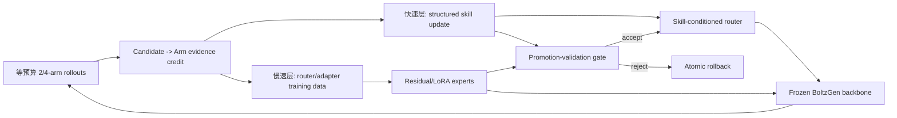

# BinderLoop 顶会发表差距、BoltzGen 生成控制与短期实验路线

> 审计日期：2026-07-22  
> Harness 提交：`f131b3d`  
> BoltzGen 官方源码提交：`a3149cf`，PyPI `boltzgen==0.3.2`  
> 目标：判断项目距离 ICLR/ICML 级发表的差距，并给出 2–4 周可启动的实验路线。

## 0. 结论摘要

当前项目已经不是一个简单的 BoltzGen 调参脚本，而是一个包含候选证据抽取、多臂受控比较、回滚、结构分析、记忆、skill 生命周期和执行治理的完整闭环系统。工程基础较强，尤其是：

- 每轮候选被区分为 `strict_positive`、边界 `near_miss` 和 `other_negative`；
- 下一轮由 2 或 4 个闭集、等预算的策略臂组成，可形成同状态下的组内比较；
- self-improvement skill 有引用、support、contradiction、utility、生命周期和去 target 特异化约束；
- LLM 输出不直接写入可执行配置，存在确定性校验、冲突解析和回滚；
- 当前排序已从单一 weighted score 转向 strict-positive yield 优先的 lexicographic objective。

但以 ICLR/ICML 主会标准判断，当前项目仍处于“有潜力的研究原型”，不是“可投稿的完整研究结果”。最关键的缺口是：

1. **最新 multi-arm/self-improvement 方法没有真实 GPU 实验支撑**。仓库内没有 `outputs/`，历史报告只覆盖两个 target，且来自旧版本策略。
2. **算法贡献尚未被清晰形式化**。当前方法更接近受约束的自适应实验设计/contextual bandit + 外部记忆治理，不能直接宣称为 RL。
3. **缺少公平基线和统计设计**。没有 random、Bayesian optimization、bandit、Reflexion/ExpeL 式经验学习、无 skill、无生命周期治理等同预算比较。
4. **缺少跨 target 泛化和严格数据隔离**。目前没有证明 skill 是可迁移知识，而不是同一 target 轨迹上的过拟合记忆。
5. **奖励只来自计算评分器，存在 reward hacking 和 evaluator coupling**。缺少独立结构模型、off-target、developability、diversity、novelty 或湿实验验证。
6. **复现性尚不够**。没有 CI、论文级原始 artifact、环境锁定、统一实验入口；当前最新回归测试还存在契约漂移。

本轮需要修正一个优先级判断：**inverse-folding checkpoint 是最低工程风险的参数更新入口，但不是最有生成杠杆或论文价值的入口**。它在结构已经给定后优化 residue logits，无法直接改变 backbone diffusion 的几何分布；如果论文把它作为主贡献，审稿人会自然追问它与 ProteinZero、Designability Preference Optimization、ResiDPO 的差异。

短期推荐改为“两时间尺度、两种学习对象”的主线：

> **Evidence-Grounded Light-Train Control for BoltzGen**：快速层保留当前 training-free group-relative skill/arm 比较；慢速层把跨 target 验证过的 skill credit 写入冻结 BoltzGen 外接的 diffusion-conditioning residual adapter 或 diffusion-transformer LoRA experts。router 只在同一 target/round 的 arms 内做 group-relative 更新，adapter 用 weighted denoising preference 或 DGPO-style group loss 更新，并由 reference KL、diversity 和独立 scorer 约束。

这个定义同时保留当前 Harness 的优势，又让学习信号进入真正影响坐标生成的节点。inverse folding DPO/LoRA 仍应保留为低风险 sanity/control，而不是默认主故事；full DDPO/Flow-GRPO 则作为后续扩展，因为当前 `AtomDiffusion.sample` 没有暴露可复用的 stochastic transition log-prob。

## 1. 证据范围与结论等级

本文区分四类表述：

| 标签 | 含义 |
|---|---|
| **代码事实** | 已在当前仓库或 BoltzGen 官方源码中直接核验 |
| **文献事实** | 来自论文原页、arXiv/bioRxiv、Crossref、PMLR、官方 GitHub/Hugging Face |
| **推断** | 根据代码与文献作出的研究判断，尚未由本项目实验验证 |
| **建议** | 面向投稿的具体实施路线，不代表已有结果 |

当前工作区不包含历史 `outputs/`，因此本文不会把 README 或旧报告中的数值当作已复现结果。

## 2. 当前 Harness 的研究对象到底是什么

### 2.1 闭环数据流

当前系统可抽象为：

```text
target + hard constraints
        ↓
closed strategy arms (2 or 4, equal budget)
        ↓
BoltzGen generation / inverse folding / refolding / scoring
        ↓
candidate metrics + structure evidence
        ↓
strict positive / near miss / other negative
        ↓
arm evidence cards + arm comparison + history resolution
        ↓
next-round strategy + rollback + self-improvement skill update
```

重要的是，当前“学习”发生在策略、prompt、memory 和 skill 层，**没有发生 BoltzGen 参数更新**。因此当前方法可以描述为 training-free adaptation、external-memory self-improvement 或受约束的在线策略优化，但不能描述成 generator RL。

### 2.2 正样本、near-miss 与负样本

**代码事实**：`binderloop/analysis/quality_thresholds.py` 定义全局成功门：

- `design_to_target_iptm >= 0.50`
- `min_design_to_target_pae <= 10 Å`
- `design_ptm >= 0.70`
- `designfolding_filter_rmsd <= 2.5 Å`

`binderloop/active_learning/examples.py` 将每个指标变成 signed normalized margin，并用固定权重构造 continuous confidence：

```text
0.40 * iPTM margin
+ 0.25 * PAE margin
+ 0.20 * RMSD margin
+ 0.15 * pTM margin
```

然后：

- 所有 margin 非负：`strict_positive`；
- 未通过但 confidence 超过 guardrail 的 top-k：`near_miss`；
- 其余：`other_negative`。

这一设计很适合研究，因为 near-miss 比随机负样本包含更强的局部学习信号。但是当前权重、阈值和 top-k 都是人工设定，尚无校准实验；全局阈值也可能对不同 target/modalities 不公平。

### 2.3 Self-improvement skill

**代码事实**：当前 skill 包含七类经验模块：

- `successful_patterns`
- `failure_avoidance`
- `parameter_effects`
- `structural_context_rules`
- `exploration_exploitation`
- `rollback_recovery`
- `transfer_candidates`

LLM 只能提出 `UPSERT/REVISE/MERGE/UPVOTE/DOWNVOTE/RETIRE`。更新门要求：

- 执行失败不产生科学更新；
- upvote/downvote/retire 的 rule 必须在本轮被实际引用；
- upvote 需要 reward delta 超过阈值且没有 watched regression；
- downvote/retire 需要明显退化或 rollback；
- 强证据还要求 rule parameter family 与实际 applied update 相交。

这比普通 Reflexion 文本记忆更严格。但是 reward delta 仍是相邻自适应轮次之间的观察差，通常同时有多个参数、模板和随机采样变化，因而不能提供可靠的因果 credit assignment。

### 2.4 Multi-arm 策略

**代码事实**：生产配置强制 `branch_width ∈ {2,4}`，arms 来自闭集、分配等预算，并写出：

- `arm_evidence_cards.json`
- `arm_comparison.json`
- `arm_history_resolution.json`
- `final_strategy_decision.json`

这为 group-relative learning 提供了天然数据结构。由于同一轮评估多个 arm，当前系统不是经典“只观察被选 arm”的 bandit，而是 selected-arm subset 上的部分 full-information feedback。真正缺少的是一个显式、可复现、可比较的策略更新算法。

## 3. 距离 ICLR/ICML 的核心差距

### 3.1 评分卡

| 维度 | 当前判断 | 顶会要求 | 主要缺口 |
|---|---:|---:|---|
| 问题重要性 | 4/5 | 4/5 | 闭环蛋白设计和 self-improving scientific agents 很重要 |
| 工程完整度 | 4/5 | 3/5 | 系统完整，但工程复杂度本身不是算法贡献 |
| 方法新颖性 | 2/5 | 4/5 | 与 Reflexion、ExpeL、AWM、AgentOptimizer、Training-Free GRPO、Skills-Coach/SkillOS 有明显邻近 |
| 实验证据 | 1/5 | 4/5 | 最新方法没有可核验 GPU 结果 |
| 统计严谨性 | 1/5 | 4/5 | 无 seeds、CI、显著性或层次统计模型 |
| 泛化 | 1/5 | 4/5 | 无 held-out target、leave-one-target-out、cross-family transfer |
| 生物有效性 | 1/5 | 3/5 | 主要依赖同类计算 predictor，缺少独立 scorer/湿实验 |
| 复现性 | 2/5 | 4/5 | 无 CI、无原始 artifacts、环境和文档漂移 |

### 3.2 方法层面的不足

1. **没有明确的 optimization object**  
   当前同时优化 candidate、arm、round、rule 和最终配置，但没有给出统一形式化。审稿人会问：policy 是什么，state/action/reward 是什么，更新发生在哪里？

2. **“自我改进”缺少反事实证据**  
   一个 rule 被引用后 reward 上升，并不代表该 rule 导致上升；同轮常有多项改动、不同随机样本和 template 变化。

3. **skill acceptance 仍可能自适应过拟合**  
   `support_count >= 2` 或固定 reward delta 门无法控制反复在同一小 dev set 上尝试 rule 所产生的 false commit。2026 年的 PACE 工作已明确指出这一问题。

4. **closed arm catalog 限制创新搜索**  
   闭集有利于安全和公平比较，但需要说明 catalog 如何构建、是否覆盖关键 intervention、是否允许组合泛化。

5. **当前 scalar reward 与 lexicographic objective 并存**  
   新决策使用 `RoundRankKey`，部分 README 和旧报告仍描述“best iPTM + success 加成”的 reward，容易造成方法定义和实验实现不一致。

### 3.3 实验层面的不足

1. 旧报告只有两个 target、每轮 160 designs、8 轮，且不是最新 multi-arm/self-improvement 机制产生。
2. 没有多个随机种子，无法区分策略收益和生成随机性。
3. 没有同预算强基线：random、TPE/BO、LinUCB/Thompson、successive halving、static expert config、unstructured reflection。
4. 没有训练、validation、test target 隔离；skill 可能只是在同一 target 上记忆。
5. 没有 target-level paired analysis，候选级样本高度相关，不能把每个 candidate 当独立样本做显著性检验。
6. 没有报告 sample-efficiency curve、GPU cost、LLM token cost、rollback/churn、失败率。
7. 缺少 diversity、novelty、off-target、developability 和 scorer disagreement。

### 3.4 复现性与当前提交质量

**代码事实**：

- 代码约 74 个 Python 模块、约 29k 行，仓库中有约 45 个测试脚本；
- 没有 `.github/workflows`，也没有标准 pytest/coverage 配置；
- `outputs/` 和 checkpoints 被 `.gitignore` 排除，当前仓库没有论文级结果包；
- `models/boltzgen` 只是内容为 `../../boltzgen` 的文本文件，不能锁定上游版本；
- `docs/testing.md` 仍描述早期 MVP，并存在明显编码问题；
- README 部分段落仍描述旧 reward/rollback 逻辑。

测试审计结果：

- Windows 直接运行被 `binderloop/llm.py:5` 的 Unix-only `fcntl` 阻塞；
- 在单进程 no-op file-lock 兼容诊断下，`test_self_improvement_skills.py` 的 15 项测试中 4 项失败，涉及冲突解析参数和 prompt 契约；
- `test_strategy_governance.py`、`test_closed_loop_governance.py` 可通过；
- `test_strategy_improvements.py` 在 rollback replay budget contract 上失败；
- `test_multi_arm_plan.py` 的 symlink 安全测试在当前 Windows 权限下无法执行。

这些问题不否定研究方向，但在发布论文代码前必须解决。

## 4. BoltzGen 可用的训练、微调和 RL 接口

### 4.1 官方训练接口

**文献与代码事实**：BoltzGen 官方仓库和 checkpoint 采用 MIT License，并公开 inference、training code、训练数据和预训练权重。

官方训练栈包括：

- Hydra 配置入口：`src/boltzgen/resources/main.py <train-config.yaml>`
- PyTorch Lightning：`Training` + `Boltz(LightningModule)`
- `pretrained`：使用 `load_from_checkpoint(..., strict=False)` 加载预训练权重
- `resume`：恢复 Lightning training checkpoint
- `strict_loading`、DDP、EMA、ModelCheckpoint、W&B
- 官方 train configs：
  - `train/boltzgen_small.yaml`
  - `train/boltzgen.yaml`
  - `train/inverse_folding.yaml`

官方 README 建议：

- small design model：8 GPU，gradient accumulation 16；
- large model：8 GPU，并依赖尚未完全公开的额外 distillation datasets；
- inverse folding：官方配置为 4 GPU。

Hugging Face artifact 大小：

| Checkpoint | 大小 | 含义 |
|---|---:|---|
| `boltzgen1_diverse.ckpt` | 约 1.93 GB | 全原子 design model |
| `boltzgen1_adherence.ckpt` | 约 1.93 GB | 全原子 design model |
| `boltzgen1_structuretrained_small.ckpt` | 约 2.21 GB | small structure-pretrained model |
| `boltzgen1_ifold.ckpt` | 约 12.6 MB | inverse-folding model |

### 4.2 当前 Harness 暴露的接口

**代码事实**：`binderloop/models/boltzgen_adapter.py` 目前只负责：

- 渲染 design spec YAML；
- 注入 inference checkpoint 路径；
- 渲染 structure redesign mask；
- 生成 `boltzgen run ...` 命令；
- 解析执行结果。

它没有：

- training config renderer；
- harness sample → BoltzGen training dataset exporter；
- LoRA/PEFT 注入；
- preference pair loader；
- reward model；
- policy gradient / DDPO trajectory log-prob；
- 新 checkpoint 注册与 A/B rollout。

因此模型微调需要新增独立 training adapter，而不应继续堆进 inference adapter。

此外，当前 `pyproject.toml` 只声明 PyYAML、Pydantic、Pandas、NumPy 和 Matplotlib，没有 PyTorch、Lightning、PEFT/TRL 依赖。短期最稳妥的边界是：Harness 负责 dataset/credit/checkpoint registry 与 experiment orchestration；训练实现放在锁定 BoltzGen commit 的独立 extra/environment 中，避免把上游深度学习依赖强加给所有 Harness 用户。

### 4.3 为什么 inverse folding 是“好入口”，但不是“主贡献”

BoltzGen `InverseFoldingDecoder.forward()` 返回 dense residue logits，内部主要由标准 `nn.Linear`、GNN decoder layers、`seq_to_s` 和 `predictor` 组成；约 12.6 MB 的 checkpoint 也显著小于约 1.93 GB 的 design checkpoint。因此它适合快速实现 weighted SFT、DPO/IPO、residue-level DPO 和 LoRA，并验证以下工程链路：

- Harness candidate 能否导出为 matched chosen/rejected data；
- reward、去重、target split 和 reference KL 是否实现正确；
- checkpoint 能否注册、A/B rollout、回滚和复现；
- 多 scorer 下是否出现 reward hacking、diversity collapse 或 sequence drift。

但其研究上限也很清楚：inverse folding 接收已经生成的结构，再决定序列；它不能直接把 BoltzGen 的 backbone/interface geometry 推向某类更优区域。对 binder 设计而言，它更像**低风险训练管线对照**，而不是最高杠杆的 intervention。ProteinZero、Designability Preference Optimization、结构条件 categorical-diffusion RL 和 CtrlProt 已使“对序列模型做偏好/RL”成为拥挤方向；若无新的 credit、数据或在线控制机制，单独微调 ifold 很难构成顶会主贡献。

### 4.4 BoltzGen 主模型的真实可插入节点

**代码事实**：large design config 使用 `token_s=384`、`token_z=128`、`atom_s=128`、`atom_z=16`，score network 的 token hidden 默认为 `2 * token_s = 768`，token diffusion transformer 深度为 24。生成路径是：

```text
Pairformer: (s[B,N,384], z[B,N,N,128])
  -> DiffusionConditioning
     q/c[B,M,128]
     atom encoder/decoder attention bias
     token_trans_bias[B,N,N,24 * 16]
  -> AtomDiffusion.score_model
     atom encoder -> token transformer[24] -> atom decoder
  -> r_update[B,M,3]
  -> EDM-style denoising update
```

关键边界来自源码：`DiffusionConditioning.forward()` 一次性产生 `q/c` 与三类 attention bias；`DiffusionModule.forward()` 在每个噪声步复用这些条件；最终 `AtomAttentionDecoder` 把 token activation 投影为每个 atom 的三维 `r_update`。这使得“冻结 trunk，在 conditioning 或 score network 中插入小模块”在工程上成立。

源码锚点（BoltzGen commit `a3149cf`）：`src/boltzgen/model/models/boltz.py:625–667`、`src/boltzgen/model/modules/diffusion_conditioning.py:77–117`、`src/boltzgen/model/modules/diffusion.py:161–226,380–415,501–629`、`src/boltzgen/model/modules/transformers.py:70–209`、`src/boltzgen/model/modules/encoders.py:414–550,553–720`。

| 插入点 | 最小实现 | 直接生成杠杆 | 训练参数/显存 | 短期风险 | 建议 |
|---|---|---:|---:|---|---|
| `DiffusionConditioning` 输出后 | 对 `q/c` 做 zero-init gated residual；对 bias 只做低秩缩放/残差 | 高 | 低 | bias 张量为 `O(N²)`，若直接生成完整残差会过重 | **首选**：先只调 `q/c`，再消融 token bias gate |
| `DiffusionModule.single_conditioner` 后 | skill/timestep-conditioned FiLM 或 AdaLN delta，调制 `s[B,N,768]` | 高 | 很低 | 需把 skill embedding 和 timestep 对齐 | **首选备选**：接口简单、每步生效 |
| 24 层 token diffusion transformer | Q/K/V/O 与 transition linear 的 rank-4/8 LoRA | 很高 | 中低 | target module 命名、checkpointing 和训练吞吐 | **首选 LoRA 方案** |
| atom encoder/decoder | 对 attention/output projection 加 LoRA | 高且局部 | 中 | 原子数大，显存敏感；更易扰动局部几何 | 第二阶段，只选末端 decoder 1–3 层 |
| `r_update` 前 | zero-init low-rank coordinate residual head | 很高 | 极低 | 最容易产生 clash、非等变偏移和 shortcut | 只作上界/风险对照，不作主方案 |
| Pairformer | LoRA 或 residual adapter on `s/z` | 中高 | 高 | 每轮 recycling 计算重，改变通用 target/binder 表征，灾难性漂移难定位 | 短期不优先 |
| 外部 reward critic/guidance | 训练小 critic，对坐标或 denoised estimate 求梯度并引导采样 | 高 | 低到中 | 必须保持 SE(3) 一致性；scorer 梯度噪声和 exploitation | training-free/critic-only 对照 |

这里最重要的设计约束是 **identity at initialization**：使用 zero-init output projection 或 gate `α=0`，确保 adapter 装入时严格复现 frozen BoltzGen。ControlNet 的 zero-convolution 和 T2I-Adapter 提供了成熟先例；BoltzGen 自身的 diffusion transformer 也使用零初始化/负偏置 gating，因此这种接法与上游代码风格一致。

### 4.5 推荐的最小模块：Skill-Conditioned Residual Adapter

第一版不建议复制完整 ControlNet side branch。可实现一个共享 bottleneck 加若干 arm experts：

```text
e = SkillEncoder(target_state, active_skill_ids, arm_id)       # d=32/64
w = softmax(Router(e, target_summary) / τ)                     # K arms/experts
Δc = Σ_k w_k * Up_k(SiLU(Down_k(LN(c))))                       # rank 4/8
c' = c + α(e) * Δc                                             # α zero-init
```

`q/c` 在进入采样循环前只计算一次，因此第一版 gate 不应假装依赖 timestep。可对 `q` 复用同一结构；第二阶段若需要 `σ` 依赖，应在 `DiffusionModule.forward()` 内将 `e` 作为 timestep-aware FiLM delta 注入 `single_conditioner` 输出 `s`。每个 expert 不应简单对应自然语言 skill 条目，而应对应**经过跨 target 验证的 intervention family**，例如 sampling schedule、interface compactness、secondary-structure bias 或 exploration/diversity。多个文本 skill 可以路由到同一 expert，同一 skill 也可由多个 experts 的凸组合表达。

最小上游改动应放在 `boltz.py` 构造 `diffusion_conditioning` 字典之后、调用 `AtomDiffusion` 之前，并新增显式的 `control_context`，不要把 skill 状态塞入任意 `feats` key：

```python
diffusion_conditioning = {...}  # original q/c/bias tensors
if self.skill_adapter is not None:
    diffusion_conditioning, route_log = self.skill_adapter(
        diffusion_conditioning,
        control_context=control_context,
    )
```

同一 hook 会同时覆盖 training `structure_module(...)` 与 inference `structure_module.sample(...)`。Harness 侧只负责把已版本化、去 target 标识的 skill/arm context 渲染为 schema；BoltzGen training extra 负责 tensor 化、冻结参数和保存 adapter state dict。

参数量粗估：若 `q/c` 维度 128、rank 8、4 experts，每个张量的 down/up LoRA 约 `2 * 128 * 8 * 4 = 8,192` 个权重；加共享 32–64 维 skill encoder/router 仍可控制在 `10^5–10^6` 量级。若对 24 层、hidden 768 的 Q/V 全层 rank-8 LoRA，则约为 `24 * 2 * 2 * 768 * 8 ≈ 0.59M`，仍远小于冻结主干。实际参数量必须从目标模块清单自动统计，不能仅引用此估算。

必须强调：**parameter-efficient 不等于 compute-efficient**。optimizer state 会很小，但 adapter 的梯度仍需穿过冻结的 atom encoder、24 层 token transformer 和 atom decoder，通常还要保存/重算下游 activations；1.93 GB backbone 仍需驻留。若单卡显存不足，优先用 activation checkpointing、bf16 和小 batch，而不是宣称“小模块训练很便宜”。由于 score network 同时依赖 noisy coordinates，不能把全部下游表示简单离线缓存。

还有一个更便宜的 black-box 版本：只训练 router 输出低维 expert/gate 选择，experts 是预定义的安全 residual basis 或现有 arm intervention，不对 BoltzGen 反传。已有等预算全臂数据先做 listwise/contextual-bandit update；只有后续按 old-router 实际采样并记录 log-prob 时才做 group-relative REINFORCE。这能先验证“skills 能否参数化路由”，但它是 learned control policy，不是 generator fine-tuning，表达能力也低于 learned adapter。

### 4.6 多 Arms skills 的参数内化：MoE 还是 Mixture-of-LoRA

Mixture of LoRA Experts、Mix-of-Show 等工作说明多个低秩 adapter 可以组合或路由，但“有多个 LoRA experts”本身不新颖。本项目的潜在贡献必须来自 **Harness credit → expert/router** 的监督结构：

1. 同一 target/round 下 K 个 arms 共享基础模型、seed pool 与总预算；
2. candidate 的 strict-positive/near-miss/negative evidence 聚合为 arm-level vector outcome；
3. 只有 arms 之间实际不同的 skill/intervention 获得 credit；
4. router 学习在 target state 下选择/混合 experts；
5. expert 只有在独立的 promotion-validation target 有正迁移、且独立 scorer 不退化时才晋升；
6. 加载均衡、熵正则与 minimum-usage 约束防止 expert collapse。

短期应采用 **soft top-2 mixture 或 convex mixture**，而不是 hard top-1 MoE。K 只有 2/4、样本量小且 reward 噪声大，hard routing 很容易把早期偶然收益固化为 expert monopoly。

### 4.7 “Light-train GRPO”的严格定义与边界

这个名称只有在 policy、group、ratio/更新对象和 reference 都定义清楚时才成立：

```text
policy πφ(k | target, history, skills): router 随机选择 adapter expert/route
group G: 从同一 old-router、target/round/reference seed 条件采样的 2/4 routes
reward R: lexicographic/vector outcome -> within-group standardized advantage
reference: frozen BoltzGen + previous accepted adapter/router
trainable: router φ + adapter experts θ；BoltzGen trunk/score backbone frozen
```

当前 `AtomDiffusion.sample()` 在 denoiser调用外包着 `torch.no_grad()`，只保存 coordinate trajectories，不返回 transition log-prob。它的 Euler/EDM sampler也不是可直接套用语言模型 token-ratio GRPO 的离散随机策略。因此需要区分三种更新：

- **Router-GRPO/REINFORCE（条件满足时短期可做）**：expert/route 选择是显式离散 policy；每个 candidate 必须记录 old-router probability，并由该 router 实际采样，才可使用 group-relative advantage、clipped ratio 和 reference KL。当前 Harness 的等预算 closed arms 更接近 partial full-information feedback；若只是把全部 arms 都评估后拟合赢家，应称 listwise/contextual-bandit update，而不是 on-policy GRPO。
- **Adapter-GPO/Diffusion-DPO（短期推荐）**：对组内 structures 做 reward-standardized denoising loss、group preference loss 或 Diffusion-DPO；它更新 adapter，但不应声称使用了 trajectory policy gradient。2025 年 GPO 与 2025 年 DGPO 已给出相邻先例。
- **True diffusion GRPO（长期）**：参考 DDPO、DanceGRPO 或 Flow-GRPO，把 sampler 改成有可计算 transition density 的 stochastic process，记录 old/new log-prob 并做 clipped policy update。Flow-GRPO 的 ODE-to-SDE 转换说明这可行，但不是一个“小补丁”。

所以本文将 **Light-Train** 定义为“小参数、冻结 backbone 的两层更新框架”，而不是一种凭名称自动成立的新 RL 算法。首版论文可称 `Light-Train Group-Relative Adapter Optimization`；只有实现并验证 transition ratio 后，才使用 `diffusion GRPO`。

截至 2026-07-22，对 arXiv 精确检索 `"Light-train GRPO"` 与 `"LightGRPO"` 未发现同名论文；`"LoRA GRPO"` 只命中若干其他领域的 adapter/RL 工作。这个命名目前可用，但**名称空缺不等于方法新颖**：GPO、DGPO、DanceGRPO、Flow-GRPO、Mixture of LoRA Experts 与 Skills-Coach 已分别覆盖其主要组成部件。

### 4.8 候选方案的综合排序

| 方案 | 生成杠杆 | 2–4 周可行性 | 新颖性上限 | 主要失败模式 | 定位 |
|---|---:|---:|---:|---|---|
| Training-free skill only | 中 | 很高 | 中 | prompt/skill novelty 被 Skills-Coach 覆盖 | 必做 baseline/快速层 |
| black-box low-dimensional router | 中 | 很高 | 中高 | 固定 basis 表达力有限、policy variance | **最便宜的参数内化验证** |
| q/c residual adapter + router | 高 | 高 | 高 | credit 稀疏、router collapse | **推荐主原型** |
| diffusion-transformer LoRA experts | 很高 | 中 | 高 | 显存、模块注入和过拟合 | **推荐第二原型** |
| timestep FiLM/AdaLN skill adapter | 高 | 中高 | 高 | 时序调制不稳定 | 与 q/c adapter 二选一 |
| external critic guidance | 高 | 中 | 中高 | reward gradient exploitation | training-free 强对照 |
| inverse-folding DPO/LoRA | 低到中 | 很高 | 低到中 | 不改变 backbone；邻近工作多 | sanity/control |
| full DDPO/Flow-GRPO | 很高 | 低 | 高 | sampler 重写、成本、reward hacking | 长期扩展 |

**结论**：值得从“training-free 主线 + inverse-folding 备选”调整为“training-free 快速层 + diffusion-conditioning 小模块主原型 + inverse-folding 训练对照”。但不值得在没有 frozen-baseline replay、独立 scorer 和 target split 时直接投入 full diffusion RL。

## 5. 如何把每轮样本变成可训练数据

### 5.1 推荐数据 schema

不要只保存给 LLM 的匿名指标摘要。模型训练需要单独、受控的结构化数据集：

```yaml
target_id_hash: ...
target_split: train | validation | held_out_test
round_id: 3
arm_id: site_primary_condition
arm_intervention_delta: ...
config_digest: ...
seed: ...
reference_seed: ...
backbone_or_complex_path: ...
backbone_hash: ...
sequence: ...
sequence_hash: ...
metrics_raw:
  iptm: ...
  min_pae: ...
  ptm: ...
  refold_rmsd: ...
  diversity: ...
  developability: ...
metric_margins: ...
strict_label: strict_positive | near_miss | other_negative
scorer_versions: ...
active_skill_ids: [...]
skill_version: ...
router_distribution: [...]
adapter_version: ...
diffusion_trace:
  sampling_schedule: ...
  sigma_steps: [...]
  initial_noise_hash: ...
  trajectory_path: ...
provenance:
  boltzgen_commit: ...
  design_checkpoint_sha256: ...
  folding_checkpoint_sha256: ...
  harness_commit: ...
```

### 5.2 Pair 构造原则

数据应分成两个不可混用的层级。对 candidate-level DPO/IPO 或 diffusion preference，必须尽量匹配 confounders：

1. 同 target、同 backbone/结构条件；
2. 相同或相近 binder length；
3. 相同 arm/template family；
4. 尽量相同 seed bucket 或 generation batch；
5. chosen/rejected 的主要差异是实际质量，而不是完全不同的任务条件。

Pair 层级可以是：

- `strict_positive > near_miss`
- `near_miss > other_negative`
- Pareto/lexicographic dominant candidate > dominated candidate
- 同 backbone 下独立 scorer 一致偏好的 candidate > scorer disagreement candidate

不建议把所有 positive 与所有 negative 做笛卡尔积，否则会扩大 target/length/template confounding。

对 arm/expert credit，则必须在同 target、同 reference seed pool、同预算下比较不同 arms，并显式保存 `arm_intervention_delta`。只有一个 intervention family 不同的 matched arms 最适合更新 expert；多个同时变化的 arms 只能用于 router ranking，不能把收益归给其中任一 skill。

### 5.3 Sequence DPO 与 diffusion preference 不能混用

对 inverse folding 的离散序列条件 `x`、chosen `y+`、rejected `y-`，可采用标准 reference-anchored pairwise objective：

```text
L_DPO = -log sigmoid(
  beta * [log pi_theta(y+|x) - log pi_ref(y+|x)
        - log pi_theta(y-|x) + log pi_ref(y-|x)]
)
```

建议增加：

- pair confidence weight；
- diversity regularizer；
- per-target balanced sampler；
- reference KL；
- promotion-validation target early stopping；
- scorer disagreement down-weighting。

对 diffusion adapter，`log pi(y|x)` 不能直接替换成最终结构的普通 log-prob。需要使用 Diffusion-DPO 的 noise/timestep-matched surrogate、GPO/DGPO 的 group objective，或显式 stochastic transition likelihood。训练记录必须保存 sampled timestep/noise/reference prediction，确保 chosen/rejected 在相同噪声条件下比较。

### 5.4 Group 与 skill credit 数据

每个训练 group 至少保存：

```text
group_key = (target_id_hash, round_id, reference_seed_pool, base_checkpoint_hash)
members = K arms × candidates
arm_outcome = vector metrics + strict yield + diversity + cost
arm_advantage = standardized rank/utility within this group
eligible_skill_credit = interventions unique to the arm comparison
promotion_evidence = later target/seed outcomes, not the same group
```

同一 group 用于产生 credit；后续、隔离的 group 才能用于 skill/adapter acceptance。把产生规则和验证规则的数据混在一起，会把当前 Harness 的 false-commit 问题带入参数训练。

## 6. Training-Free GRPO 与当前 Harness 的结合方式

### 6.1 文献中的 Training-Free GRPO

2025 年的 Training-Free GRPO 不更新模型参数，而是在同组 rollouts 内计算 group-relative semantic advantage，反复蒸馏高质量 experiential knowledge，并把它作为 token prior 注入后续 API 调用。2026 年 Skills-Coach 已进一步把 training-free GRPO 用于 skill prompt/code 优化。

因此，仅把当前正负样本总结成 skill 并称为“Training-Free GRPO”不构成新贡献。它仍然值得保留，因为无需改 BoltzGen、可最快验证 candidate→arm→skill credit；但它在本项目中的角色应从“最终方法”变为：

- Light-train adapter 的数据生成器与 warm-start coach；
- 对 adapter 是否真正内化 skill 的必要 baseline；
- 当 parameter update 未通过 acceptance gate 时的安全 fallback；
- 以低成本持续探索新 intervention family 的快速层。

### 6.2 推荐形式化

对 target `g` 的第 `t` 轮，状态为：

```text
s_tg = target profile + hard constraints + history + skill repository
```

同一状态下产生 `K=2/4` 个 arms，每个 arm 有 candidate set。候选质量使用向量而不是单 scalar：

```text
u(c) = (
  strict_pass,
  worst_normalized_margin,
  iPTM,
  -PAE,
  -RMSD,
  diversity,
  -cost
)
```

arm 质量：

```text
U(a) = (
  strict-positive yield,
  median top-k worst margin,
  median iPTM,
  -median PAE,
  -median RMSD,
  diversity,
  -GPU cost
)
```

组相对优势不必强行 scalarize，可采用 lexicographic rank、Pareto rank 或 Bradley–Terry pairwise preference：

```text
A_tg(a_k) = group_rank(U(a_k)) - median_group_rank
```

然后从赢家与输家的可执行差异、候选证据和 failure taxonomy 中生成 skill delta。

### 6.3 推荐的新颖点

建议把方法贡献集中在四个层级：

1. **Candidate → Arm credit**  
   由 strict positives、near-misses、负样本和结构失败模式解释 arm 优劣。

2. **Arm → Skill credit**  
   只有 arm 间明确不同的 intervention 才能产生 skill；共同参数不能被归因。

3. **Evidence-grounded skill acceptance**  
   使用 paired target/seed evidence、置信区间或 anytime-valid gate，而不是相邻轮单点 reward delta。

4. **Cross-target transfer**  
   skill 必须在未参与生成该 skill 的 target 上提高 sample efficiency 才能晋升为 transferable rule。

### 6.4 与当前 self-improvement 的直接对照实验

| 方法 | 更新对象 | 接受规则 | 是否跨 target |
|---|---|---|---|
| No memory | 无 | 无 | 否 |
| Reflexion-style | 自由文本 reflection | 总是追加 | 可选 |
| 当前 governed skill | 结构化 rule | reward delta + lifecycle | 尚未验证 |
| Training-Free GRPO baseline | semantic token prior | group-relative distillation | 是 |
| Evidence-grounded skill | 分层 structured skill | paired/certified gate | 必须 |
| Light-train router | expert probability/mixture weight | group-relative advantage + KL | 必须 |
| Light-train adapter | q/c residual 或 diffusion LoRA | group preference/denoising loss + rollback | 必须 |

### 6.5 Training-free guidance 是另一条强基线

Training-Free GRPO 优化的是外部经验文本；diffusion training-free guidance 则在每个 denoising step 用 property predictor 的梯度或采样重加权改变轨迹。Universal Guidance、TFG 和蛋白领域 Adam-PnP 表明，冻结 diffusion prior、接入外部梯度可以产生强控制，因此本项目不能只比较“默认 BoltzGen vs adapter”。至少需要一个推理时 guidance baseline：

```text
score_guided = score_boltzgen + λ(σ) * project_SE3(∇x reward_proxy)
```

但当前很多最终 binder 指标依赖完整结构预测/复折叠，不对中间坐标直接可微。短期可只对 clash、contact-map、interface compactness、radius/secondary-structure proxy 做 guidance，并明确它优化的是 proxy，而不是最终 iPTM。TFG 也显示 training-free guidance 的超参数非常敏感，因此必须给 guidance 与 light-train adapter 相同的调参预算。

### 6.6 Two-timescale coach：从 skill prompt 到参数 credit

推荐把 Skills-Coach 路线升级为可检验的 two-timescale coach：



```text
fast loop: arm rollout -> evidence -> structured skill delta -> certified text skill
slow loop: certified skill + arm advantage -> router/expert update -> frozen A/B replay
promotion: promotion-validation target gain AND independent-scorer non-regression
rollback: adapter version and skill version atomically revert
```

创新点不是“coach 也能训 LoRA”，而是同一份分层证据同时治理外部 skill 与参数内 expert，并能测量两者的互补、替代和遗忘：`skill only`、`adapter only`、`skill+adapter`、`router without skill text` 四个消融必须同时存在。

## 7. Self-improving Agent 文献对本项目的启示

### 7.1 经典 training-free 经验学习

| 工作 | 核心机制 | 对 Harness 的启示 |
|---|---|---|
| Reflexion | verbal reinforcement + episodic memory | 当前 structured skill 是更严格版本，但需要证明结构化治理优于自由 reflection |
| Self-Refine | 同模型 feedback/refinement，无训练 | 可作为单轮配置修正基线，不应与跨轮 self-improvement 混为一谈 |
| Voyager | 自动课程 + 可执行 skill library + self-verification | 支持保留可组合 skill，但需要 skill retrieval 和跨任务复用实验 |
| ExpeL | 从训练任务抽取经验，推理时检索 | 最接近当前经验蒸馏；应做同预算对照 |
| Agent Workflow Memory | 提炼可复用 workflow，支持 online/offline | 支持从连续 binder 轨迹抽取 workflow，而不只是参数方向 |
| AgentOptimizer | 把 functions 当 learnable weights，带 rollback/early stop | 与当前 strategy/function 层优化高度邻近，必须明确差异 |
| Promptbreeder | population prompt evolution | 可作为 training-free prompt/skill search 强基线 |
| TextGrad | textual feedback 在 compound system 中反向传播 | 可用于候选失败 → arm intervention → skill 文本的分层 textual gradient baseline |

### 7.2 参数级 self-improvement

| 工作 | 核心机制 | 启示 |
|---|---|---|
| Self-Rewarding LMs | 模型自己 judge，迭代 DPO | 说明自生成 reward 可扩展，但也强调 judge drift/reward hacking 风险 |
| SEAL | 模型生成 self-edit 和 finetuning directive，以更新后性能为 RL reward | 可启发“两时间尺度”：快速 skill 更新 + 慢速 diffusion adapter/router 更新 |
| TTRL | 无标签 test data 上用 self-consistency pseudo-reward 做 RL | 只有当 group consensus 与真实质量相关时才适用；蛋白指标不能直接照搬 majority vote |
| Darwin Gödel Machine | 修改自身代码并用 benchmark 验证，维护多样 archive | 支持保留多条策略分支，而不是单调覆盖 incumbent；但安全和评估成本更高 |

### 7.3 2025–2026 新近工作与 novelty 风险

| 工作 | 状态 | 与本项目的关系 |
|---|---|---|
| Self-Evolving Agents Survey | 预印本 | 提供 what/when/how-to-evolve taxonomy |
| Contextual Experience Replay | 预印本 | 训练免费动态 memory buffer，适合作为基线 |
| Training-Free GRPO | 预印本 | 与“组相对经验蒸馏”直接重叠 |
| Skills-Coach | 预印本 | 已将 Training-Free GRPO 用于 skill 优化，单纯 skill prompt 优化 novelty 不足 |
| SkillOS | 预印本 | 训练一个 skill curator；可作为参数化 skill policy 的长期方向 |
| Mixture of LoRA Experts | 预印本及大量后续工作 | 多 adapter 路由本身不新；本项目必须依靠科学 evidence credit、cross-target promotion 和 rollback 区分 |
| GPO / DGPO / DanceGRPO / Flow-GRPO | 2025 预印本 | group-relative diffusion alignment 已经拥挤；“将 GRPO 用于 diffusion”不能单独作为 novelty claim |
| EXG | 预印本 | 用 experience graph 组织成功/失败，可启发 target/arm/rule 因果图 |
| PACE | 预印本 | 指出 repeated dev-set acceptance 会自适应 p-hacking，提出 anytime-valid commit gate |
| SEA certificates | 预印本 | frozen base + steering adapter + versioned harness + acceptance certificate，与本项目治理思路很接近 |

结论：2026 年 self-evolving agent 与 diffusion GRPO 两条赛道都已经很拥挤。投稿必须依靠科学设计中的独特问题：昂贵 evaluator、结构化多目标、candidate→arm→expert 的层次 credit、跨 target transfer、scorer uncertainty、可撤销的 parameter promotion，而不能只依靠“会总结 skill”或“给模型加了 LoRA/MoE”。

## 8. 蛋白生成模型对齐文献的启示

### 8.1 直接相关工作

| 工作 | 方法 | 对本项目的可迁移点 |
|---|---|---|
| ProteinZero | inverse-folding online RL，多目标 reward + KL + diversity | 最直接的 online RL 参考；适合 BoltzGen ifold，不适合直接证明 full diffusion 可行 |
| Designability Preference Optimization / ResiDPO | 用 AlphaFold pLDDT 构造偏好，DPO/残基级 DPO 微调 LigandMPNN | 直接支持 positive/near-miss pair 和 residue-level credit |
| CtrlProt | protein LLM multi-listwise preference optimization | 支持多属性偏好，但 sequence LLM 与结构条件 ifold 仍有差异 |
| RankNB | nanobody diffusion model 的 ranking-aware DPO，ICASSP 2026 | 与“binder/nanobody diffusion preference alignment”高度邻近；仅做 Diffusion-DPO 已不足以形成 novelty |
| DDPO | 把 diffusion denoising 当多步决策过程 | full BoltzGen RL 的算法起点 |
| Diffusion-DPO | 用 diffusion likelihood/ELBO 做 pairwise preference alignment | 可避免 online RL，但需改 loss 和训练管线 |
| GPO | groupwise preference + reward standardization，自生成 preference data | 最接近“组内样本驱动 adapter self-improvement”的离线/自训练基线 |
| DGPO | 直接从 group preferences 优化 deterministic diffusion，避免 policy-gradient/SDE | 最接近短期 Light-train adapter objective 的方法基线 |
| DanceGRPO / Flow-GRPO | 对 diffusion/flow 做 online GRPO；Flow-GRPO 将 ODE 转 SDE | 说明 true diffusion GRPO 可行，也说明必须实现 stochastic policy/log-prob，不能只借用名称 |
| Universal Guidance / TFG | frozen diffusion + predictor guidance | 不训练 backbone 的强对照；需匹配超参数搜索预算 |
| Adam-PnP | 蛋白 diffusion prior 上的多模态 plug-and-play gradient guidance | 证明蛋白结构 diffusion 可外接 guidance，但其目标是逆问题/实验数据融合，并非 binder reward alignment |

### 8.2 必须避免的 evaluator leakage

如果训练 reward、early stopping 和最终测试都使用同一 Boltz/AlphaFold 系列 predictor，模型可能只学会提高 predictor score，而不是提高真实 binding/foldability。建议至少采用：

- 主 scorer：当前 BoltzGen/Boltz2 pipeline；
- 独立 scorer：另一结构预测模型或不同 checkpoint family；
- top candidate 物理/经验过滤：clash、interface area、hydrophobic exposure、aggregation/solubility；
- off-target panel；
- 少量高价值 candidate 的湿实验或外部验证。

如果短期没有湿实验，应把论文 claim 限制为“提高多模型一致的 in-silico sample efficiency”，而不是“提高真实 binder 成功率”。

## 9. 推荐研究方向优先级

### P0：论文级 benchmark 与数据契约，1 周

**目的**：先让所有后续方法可比较。

需要完成：

- 固定 harness、BoltzGen、checkpoint、scorer 的 commit/hash；
- 固定 target split、seed、round budget、arm catalog；
- 保存全部 candidate/arm/skill provenance；
- 自动生成主表、学习曲线、置信区间和失败审计；
- 建立 Linux CI 和一键 CPU smoke test；
- 恢复或归档历史 outputs，不能只保留二手 Markdown 报告。

这不是论文主贡献，但缺少它，任何 RL/self-improvement 结论都不可信。

### P1：Group-relative skill optimization，1–2 周

**目的**：最大化复用当前 2/4-arm 机制，不训练 BoltzGen。

最小实现：

1. 每轮 arm 按 `RoundRankKey + diversity + cost` 排序；
2. 只抽取 winner/loser 的 intervention delta；
3. 从 candidate positives/near-misses/negatives 生成支持与反证；
4. 生成 skill candidate；
5. 在后续 paired target/seed 上通过 acceptance gate 后晋升；
6. 与当前 reward-delta lifecycle、Reflexion、Training-Free GRPO baseline 比较。

关键结果不是单个 target 最优值，而是 held-out targets 上的 area under yield-vs-designs curve、regret 和 false-commit rate。

### P1：Cross-target skill transfer，1–2 周

**目的**：证明 skill 不是 target 记忆。

实验：

- leave-one-target-out skill training；
- freeze skill repository 后进入 held-out target；
- target family 内和 family 外分别报告；
- 比较 target-specific、deidentified、transfer-certified 三种 skill；
- 统计 skill transfer precision、negative transfer、rule churn。

这是当前项目最可能形成顶会贡献的实验之一。

### P1：Contextual bandit/BO 强基线，约 1 周

使用相同 closed arm catalog 和等预算：

- uniform random；
- static expert ordering；
- epsilon-greedy；
- Thompson sampling/LinUCB；
- Optuna TPE 或简单 Bayesian optimization；
- successive halving；
- oracle best arm（仅作为上界）。

若 self-improving LLM 方法不能稳定胜过 TPE/Thompson，同样预算下很难说服 ICML/ICLR 审稿人。

### P1：Diffusion-conditioning residual adapter，1–2 周原型

**目的**：用最少代码验证小参数模块能否稳定改变 BoltzGen backbone/interface 生成偏好。

最小版本只做：

- freeze 全部 BoltzGen 参数；
- 在 `diffusion_conditioning` 输出后，只对 `q/c[B,M,128]` 加 rank-4/8 residual adapter；
- output projection/gate zero-init，加载时输出与 frozen baseline 数值一致；
- 用现有正/near-miss/负样本构造 reward-weighted denoising 或 group preference loss；
- 保存 `base_checkpoint_hash + adapter_version + skill_version`；
- frozen、random adapter、shared adapter 三方 A/B rollout。

第一周的成功不是最终 yield 显著提升，而是：身份初始化通过、loss 可下降、相同 seed 下干预可重复、结构不过度 clash、adapter checkpoint 可原子回滚。

若显存/训练吞吐成为瓶颈，先做 black-box low-dimensional router：只学习现有 arms 或固定 residual bases 的概率，不对 BoltzGen 反传。它是比 ifold 更贴近生成控制、又比 q/c adapter 更便宜的中间台阶。

### P1/P2：Arm-conditioned Mixture-of-LoRA router，2–4 周

在 q/c adapter 跑通后再加入 2/4 experts：

- `single shared adapter`；
- `per-arm adapter, fixed routing`；
- `soft top-2 router`；
- `router without skill text`；
- `router + structured skill embedding`。

router 用同组 arm 的 standardized advantage 更新；experts 先用 offline group preference/weighted denoising 更新。只有当上述版本稳定后，才把 LoRA 扩展到 diffusion token transformer 的 Q/V 或 transition projection。这样能把“multi-arm skills 参数内化”拆成可归因的实验，而不是同时改变路由、专家结构和 RL objective。

### P2：Two-timescale Light-train self-improvement，3–4 周

快速层每轮更新/验证外部 skill；慢速层每若干轮只把通过 cross-target gate 的 credit 写入 router/adapter。核心研究问题是：

- 外部 skill 与参数内 expert 是互补、替代还是相互干扰；
- 哪些 skill family 适合参数内化，哪些应继续保持可读规则；
- parameter promotion 是否比每轮在线更新更能控制 reward hacking 和遗忘；
- held-out target 上能否减少 time-to-first-positive 和 yield-AUC regret。

这是当前最有创新上限的主线，但首版应允许退化为 shared-adapter + certified skill 的较小故事。

### P2：Inverse-folding DPO/LoRA，1–2 周对照

从 candidates 构造 matched sequence pairs，比较 frozen ifold、weighted SFT、DPO/IPO 和 decoder LoRA。它用于验证数据/训练/checkpoint 管线，并回答“只改序列是否已经足够”；除非效果显著且出现新的 residue/candidate→skill credit 机制，不建议升为主线。

### P2：Training-free diffusion guidance，1–2 周强基线

对可微的 clash/contact/interface proxy 实现 Universal Guidance/TFG 式引导，并固定与 adapter 相同的搜索预算。若 guidance 已能达到 adapter 的收益，则小模块训练的应用价值必须由更低 inference 成本、更好跨 target 泛化或更少超参数调节来证明。

### P3：Full BoltzGen DDPO/Flow-GRPO，长期

只有在 adapter 对 frozen BoltzGen 的增益、奖励独立性和数据管线稳定后，再改写 sampler 为可计算 transition density 的 stochastic process。否则很容易在高算力成本下得到不可解释的结果。DGPO-style deterministic group preference 可以先于 true policy-gradient GRPO 测试。

## 10. 2–4 周实验矩阵

### 10.1 第一阶段：无新增模型训练

| 实验 | 方法 | 数据 | 新 GPU 成本 | 主要结论 |
|---|---|---|---:|---|
| E0 | artifact/replay audit | 历史 outputs | 若 outputs 可恢复则 0 | 数据完整性、旧结果可复现性 |
| E1 | current skill lifecycle ablation | 4 dev targets | 与现有闭环相同 | 每个治理部件是否有效 |
| E2 | group-relative skill distillation | 4 dev targets | 不增加每轮总预算 | 组相对更新是否优于相邻轮 reward delta |
| E3 | random/TPE/Thompson baselines | 与 E2 共享 arm outcomes | 可大幅复用 | LLM/skill 是否胜过经典优化 |
| E4 | frozen cross-target transfer | 4 train + 4 held-out | held-out rollout | skill 是否可迁移 |
| E5 | scorer robustness | 每轮 top candidates | 仅额外 inference | 收益是否跨 scorer 成立 |

### 10.2 第二阶段：小参数 backbone control

| 实验 | 方法 | 训练对象 | 最小数据/预算 | 判定问题 |
|---|---|---|---:|---|
| E6 | identity smoke test | zero-init q/c adapter | 0 training，固定 seed | 装载 adapter 是否逐元素复现 frozen 输出 |
| E6b | black-box router | 现有 arms/固定 residual bases 的选择概率 | 共享既有 rollouts | 不反传 BoltzGen 时，skill 参数化路由是否已有收益 |
| E7 | shared adapter | rank-4/8 q/c residual | 历史 matched groups + 小规模 online A/B | 小参数是否能改变 backbone 指标且不破坏几何 |
| E8 | fixed per-arm experts | 2/4 adapters，无 learned router | 与 E7 等训练样本 | arms 是否包含可参数化的异质方向 |
| E9 | soft router | shared skill encoder + top-2 mixture | 同组 arms，group-relative advantage | context-aware routing 是否优于固定/平均融合 |
| E10 | token-transformer LoRA | Q/V rank-4/8 | 只在 E7 有信号后启动 | 更深注入是否带来额外杠杆 |
| E11 | training-free guidance | clash/contact/interface proxy gradient | 与 E7 等 inference 调参预算 | 不训练能否获得相同控制 |
| E12 | two-timescale coach | certified skill + adapter/router promotion | 4 dev + 4 promotion-validation targets | skill 参数内化是否提升跨 target sample efficiency |

建议按 E6→E7→E8/E9 顺序设置 stop gate。E7 在两个 development targets 上若没有方向一致的 effect，立即停止 E8–E10，回到 training-free 主线；不要用更多模块掩盖基础 adapter 无效。

### 10.3 第三阶段：inverse-folding 与 RL 对照

| 实验 | 方法 | 角色 | 风险 |
|---|---|---|---|
| E13 | ifold weighted SFT/DPO/LoRA | 低风险训练管线和“只改序列”对照 | backbone 不变、邻近工作多 |
| E14 | adapter GPO/DGPO-style objective | 不依赖 transition log-prob 的 group preference 对照 | 必须正确匹配 noise/timestep |
| E15 | router clipped GRPO | 只更新显式、on-policy sampled expert-route policy | 必须记录 old log-prob；arm 数小、advantage 方差大 |
| E16 | true diffusion GRPO pilot | stochastic sampler + trajectory ratio | sampler 重写和 inference 成本高，非 4 周承诺 |

所有 GPU 数和 wall-clock 当前都只是待测量项。不能由 checkpoint 大小推导正式成本结论；报告必须实测 peak memory、samples/s、reward calls、总 GPU-hours 和每个 strict positive 的成本。

### 10.4 设计等价预算

建议使用 design-equivalents 而不是先承诺 GPU-hours：

```text
cost = targets × seeds × rounds × designs_per_round × methods
```

例如：8 targets × 3 seeds × 4 rounds × 64 designs = 6144 designs/方法。若四种方法完全独立运行则为 24576 designs。当前 multi-arm 每轮总预算应保持 64，而不是每个 arm 64，否则方法比较会隐性增加 2–4 倍成本。

开发阶段应尽量让多种策略共享同一批等预算 arm outcomes，先做 replay/off-policy policy comparison；最终只对 2–3 个最强方法做独立在线复现。

## 11. 论文级评估协议

### 11.1 Target split

最低建议：

- 4–6 个 development/train targets：允许训练 skill、router/adapter，并调试方法；
- 3–4 个 promotion-validation targets：只用于接受/回滚、early stopping 和一次性超参数选择；
- 8–12 个 final held-out test targets：版本冻结后一次性评估，不允许更新 skill、adapter、router、阈值或 prompt；
- 每个 target 3 个以上随机种子；
- target sequence/structure family 去重；
- 明确 BoltzGen training cutoff 和 target contamination 风险。

如果只能做 4 个 target，除非有强湿实验，否则更适合作为 workshop/系统论文，不足以支持通用 self-improvement claim。

### 11.2 主要指标

1. strict-positive yield；
2. yield-vs-designs curve 的 AUC；
3. 达到首个 strict positive 所需 designs；
4. top-k worst normalized margin；
5. target-level regret；
6. sequence/structure diversity，如 Vendi score；
7. Foldseek novelty；
8. independent scorer agreement；
9. GPU-hours、wall-clock、LLM tokens/API cost；
10. rollback rate、skill false-commit、negative transfer、rule churn。

### 11.3 统计方法

- 以 target 为主要统计单位，而不是 candidate；
- 对 target × seed 做 paired bootstrap confidence intervals；
- 可采用 hierarchical mixed-effects 或 Bayesian hierarchical model；
- 多方法比较做 multiplicity correction；
- 同一 round 的 arms 使用 paired comparison；
- 报告 effect size 和置信区间，不只报告 p-value；
- 预注册 primary metric、primary baseline 和停止规则。

### 11.4 必做消融

- no memory / no skill；
- unstructured reflection；
- no near-miss，只用正负二分类；
- no group-relative comparison；
- no evidence citation gate；
- no lifecycle/retirement；
- no rollback；
- target-specific vs deidentified vs transfer-certified skill；
- scalar reward vs lexicographic/vector objective；
- 2 arms vs 4 arms；
- 主 scorer vs independent scorer。
- frozen BoltzGen vs random/zero-init adapter vs trained adapter；
- skill only vs adapter only vs skill+adapter；
- shared adapter vs fixed per-arm experts vs learned router；
- q/c residual vs timestep FiLM vs token-transformer LoRA；
- offline group preference vs router GRPO；
- training-free diffusion guidance vs light-train adapter；
- reference KL、routing entropy/load-balance 和 adapter promotion gate。

## 12. 最低可投稿故事

### 12.1 推荐故事 A：Evidence-grounded Light-Train backbone control

**题目方向**：Internalizing Verified Design Skills with Group-Relative Lightweight Control of Protein Diffusion Models

最低贡献组合：

1. 一个 target-separated、trace-complete 的 closed-loop binder benchmark；
2. 一个 candidate→arm→skill→expert/router 的分层 credit 机制；
3. 一个冻结 BoltzGen、zero-init 的 diffusion-conditioning adapter 或 mixture-of-LoRA experts；
4. 两时间尺度 coach：training-free skill discovery + cross-target-gated parameter promotion；
5. 8–12 个 held-out targets、3 seeds、BO/bandit、Training-Free GRPO、guidance、shared-adapter 和 ifold baselines；
6. 独立 scorer、diversity、novelty、sample-efficiency、成本和 rollback/forgetting 结果。

审稿风险：被认为只是 LoRA/MoE 应用。解决方式不是增加更多网络，而是证明 Harness 的层次 credit、参数化 skill 路由和受控 promotion 各自必要，并在 held-out target 上胜过 training-free 与 guidance 强基线。

### 12.2 保底故事 B：Training-free scientific self-improvement

**题目方向**：Evidence-Grounded Group-Relative Self-Improvement for Closed-Loop Protein Binder Design

若 E7 shared adapter 没有清晰信号，应迅速回到该故事。最低贡献仍需 candidate→arm→skill credit、false-commit gate、跨 target transfer、强 BO/bandit/Skills-Coach 类基线与独立 scorer。其优点是可最大化复用现有系统；缺点是 2026 年容易被归为 prompt/skill engineering。

### 12.3 对照故事 C：Inverse-folding preference alignment

Inverse-folding weighted SFT/DPO/LoRA 可作为独立 workshop 结果或主论文对照。只有在它显著胜过 frozen/weighted SFT、跨 scorer 成立，并引入新的 near-miss/residue credit 或在线数据选择机制时，才考虑升为主故事；否则与 ProteinZero、Designability Preference Optimization 等工作的差异不足。

### 12.4 不建议的故事

- “我们搭建了很多 Agents 自动调 BoltzGen 参数”；
- “在两个 targets 上 best iPTM 提高”；
- “每轮总结 skill，因此是 self-improving/RL”；
- “加入几个 LoRA/MoE experts，因此是参数内化/Light-train GRPO”；
- “对无 trajectory log-prob 的 deterministic sampler 直接套语言模型 GRPO 公式”；
- “只在同一 scorer 上训练和测试”；
- “只比较默认 BoltzGen，不比较 BO/bandit/反思基线”。

这些故事通常不足以达到 ICLR/ICML 主会标准。

## 13. 30 天执行建议

### 第 1 周：复现与数据契约

- 修复最新回归测试和 Linux CI；
- 固定版本/hash；
- 恢复历史 outputs 或重新跑小规模 trace；
- 实现 candidate/arm/skill 论文数据 exporter；
- 自动生成 seed/target 级主表。

### 第 2 周：Training-free baselines

- 实现 random、TPE、Thompson、Reflexion、current governed skill；
- 实现 group-relative skill updater；
- 实现 training-free diffusion guidance 的最小 proxy baseline；
- 完成 q/c adapter identity test、training exporter 和 checkpoint registry；
- 在 4 个 development targets 上调试并冻结 primary metric/acceptance rule。

### 第 3 周：Shared adapter pilot

- 训练 rank-4/8 shared q/c residual adapter；
- 与 frozen、random adapter、skill-only、guidance 和 ifold 对照做 matched-seed A/B；
- 检查 clash、diversity、主/独立 scorer disagreement 和 adapter norm；
- 若两个 dev targets 的 effect 方向不一致，停止小模块扩展并回到 training-free 主故事。

### 第 4 周：Router 与 held-out gate

- 只在 shared adapter 通过 go gate 后训练 2/4 expert soft router；
- 比较 fixed routing、router without skill text、router + structured skill；
- 在 4 个 promotion-validation targets 上做 parameter promotion/rollback，之后冻结全部版本；
- 冻结后才进入最终 held-out test，test 结果不得再触发 skill/adapter 更新；
- inverse-folding DPO/LoRA 只作数据管线和“只改序列”对照；
- 不在本月承诺 true diffusion GRPO；先报告 GPO/DGPO-style adapter objective 与 router GRPO。

## 14. Go/No-Go 判据

### Training-free 快速层 Go

- 在 held-out targets 上，相对最强非 LLM baseline 的 yield-AUC 有稳定正 effect；
- 至少 3 seeds，target-level CI 不跨过实质无效区间；
- 没有显著 diversity/developability 退化；
- skill transfer 的正迁移明显高于负迁移；
- 接受门显著降低 false commit/churn。

### Light-train adapter 主线 Go

- trained adapter 相对 frozen、random adapter、skill-only 和等预算 guidance 均有增益；
- identity-at-initialization、deterministic replay 和原子 rollback 均通过；
- 主 scorer 与独立 scorer 方向一致；
- reference drift、geometry violations 和 diversity 可控；
- held-out target 增益不只来自已见 target/backbone family；
- router 不出现 expert collapse，且优于平均融合/fixed routing；
- skill+adapter 至少在 sample efficiency、泛化或 inference cost 中一项优于 skill-only。

### Inverse-folding 对照 Go

- DPO/LoRA 相对 weighted SFT 和 frozen ifold 均有增益；
- 增益跨 scorer、target family 成立，且没有 sequence/diversity collapse；
- 若不能改变 backbone-level failures，只保留为对照，不提升为主线。

若这些条件不满足，应把项目定位为可靠的 scientific-agent infrastructure 或 benchmark，而不是强行包装成 RL/self-improvement 算法论文。

## 15. 关键参考文献与官方资源

### BoltzGen 与 binder design

1. Stark et al. **BoltzGen: Toward Universal Binder Design**. bioRxiv, 2025. [DOI](https://doi.org/10.1101/2025.11.20.689494) · [GitHub](https://github.com/HannesStark/boltzgen) · [Hugging Face](https://huggingface.co/boltzgen/boltzgen-1)
2. Watson et al. **De novo design of protein structure and function with RFdiffusion**. Nature, 2023. [DOI](https://doi.org/10.1038/s41586-023-06415-8)
3. Pacesa et al. **One-shot design of functional protein binders with BindCraft**. Nature, 2025. [DOI](https://doi.org/10.1038/s41586-025-09429-6)

### Self-improving agents、memory 与 skills

4. Shinn et al. **Reflexion: Language Agents with Verbal Reinforcement Learning**. 2023. [arXiv](https://arxiv.org/abs/2303.11366)
5. Madaan et al. **Self-Refine: Iterative Refinement with Self-Feedback**. 2023. [arXiv](https://arxiv.org/abs/2303.17651)
6. Wang et al. **Voyager: An Open-Ended Embodied Agent with Large Language Models**. TMLR, 2024. [OpenReview](https://openreview.net/forum?id=ehfRiF0R3a)
7. Zhao et al. **ExpeL: LLM Agents Are Experiential Learners**. 2023. [arXiv](https://arxiv.org/abs/2308.10144)
8. Wang et al. **Agent Workflow Memory**. ICML, 2025. [PMLR](https://proceedings.mlr.press/v267/wang25bx.html)
9. Zhang et al. **Offline Training of Language Model Agents with Functions as Learnable Weights**. 2024. [arXiv](https://arxiv.org/abs/2402.11359)
10. Fernando et al. **Promptbreeder: Self-Referential Self-Improvement via Prompt Evolution**. ICML, 2024. [PMLR](https://proceedings.mlr.press/v235/fernando24a.html)
11. Yuksekgonul et al. **TextGrad: Automatic Differentiation via Text**. 2024. [arXiv](https://arxiv.org/abs/2406.07496)
12. Sumers et al. **Cognitive Architectures for Language Agents**. 2023. [arXiv](https://arxiv.org/abs/2309.02427)
13. Yuan et al. **Self-Rewarding Language Models**. 2024. [arXiv](https://arxiv.org/abs/2401.10020)
14. Zweiger et al. **Self-Adapting Language Models**. 2025. [arXiv](https://arxiv.org/abs/2506.10943)
15. Zhang et al. **Darwin Gödel Machine**. 2025. [arXiv](https://arxiv.org/abs/2505.22954)
16. Gao et al. **A Survey of Self-Evolving Agents**. 2025. [arXiv](https://arxiv.org/abs/2507.21046)
17. Liu et al. **Contextual Experience Replay for Self-Improvement of Language Agents**. 2025. [arXiv](https://arxiv.org/abs/2506.06698)
18. Ouyang et al. **SkillOS: Learning Skill Curation for Self-Evolving Agents**. 2026 preprint. [arXiv](https://arxiv.org/abs/2605.06614)
19. Jin et al. **EXG: Self-Evolving Agents with Experience Graphs**. 2026 preprint. [arXiv](https://arxiv.org/abs/2605.17721)
20. Shawn. **PACE: Anytime-Valid Acceptance Tests for Self-Evolving Agents**. 2026 preprint. [arXiv](https://arxiv.org/abs/2606.08106)
21. Sengupta. **Self-Evolving Agents with Anytime-Valid Certificates**. 2026 preprint. [arXiv](https://arxiv.org/abs/2607.00871)

### GRPO、test-time RL 与 training-free optimization

22. Shao et al. **DeepSeekMath: Pushing the Limits of Mathematical Reasoning in Open Language Models**. 2024. [arXiv](https://arxiv.org/abs/2402.03300)
23. Zuo et al. **TTRL: Test-Time Reinforcement Learning**. 2025. [arXiv](https://arxiv.org/abs/2504.16084)
24. Cai et al. **Training-Free Group Relative Policy Optimization**. 2025 preprint. [arXiv](https://arxiv.org/abs/2510.08191)
25. Tian et al. **Skills-Coach: A Self-Evolving Skill Optimizer via Training-Free GRPO**. 2026 preprint. [arXiv](https://arxiv.org/abs/2604.27488)

### Protein preference optimization 与 diffusion alignment

26. Wang et al. **ProteinZero: Self-Improving Protein Generation via Online Reinforcement Learning**. 2025 preprint. [arXiv](https://arxiv.org/abs/2506.07459)
27. Xue et al. **Improving Protein Sequence Design through Designability Preference Optimization**. 2025 preprint. [arXiv](https://arxiv.org/abs/2506.00297)
28. Liu et al. **Controllable Protein Sequence Generation with LLM Preference Optimization**. 2025. [arXiv](https://arxiv.org/abs/2501.15007)
29. Ektefaie et al. **Reinforcement Learning on Structure-Conditioned Categorical Diffusion for Protein Inverse Folding**. 2024 preprint. [arXiv](https://arxiv.org/abs/2410.17173)
30. Wu et al. **RankNB: Ranking-Aware Direct Preference Optimization for Alignment of a Nanobody Diffusion Model**. ICASSP, 2026. [DOI](https://doi.org/10.1109/ICASSP55912.2026.11462703)
31. Stocco et al. **Steering Generative Models for Protein Design: Aligning and Conditioning Strategies**. 2025 preprint. [arXiv](https://arxiv.org/abs/2511.21476)
32. Banerjee et al. **Adaptive Multimodal Protein Plug-and-Play with Diffusion-Based Priors**. 2025 preprint. [arXiv](https://arxiv.org/abs/2507.21260)
33. Zhang et al. **ProteinOPD: Towards Effective and Efficient Preference Alignment for Protein Design**. 2026 preprint. [arXiv](https://arxiv.org/abs/2605.10189)

### 小参数控制、diffusion guidance 与 group-relative alignment

34. Hu et al. **LoRA: Low-Rank Adaptation of Large Language Models**. ICLR, 2022. [OpenReview](https://openreview.net/forum?id=nZeVKeeFYf9)
35. Zhang et al. **Adding Conditional Control to Text-to-Image Diffusion Models**. ICCV, 2023. [arXiv](https://arxiv.org/abs/2302.05543)
36. Mou et al. **T2I-Adapter: Learning Adapters to Dig out More Controllable Ability for Text-to-Image Diffusion Models**. 2023/AAAI 2024. [arXiv](https://arxiv.org/abs/2302.08453)
37. Wu et al. **Mixture of LoRA Experts**. 2024 preprint. [arXiv](https://arxiv.org/abs/2404.13628)
38. Gu et al. **Mix-of-Show: Decentralized Low-Rank Adaptation for Multi-Concept Customization of Diffusion Models**. NeurIPS, 2023. [arXiv](https://arxiv.org/abs/2305.18292)
39. Bansal et al. **Universal Guidance for Diffusion Models**. 2023. [arXiv](https://arxiv.org/abs/2302.07121)
40. Ye et al. **TFG: Unified Training-Free Guidance for Diffusion Models**. NeurIPS, 2024. [arXiv](https://arxiv.org/abs/2409.15761)
41. Black et al. **Training Diffusion Models with Reinforcement Learning**. ICLR, 2024. [arXiv](https://arxiv.org/abs/2305.13301)
42. Wallace et al. **Diffusion Model Alignment Using Direct Preference Optimization**. CVPR, 2024. [DOI](https://doi.org/10.1109/CVPR52733.2024.00786) · [arXiv](https://arxiv.org/abs/2311.12908)
43. Prabhudesai et al. **Aligning Text-to-Image Diffusion Models with Reward Backpropagation**. 2023. [arXiv](https://arxiv.org/abs/2310.03739)
44. Clark et al. **Directly Fine-Tuning Diffusion Models on Differentiable Rewards**. ICLR, 2024. [arXiv](https://arxiv.org/abs/2309.17400)
45. Chen et al. **Towards Self-Improvement of Diffusion Models via Group Preference Optimization**. 2025 preprint. [arXiv](https://arxiv.org/abs/2505.11070)
46. Liu et al. **DanceGRPO: Unleashing GRPO on Visual Generation**. 2025 preprint. [arXiv](https://arxiv.org/abs/2505.07818)
47. Liu et al. **Flow-GRPO: Training Flow Matching Models via Online RL**. 2025 preprint. [arXiv](https://arxiv.org/abs/2505.05470)
48. Luo et al. **Reinforcing Diffusion Models by Direct Group Preference Optimization**. 2025 preprint. [arXiv](https://arxiv.org/abs/2510.08425)

## 16. 检索限制与 AI 辅助声明

本次调研使用了 arXiv API、Crossref、Semantic Scholar 的可用结构化结果、官方 GitHub、PyPI、Hugging Face 和项目源码，并按 DOI/arXiv ID 去重。OpenAlex 在本轮首个批量查询即返回 429，Crossref 在连续请求后也出现 429；DuckDuckGo/Google HTML 搜索未返回可稳定解析的结果，因此没有使用搜索引擎摘要或引用数作为核心证据。RankNB 的题名、作者、venue 和 DOI 由 Crossref 与 Semantic Scholar 交叉核验，但公开摘要未获得，本文只据题名判断其邻近性，不推断其未核验细节。

精确术语检索未发现 `Light-train GRPO`/`LightGRPO` 同名 arXiv 记录，但发现了大量 component-level 邻近工作；因此报告只把它作为项目内部路线名，不把命名本身当作 novelty。2025–2026 的多篇 self-evolving agent、Training-Free GRPO、diffusion GRPO 和 protein RL 工作仍是预印本，已明确标注，不应与同行评审论文等量看待。

本文由 AI 辅助完成代码审计、文献发现和研究综合；关键论文存在性、标识符和官方代码接口均通过独立公开来源核验。最终实验设计、统计方案和生物学 claim 应由项目作者复核并预注册。
